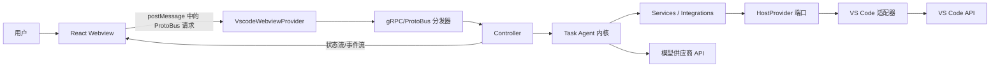
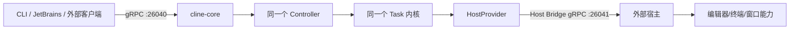
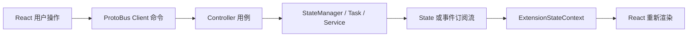
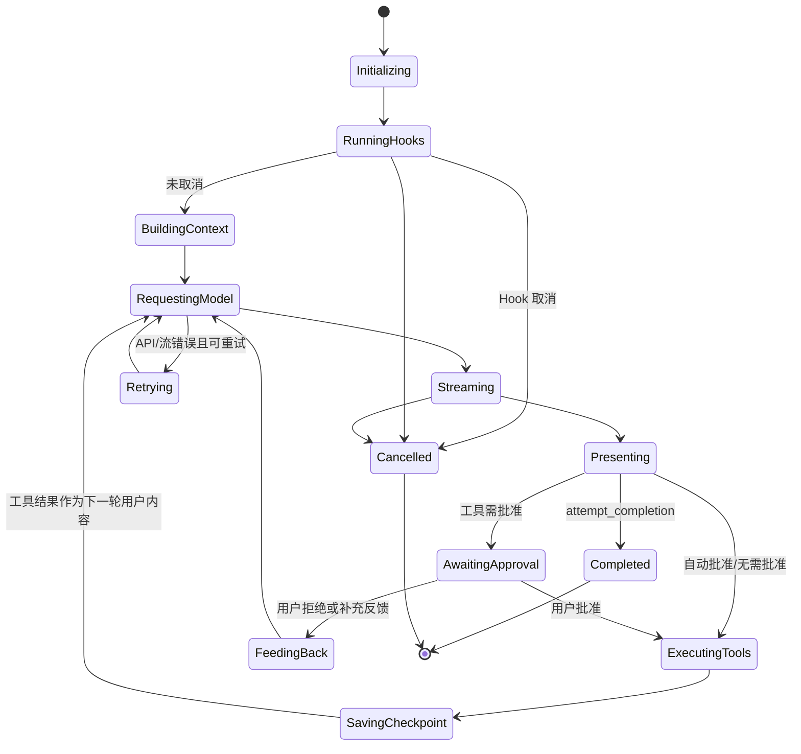

# Cline VS Code 项目架构模式分析

> 分析对象：`apps/vscode` 当前源码  
> 分析日期：2026-07-14

## 1. 结论先行

这个项目不是只采用了某一种教科书式架构。更准确的结论是：

> **它以“模块化单体”为代码组织基础，以“六边形架构（端口与适配器）”隔离 IDE/宿主差异，以“Proto/gRPC 客户端—服务器架构”连接 UI、核心和外部宿主；在 Agent 核心内部，又组合了事件驱动、状态机、策略、工厂、命令和注册表等模式。**

按重要性排序，可以概括为：

1. **主架构：分层的模块化单体（Layered Modular Monolith）**
2. **跨平台边界：六边形架构 / 端口与适配器（Hexagonal / Ports and Adapters）**
3. **进程与 UI 通信：协议驱动的客户端—服务器架构（ProtoBus / gRPC）**
4. **状态同步：事件驱动 + 发布订阅 + 单向数据流**
5. **Agent 执行内核：显式状态对象 + 隐式工作流状态机 + 流式处理管线**
6. **可扩展能力：策略、工厂、命令处理器、注册表和插件化机制**

它与经典 MVC 有一些“视图—控制器—状态”的外观相似性，但不能简单归类为 MVC；它也不是微服务，更不是严格遵守依赖倒置规则的 Clean Architecture。

## 2. 分析范围与源码概况

本次分析覆盖了当前目录中的 TypeScript、TSX、JavaScript、构建脚本、Proto 定义、Standalone 运行时和测试源码，并对全部源码文件进行了目录、导入依赖和入口扫描。工作区中可统计到约：

| 区域 | 源码文件数 | 主要职责 |
| --- | ---: | --- |
| `src/core` | 589 | Agent 核心、控制器、任务循环、提示词、上下文、状态、RPC 用例 |
| `webview-ui/src` | 339 | React Webview 前端 |
| `src/shared` | 90 | 跨前后端类型、消息、Proto 转换、存储抽象 |
| `src/services` | 86 | MCP、浏览器、认证、遥测、错误、搜索等服务 |
| `src/hosts` | 71 | VS Code 与外部宿主适配器 |
| `src/integrations` | 45 | 编辑器、终端、检查点、通知等集成 |
| `src/utils` | 31 | 文件、Git、Shell、路径等工具 |
| `src/test` | 31 | 单元、集成和 E2E 测试基础设施 |
| `proto` | 21 | Cline 服务与 Host Bridge 协议 |
| `scripts` | 21 | Proto 生成、构建、打包、发布和测试编排 |
| `src/standalone` | 8 | 独立 Cline Core 进程入口及生命周期 |
| `testing-platform` | 5 | 基于 gRPC 录制数据的黑盒测试工具 |

合计约 1,351 个源码文件、23 万行。`src/generated` 与 `webview-ui/src/services/grpc-client.ts` 属于构建时生成物，当前工作树未保存这些文件；它们的结构由 `proto/**/*.proto`、`scripts/build-proto.mjs`、`scripts/generate-protobus-setup.mjs` 和 `scripts/generate-host-bridge-client.mjs` 唯一决定，因此协议定义与生成器才是这部分架构的源代码事实来源。

测试文件没有被当成“附属内容”忽略：它们验证了 Host Provider、RPC、任务状态、工具执行、Hooks、MCP、存储、多根工作区、Webview 组件以及 VS Code 真机 E2E 边界。

## 3. 系统的两个运行形态

理解这个项目的关键，是先看到它同时支持两种部署形态。

### 3.1 VS Code 扩展内嵌形态



在这个形态中：

- `src/extension.ts` 是 VS Code 的组合根（Composition Root）。
- `setupHostProvider()` 把 Webview、Diff、评论审查、终端和 Host Bridge 的 VS Code 实现注入 `HostProvider`。
- `src/common.ts` 完成所有宿主共享的初始化：存储、日志、错误服务、Webview、后台同步和清理任务。
- `VscodeWebviewProvider` 承载 React 页面，并把 `postMessage` 消息交给 `handleGrpcRequest()`。
- `Controller` 和 `Task` 与 VS Code 运行在同一个 Extension Host 进程中，但 React Webview 处于隔离的浏览器上下文，二者通过消息协议通信。

### 3.2 Standalone / 外部宿主形态



在这个形态中：

- `src/standalone/cline-core.ts` 是第二个组合根。
- Core 先等待外部 Host Bridge 健康检查成功，再建立 `ExternalHostBridgeClientManager`。
- `src/standalone/protobus-service.ts` 把同一套 Controller RPC 用例暴露为真正的 gRPC 服务。
- `ExternalDiffViewProvider`、`ExternalWebviewProvider`、`StandaloneTerminalManager` 等替代 VS Code 实现。
- SQLite 锁管理器负责多进程实例和任务目录互斥。

这两种形态共用绝大多数业务代码，正是六边形架构存在的直接证据。

## 4. 分层与模块边界

项目可以按下面的逻辑层理解。这里的“层”是职责层，不代表源码依赖完全单向。

| 层 | 关键目录/文件 | 职责 |
| --- | --- | --- |
| 组合根与生命周期 | `src/extension.ts`、`src/common.ts`、`src/standalone/cline-core.ts` | 选择运行形态、装配实现、启动和释放资源 |
| 表现层 | `webview-ui/src`、`src/core/webview` | React UI、页面导航、用户交互、Webview 容器 |
| 协议层 | `proto/cline`、`proto/host`、`grpc-client-base.ts`、生成脚本 | 请求/响应契约、序列化、流式订阅、取消 |
| 应用层 | `src/core/controller`、`Controller` | RPC 用例入口、任务生命周期、认证、模型配置和状态协调 |
| Agent 领域/编排层 | `src/core/task`、`context`、`prompts`、`permissions`、`workspace` | Agent 循环、上下文、提示词、工具调用、审批和任务状态 |
| 端口层 | `HostProvider`、`ApiHandler`、`ITerminalManager`、`DiffViewProvider`、存储接口 | 定义核心需要的外部能力 |
| 适配器与基础设施层 | `src/hosts`、`src/integrations`、`src/services`、`src/core/api/providers` | VS Code、gRPC、模型厂商、MCP、浏览器、Git、终端、遥测 |
| 共享契约层 | `src/shared` | 前后端共同类型、消息、转换函数、纯逻辑和存储实现 |

### 4.1 为什么称为“模块化单体”

`src/core`、`services`、`integrations`、`hosts` 虽然模块很多，但 VS Code 版本最终由 esbuild 打成一个 `dist/extension.js`；Standalone 版本也打成一个 `dist-standalone/cline-core.js`。模块之间是本地函数和对象调用，而不是独立部署的网络服务。

所以它具备“按领域拆模块”的单体特征，而不是微服务。ProtoBus 在 VS Code 内部主要是跨 Webview 隔离边界的应用协议；只有 Standalone 形态才真正跨进程走 gRPC。

### 4.2 分层不是严格的 Clean Architecture

依赖扫描显示：

- `src/core` 大量依赖 `shared`，也会调用 `services`、`integrations` 和 `hosts`。
- `services` 与 `integrations` 中又有代码反向依赖 `core`。
- `Controller`、`Task` 和 `ExtensionStateContext` 都承担了较多职责。
- 一些 VS Code 特有能力仍位于 `core/api/providers/vscode-lm.ts`、`core/controller/models/getVsCodeLmModels.ts`、`core/storage/state-migrations.ts` 等位置。

因此它借鉴了 Clean/Hexagonal Architecture 的边界思想，但没有形成“领域层绝不依赖基础设施层”的严格同心圆结构。称其为“实用主义的分层模块化单体”更准确。

## 5. 主模式之一：六边形架构（端口与适配器）

### 5.1 HostProvider 是核心端口门面

`src/hosts/host-provider.ts` 定义并集中暴露了核心需要的宿主能力：

- 创建 Webview；
- 创建 Diff View；
- 创建评论审查控制器；
- 创建终端管理器；
- 访问 workspace、window、env、diff Host Bridge 客户端；
- 获取 OAuth 回调 URL、扩展目录和二进制路径。

VS Code 组合根注入：

- `VscodeWebviewProvider`
- `VscodeDiffViewProvider`
- `VscodeCommentReviewController`
- `VscodeTerminalManager`
- `vscodeHostBridgeClient`

Standalone 组合根注入：

- `ExternalWebviewProvider`
- `ExternalDiffViewProvider`
- `ExternalCommentReviewController`
- `StandaloneTerminalManager`
- `ExternalHostBridgeClientManager`

这就是“核心定义自己需要什么，外部宿主提供怎么实现”的端口—适配器结构。

### 5.2 主要端口与适配器

| 端口/抽象 | VS Code 适配器 | Standalone/外部适配器 |
| --- | --- | --- |
| `WebviewProvider` | `VscodeWebviewProvider` | `ExternalWebviewProvider` |
| `DiffViewProvider` | `VscodeDiffViewProvider` | `ExternalDiffViewProvider` / `FileEditProvider` |
| `CommentReviewController` | `VscodeCommentReviewController` | `ExternalCommentReviewController`（能力缺失时为空实现） |
| `ITerminalManager` | `VscodeTerminalManager` | `StandaloneTerminalManager` |
| Host Bridge clients | VS Code 内部方法适配器 | `nice-grpc` 客户端 |
| `ApiHandler` | 多个云端/本地模型 Handler | 同一套 Handler |
| `StorageContext` | 共享文件存储 | 共享文件存储 |

### 5.3 依赖注入的实际形式

这里没有使用 Inversify、NestJS 一类 IoC 容器，而是采用：

- 组合根中的手工工厂；
- 构造函数参数；
- 回调函数注入；
- `HostProvider`、`StateManager` 等单例服务定位器。

优点是直接、运行时开销低；代价是单例会隐藏依赖，测试隔离和多实例并存更困难。因此 `HostProvider.reset()`、多个 `resetInstanceForTests()` 才会成为必要的测试辅助。

## 6. 主模式之二：协议驱动的客户端—服务器架构

### 6.1 两组协议

项目有两套方向相反的协议：

1. `proto/cline/*.proto`：UI/外部客户端调用 Cline Core。
2. `proto/host/*.proto`：Cline Core 反向调用宿主 IDE 能力。

`cline` 协议按领域拆成 Account、Browser、Checkpoints、Commands、File、MCP、Models、OCA Account、Slash、State、Task、UI、Web、Worktree 等服务；`host` 协议提供 Diff、Env、Testing、Window、Workspace 服务。

这形成了清晰的双向边界：

```text
UI/客户端  -- cline.* RPC -->  Cline Core
Cline Core -- host.* RPC  -->  IDE 宿主
```

### 6.2 VS Code 内的 ProtoBus

`webview-ui/src/services/grpc-client-base.ts` 为每次请求生成 UUID，并通过 `PLATFORM_CONFIG.postMessage()` 发送：

- `grpc_request`
- `grpc_request_cancel`

`VscodeWebviewProvider` 接收消息后调用 `handleGrpcRequest()`。分发器再根据 `service + method` 查询构建时生成的 `serviceHandlers`，最终进入 `src/core/controller/<domain>/<method>.ts` 中的一个薄用例函数。

例如新任务的调用链是：

```text
TaskServiceClient.newTask
  -> grpc_request(cline.TaskService/newTask)
  -> VscodeWebviewProvider
  -> handleGrpcRequest
  -> generated serviceHandlers
  -> core/controller/task/newTask.ts
  -> Controller.initTask
```

虽然命名叫 gRPC，VS Code Webview 路径实际上是“Proto 语义 + JSON/消息总线传输”，不是 HTTP/2 gRPC。

### 6.3 Standalone 中的真实 gRPC

同一份 `.proto` 会生成 `@grpc/grpc-js` 和 `nice-grpc` 代码。`startProtobusService()` 把相同 Controller handler 包装成真正的 unary/server-streaming gRPC 方法，并提供健康检查和服务反射。

这体现了一个很重要的架构决定：**业务用例函数不绑定传输机制，传输层只负责解码、分发、错误包装和流生命周期。**

### 6.4 Contract-first 与代码生成

`npm run protos` 会：

1. 编译全部 `.proto`；
2. 生成共享消息类型；
3. 生成 Webview Client；
4. 生成 VS Code ProtoBus handler 表；
5. 生成 Standalone gRPC Server 装配代码；
6. 生成 Host Bridge 类型和客户端。

因此新增 RPC 的正确入口是修改协议，而不是手写一组容易漂移的前后端接口。

## 7. UI 架构：React + Context + 单向数据流

### 7.1 组件结构

`webview-ui/src/main.tsx` 挂载 `App`。`Providers.tsx` 依次提供：

- `PlatformProvider`
- `ExtensionStateContextProvider`
- `CustomPostHogProvider`
- `ClineAuthProvider`
- `HeroUIProvider`

`App.tsx` 根据 Context 中的视图状态显示 Onboarding、Settings、History、MCP、Account、Worktrees 或 Chat。

项目没有采用 React Router；页面切换是 `ExtensionStateContext` 中的一组布尔状态和导航函数。ChatView 会始终保持挂载，只通过 `isHidden` 隐藏，以避免丢失输入、滚动、等待响应等局部状态。

### 7.2 前端更接近 MVVM，而不是经典 MVC

可以近似映射为：

- View：React components；
- ViewModel：`ExtensionStateContext`、`ClineAuthContext`、各类 hooks；
- Model/Backend：Core 的 `StateManager`、`Controller`、`Task`；
- Commands：生成的 ProtoBus clients。

但是 ViewModel 不拥有业务真相。后端状态才是权威来源，Context 负责订阅、转换并投影给 React，所以“服务端状态 + 单向数据流”比 MVC 更贴切。

### 7.3 状态流向



前端主要订阅：

- 全量 Extension State；
- 流式 partial message；
- MCP Server 与 Marketplace 更新；
- 模型列表更新；
- 工具栏按钮、显示页面、释放控制权等 UI 事件；
- 认证状态。

这是典型的 Command + Event/State Projection 模型。

## 8. Controller：应用服务、门面与前置控制器

`src/core/controller/index.ts` 中的 `Controller` 是应用层核心门面。它负责：

- 创建和销毁当前 `Task`；
- 管理 `McpHub`、认证和账户服务；
- 初始化工作区与任务锁；
- 切换 Plan/Act 模式和 API Handler；
- 组装前端需要的 Extension State；
- 管理任务历史、远程配置和后台命令状态；
- 响应 OAuth、模型和 Marketplace 流程。

具体 RPC handler 通常很薄，例如 `task/newTask.ts` 负责 Proto 转换和请求校验，随后委托给 `Controller.initTask()`。因此 Controller 同时体现了：

- **Application Service**：编排一个用例需要的多个领域/基础设施对象；
- **Facade**：给 RPC handlers 提供统一入口；
- **Front Controller 的后端部分**：所有 UI 用例最后集中到同一个控制器实例。

它不是纯粹的 MVC Controller，因为它还持有服务、状态和当前 Task，生命周期明显比一次 UI 请求更长。

## 9. Task：Agent 工作流内核

### 9.1 任务生命周期

`src/core/task/index.ts` 是整个项目最核心的运行时。一个新任务大致经历：



代码没有用状态机框架；`TaskState` 中的字段与 `startTask()`、`initiateTaskLoop()`、`recursivelyMakeClineRequests()`、`presentAssistantMessage()`、`abortTask()` 共同实现了一个**隐式有限状态机**。

### 9.2 Agent 循环

任务循环的核心逻辑是：

1. 接收初始任务或上一轮工具结果；
2. 执行 TaskStart/UserPromptSubmit 等 Hooks；
3. 收集规则、Skills、Mentions、工作区与环境信息；
4. 由 Prompt Registry 构建当前模型对应的系统提示词和工具声明；
5. 通过 `ApiHandler.createMessage()` 发起流式模型请求；
6. 解析 reasoning、text、tool_calls、usage；
7. 把可展示内容排队刷新到 UI；
8. 执行工具、审批、检查点与 Hooks；
9. 将工具结果加入下一轮 user content；
10. 递归进入下一轮，直到完成、取消、错误或达到限制。

`initiateTaskLoop()` 外层使用 `while`，`recursivelyMakeClineRequests()` 内部又会递归调用自身。它表达 Agent 对话非常直接，但长远看也让控制流、退出条件和异常恢复较难推理。

### 9.3 流式处理管线

```text
ApiStream
  -> StreamChunkCoordinator
       -> usage：立即更新 token/cost/telemetry
       -> text/reasoning/tool_calls：进入顺序队列
  -> StreamResponseHandler / assistant parser
  -> TaskPresentationScheduler
  -> presentAssistantMessage
  -> ToolExecutor
  -> Tool Result
  -> 下一轮模型请求
```

`StreamChunkCoordinator` 将 usage 与可能被审批/工具阻塞的可见内容分离，避免 token 统计被 UI 等待阻塞。`TaskPresentationScheduler` 对远程工作区和普通工作区使用不同节奏，并合并高频流式刷新。这是生产级流式系统中常见的生产者—消费者与调度器组合。

### 9.4 并发控制

任务层显式处理了多种竞态：

- `Task` 用 `p-mutex` 串行化任务状态修改；
- `MessageStateHandler` 用独立 mutex 保证消息变更与落盘原子性；
- Presentation Scheduler 防止并发刷新；
- `GrpcRequestRegistry` 管理流式订阅的取消和清理；
- Standalone 使用 SQLite 任务锁防止多个实例操作同一任务；
- API 流支持 abort、重试、退避和 abandoned 实例隔离。

这说明 Task 并非普通 CRUD 领域对象，而是一个长期运行、事件密集的 Process Manager / Workflow Orchestrator。

## 10. 工具系统：命令模式 + 注册表 + 策略模式

工具执行由 `ToolExecutor` 和 `ToolExecutorCoordinator` 协作完成。

### 10.1 命令模式

每个工具 Handler 都实现统一接口：

```text
IToolHandler
  - name
  - execute(config, block)
  - getDescription(block)
```

支持流式半成品的 Handler 还实现 `IPartialBlockHandler`。文件读取、写入、Shell、浏览器、MCP、Web Search、Plan/Act 响应、完成任务等都被封装为独立命令对象。

### 10.2 注册表模式

`ToolExecutorCoordinator` 保存 `ClineDefaultTool -> Handler factory` 映射，并统一负责：

- 查找 Handler；
- 规范化 MCP 工具名；
- 动态识别 Subagent 工具；
- 执行对应策略。

`ToolExecutor` 在分发前后统一实施：

- 参数和路径校验；
- `.clineignore`；
- Plan 模式写操作限制；
- Auto Approve 和用户审批；
- PreToolUse/PostToolUse Hooks；
- 浏览器关闭、检查点、遥测和错误回传。

这是“中间件式公共流程 + 命令 Handler”的结构。

### 10.3 插件化程度

静态工具需要同时更新工具枚举、提示词定义、Handler 和注册表，因此还不是完全动态的插件系统。但 MCP 工具、Skills 和 YAML Subagents 可以在运行时发现，已经具备微内核式扩展能力。

## 11. 模型供应商：策略模式 + 简单工厂 + 适配器

`ApiHandler` 把所有模型统一成：

- `createMessage()` 返回标准 `ApiStream`；
- `getModel()` 返回标准模型信息；
- 可选 usage 查询与 abort。

`buildApiHandler()` / `createHandlerForProvider()` 根据当前 Plan/Act 配置创建 Anthropic、OpenAI、Gemini、OpenRouter、Bedrock、Ollama、LM Studio、Cline 等数十种 Handler。

这里组合了三个模式：

- **Strategy**：运行时选择供应商策略；
- **Factory**：集中创建具体 Handler；
- **Adapter**：把不同 SDK、流格式、usage 和 tool call 格式转成统一协议。

`src/core/api/transform` 进一步负责不同供应商消息与流格式的转换。

局限是工厂使用一个很长的 `switch`。新增供应商必须修改中央工厂、共享配置、Proto、Controller 模型服务和前端设置组件，开放—封闭原则只实现了一部分。

## 12. Prompt 系统：注册表 + Builder + Template Method

系统提示词不是单个巨型字符串，而是一个可组合的提示词引擎：

- `PromptRegistry` 注册和选择模型族变体；
- `VariantBuilder` 用 Fluent Builder 定义变体；
- `PromptBuilder` 按 component order 组合各部分；
- `TemplateEngine` 替换占位符；
- `ClineToolSet` 根据模型与上下文筛选工具；
- `variants/*` 为 GPT、Gemini、GLM、Hermes、Next Gen 等模型族定义模板和 override。

它解决的是“不同模型需要不同提示词、工具格式和能力开关”这一变化轴。提示词由数据/配置驱动，而 Task 只请求“给定上下文的最终 prompt”。

## 13. 事件驱动与发布订阅

项目的事件流不是使用一个全局 Event Bus，而是多种局部机制组合：

1. `MessageStateHandler` 继承强类型 `EventEmitter`，发布消息 add/update/delete/set。
2. Controller 的 `subscribeTo*` 文件维护订阅集合，并通过 server-streaming RPC 推送状态或事件。
3. Webview 的 Context 在 `useEffect` 中建立订阅，在卸载时取消。
4. MCP、Hooks、文件监听器、Agent 配置监听器通过回调或 EventEmitter 更新运行时。
5. VS Code commands 转换成 UI 订阅事件，而不是直接操作 React。

这种结构降低了 Extension Host 与 Webview 的直接耦合，也让 CLI 等非 Webview 消费者可以注册 callback；代价是事件源分散，订阅清理和事件顺序必须谨慎维护。

## 14. 状态与持久化架构

### 14.1 后端状态分层

| 状态范围 | 实现 | 生命周期 |
| --- | --- | --- |
| 全局设置/状态 | `StateManager.globalStateCache` | 跨工作区持久化 |
| Secrets | `secretsCache` + 权限为 `0600` 的文件 | 跨会话持久化 |
| Workspace State | `workspaceStateCache` | 每个工作区独立 |
| Task Settings | `taskStateCache` | 当前任务，可持久化 |
| Session Override | `sessionOverrideCache` | 仅当前进程 |
| Remote Config | `remoteConfigCache` | 内存只读策略 |
| Agent 运行状态 | `TaskState` | 当前任务实例 |
| 对话与 UI 消息 | `MessageStateHandler` | 任务目录持久化 |
| 前端投影状态 | `ExtensionStateContext` | Webview 生命周期 |

设置读取优先级是：

```text
Remote Config > Session Override > Task Settings > Global Settings
```

### 14.2 Repository/Cache 风格

`StateManager` 是一个内存优先的状态仓储门面：写入先立即更新 cache，再在 500ms 后批量落盘。`StorageContext` 屏蔽具体文件位置，当前统一使用 `~/.cline/data` 下的 JSON 文件。

这种设计让高频读取很快，也统一了 VS Code、CLI 和 JetBrains 的存储格式。它不是完整 Repository Pattern，因为业务对象并没有通过聚合仓储加载；更准确地说是“Typed State Store + Write-behind Cache”。

### 14.3 多实例一致性边界

源码明确说明：大部分状态只在初始化时从磁盘读取，不保证多个 VS Code 窗口实时一致。Task History 额外使用 chokidar 监听外部变化，但普通设置主要依赖进程重启或明确同步。

这是性能和一致性的主动取舍，不能把文件存储误解为强一致共享数据库。

## 15. 运行时扩展机制

项目同时存在四类扩展机制：

### 15.1 MCP

`McpHub` 支持 stdio、SSE、Streamable HTTP、OAuth、自动重连、文件热加载、远程策略限制和工具/资源/Prompt 发现。MCP 工具在运行时进入 Agent 工具空间，是最接近真正插件系统的部分。

### 15.2 Hooks

TaskStart、TaskResume、UserPromptSubmit、PreToolUse、PostToolUse、TaskCancel、TaskComplete、PreCompact 等生命周期点可执行外部脚本。Hook 可以：

- 注入上下文；
- 取消操作；
- 流式输出日志；
- 响应 AbortSignal；
- 参与 UI 状态展示。

这是 Interceptor / Middleware / Observer 三种思想的结合。

### 15.3 Skills

Skills 从全局、项目或远程来源延迟发现。`UseSkillToolHandler` 在需要时读取 `SKILL.md` 内容并注入当前上下文，不需要重新编译 Core。

### 15.4 Subagents

`AgentConfigLoader` 监听 YAML 配置目录，把配置动态转换成工具名并注册到 Coordinator。`SubagentRunner` 使用受限工具集、独立上下文和可选模型执行子任务。

这些能力使 Agent 内核具有“稳定内核 + 动态外围能力”的微内核特征，但宿主应用本身仍然是模块化单体。

## 16. 其他重要设计模式

| 模式 | 代码证据 | 作用 |
| --- | --- | --- |
| Singleton | `HostProvider`、`StateManager`、`PromptRegistry`、多个 Service | 保证进程内唯一共享实例 |
| Abstract Factory / Factory Method | Host 创建器、Checkpoint Factory、Provider Factories | 根据运行环境或配置创建实现 |
| Strategy | `ApiHandler`、Terminal Manager、Diff Provider、Telemetry/Error/Feature Flag Provider | 可替换实现 |
| Command | Tool Handlers、VS Code commands、RPC 用例函数 | 封装一次用户/Agent 操作 |
| Registry | Proto service handlers、Tool Coordinator、Prompt Registry | 运行时按名称分发 |
| Adapter | 各模型 Provider、Host Bridge、Proto conversions | 统一外部协议 |
| Facade | `Controller`、`McpHub`、`StateManager` | 给上层提供统一入口 |
| Observer / Pub-Sub | gRPC streaming、EventEmitter、React subscriptions | 异步状态传播 |
| Builder | PromptBuilder、VariantBuilder、GrpcRecorderBuilder、SubagentBuilder | 分步构造复杂对象 |
| Template Method | 抽象 `WebviewProvider`、`DiffViewProvider` 的具体子类 | 固定骨架、替换宿主步骤 |
| Null Object | `ExternalCommentReviewController` | 宿主不支持能力时保持接口稳定 |
| Process Manager | `Task`、`CommandOrchestrator` | 编排长事务和异步工作流 |
| Cache Aside / Write Behind | StateManager、模型缓存、MCP 配置 watcher | 降低 I/O 和网络请求 |

## 17. 安全和权限也是架构边界

工具不是直接访问系统资源，而是经过多层策略：

- `.clineignore` 控制文件边界；
- `CommandPermissionController` 分析 Shell 命令；
- `AutoApprove` 决定是否绕过交互；
- Plan 模式可禁止写操作；
- Remote Config 可限制 MCP、YOLO 等企业能力；
- PreToolUse Hook 可以取消工具；
- Diff/Checkpoint 支持用户审阅和恢复；
- Webview 使用 CSP 与 nonce；
- Secrets 文件设置为仅所有者读写。

因此“审批—执行—记录—恢复”不是 UI 附加功能，而是 Task/Tool 架构中的核心横切流程。

## 18. 构建与测试架构

### 18.1 构建

- esbuild 生成 VS Code Extension 与 Standalone 两个 Node/CJS bundle；
- Vite 单独构建 React Webview；
- Proto 生成器保证 Webview、VS Code 消息总线、Standalone gRPC 和 Host Bridge 使用同一契约；
- Tree-sitter WASM 和平台资源由构建插件复制；
- `package.json` 的 `contributes` 声明 VS Code View、Commands、Menus、Keybindings 和 Walkthrough。

### 18.2 测试金字塔

项目不是只有单元测试，而是多层测试：

1. Mocha/Vitest：纯函数、Handler、Service、Context、React 组件；
2. VS Code Integration：真实 Extension Host API；
3. Playwright E2E：真实 VS Code Electron + Webview + Mock API；
4. Standalone gRPC testing platform：根据 JSON 录制会话调用协议；
5. Storybook：UI 组件视觉与交互开发；
6. Proto lint、TypeScript、Biome 和构建检查：契约与静态边界。

测试结构也反向证明了项目的几个架构端口：Core 可被单测，Host 适配器可在 Extension Host 中测，ProtoBus 可做黑盒测试，UI 可在 Webview/E2E 中测。

## 19. 为什么它不是其他常见架构

### 19.1 不是经典 MVC

- React 组件不直接调用一个 MVC Controller 并获取 View Model；
- 前后端存在序列化协议和流式订阅边界；
- `Controller` 管理长期 Task 和服务生命周期，而不是请求级控制器；
- 后端 State 是权威，前端 Context 是状态投影。

所以 UI 局部可以说“MVVM-like”，整体不能说是 MVC。

### 19.2 不是微服务

- 业务模块一起构建和发布；
- 没有按领域独立部署、独立数据库和服务治理；
- Standalone 的两个 gRPC 方向是 Core 与宿主的边界，不是内部业务微服务拆分。

### 19.3 不是纯插件架构

MCP、Hooks、Skills、Subagents 是动态扩展点，但模型 Provider、内置工具和 Controller 服务大多在编译期注册。因此“内核带插件化扩展点”比“纯插件架构”准确。

### 19.4 不是严格 Clean Architecture

它有端口、适配器和依赖倒置，但目录间存在双向引用，核心也会直接依赖部分服务实现。当前边界更服务于跨 IDE 复用，而不是追求理论上的完全无基础设施依赖。

## 20. 架构优势

1. **同一 Core 支持多个宿主**：VS Code 和 Standalone 复用 Controller、Task、Prompt、Tool 与存储。
2. **协议是明确边界**：UI 和外部客户端不需要了解内部类结构。
3. **模型供应商可替换**：统一 ApiHandler 和流格式隐藏厂商差异。
4. **Agent 能力可扩展**：工具 Handler、MCP、Hooks、Skills、Subagents 各有扩展通道。
5. **流式体验经过专门设计**：usage、内容、UI 刷新和工具等待被解耦。
6. **状态可恢复**：消息、历史、检查点和任务锁支持长任务及异常恢复。
7. **可测试面较完整**：从纯逻辑到真实 VS Code E2E 均有覆盖入口。

## 21. 架构风险与改进方向

### 21.1 Controller 和 Task 过大

`Controller` 同时管理任务、账户、认证、MCP、状态、远程配置和模型；`Task` 同时管理流、Prompt、Context、工具、审批、Hooks、持久化和重试。它们是明显的 God Object 风险点。

可逐步拆成：

- TaskLifecycleService；
- ConversationEngine；
- ModelRequestRunner；
- ToolExecutionPipeline；
- TaskPersistenceService；
- ExtensionStateProjector。

### 21.2 隐式状态机难以验证

大量布尔字段组合可能产生非法状态，例如 streaming、abort、abandoned、userMessageContentReady、presentation lock 之间的组合。

可以引入明确的 discriminated union 或 reducer：

```text
Idle | Initializing | Requesting | Streaming | AwaitingApproval |
ExecutingTool | Retrying | Completed | Cancelling | Cancelled | Failed
```

并让事件驱动状态迁移，而不是由任意方法直接改多个 flag。

### 21.3 单例与 Service Locator 隐藏依赖

大量 `getInstance()` 让对象创建方便，但降低了测试替换性和多实例能力。新的模块宜优先用构造函数注入明确依赖，让组合根持有生命周期。

### 21.4 前端 Context 过于集中

`ExtensionStateContext` 同时包含后端状态、模型缓存、导航、MCP、订阅和大量 setter。任何小状态变化都可能扩大重渲染范围。

可以按领域拆成：

- BackendStateContext；
- NavigationContext；
- ModelsContext；
- McpContext；
- TaskStreamContext。

也可以用 selector store 降低无关组件更新。

### 21.5 目录依赖不是单向

`services`、`integrations` 与 `core` 互相引用，长期容易形成循环。可新增明确的 `application/ports` 和 `infrastructure` 边界，并在 lint/依赖图中强制规则。

### 21.6 扩展 Provider 的改动面偏大

中央 `switch`、共享配置、Proto、Controller 和 UI Provider 组件需要一起修改。可以逐步改成 Provider Descriptor Registry，让后端策略和前端配置元数据从同一描述生成。

### 21.7 多实例状态只有部分同步

当前只有 Task History 有文件 watcher。若多个窗口需要共享设置，应明确采用版本号、文件锁和冲突解决策略；否则应在 UI 中清楚表达“设置是窗口会话快照”。

## 22. 新增功能时应走哪条架构路径

### 新增一个 UI—Core 用例

```text
修改 proto/cline/*.proto
  -> npm run protos
  -> 新增 core/controller/<domain>/<rpc>.ts
  -> 前端调用生成的 ServiceClient
  -> 如需推送，使用 server-streaming + RequestRegistry 清理
```

### 新增一个内置工具

```text
定义 ClineDefaultTool / Tool Spec
  -> 提示词工具描述
  -> 新增 Handler
  -> Coordinator 注册
  -> 补充审批、校验、Hook 与测试
```

### 新增一个模型供应商

```text
实现 ApiHandler
  -> 统一 ApiStream 转换
  -> Provider Factory 注册
  -> State/Proto 配置字段
  -> Controller 模型查询
  -> Webview 设置组件
  -> Provider/Transform 测试
```

### 新增一个 IDE 宿主

```text
实现 Host Bridge 服务
  -> 实现 Webview/Diff/Terminal/Comment 等适配器
  -> 在新组合根初始化 HostProvider
  -> 复用 common.initialize + Controller + Task
```

## 23. 推荐阅读顺序

要快速建立对项目的完整心智模型，建议按以下顺序阅读：

1. `src/extension.ts`：VS Code 启动与组合根；
2. `src/common.ts`：跨平台公共初始化；
3. `src/hosts/host-provider.ts`：宿主端口；
4. `src/standalone/cline-core.ts`：第二运行形态；
5. `proto/cline/*.proto` 与 `proto/host/*.proto`：系统边界；
6. `src/core/controller/grpc-handler.ts`：协议分发；
7. `src/core/controller/index.ts`：应用门面；
8. `src/core/task/index.ts`、`TaskState.ts`：Agent 工作流；
9. `ToolExecutor.ts`、`ToolExecutorCoordinator.ts`：工具管线；
10. `src/core/api/index.ts` 与 `providers/*`：模型策略；
11. `src/core/prompts/system-prompt`：Prompt 引擎；
12. `src/core/storage/StateManager.ts`：状态真相与持久化；
13. `webview-ui/src/App.tsx`、`Providers.tsx`、`ExtensionStateContext.tsx`：前端投影；
14. `scripts/generate-protobus-setup.mjs`：协议如何连接各端。

## 24. 最终定性

如果必须只用一句架构术语描述：

> **Cline VS Code 是一个协议驱动、采用六边形边界的分层模块化单体，内部运行一个事件驱动的 Agent 工作流内核。**

如果要更完整地描述：

> **外层**通过 VS Code Extension 或 Standalone 组合根装配宿主适配器；**中间层**通过 ProtoBus/gRPC 暴露应用用例并同步状态；**内核层**由 Controller、Task、Prompt、Context 和 Tool Pipeline 完成 Agent 编排；**外围层**通过模型 Provider、MCP、Hooks、Skills、Subagents、终端和编辑器适配器扩展能力。整个系统是模块化单体，但在宿主边界、传输边界和供应商边界上系统性使用了端口与适配器思想。
