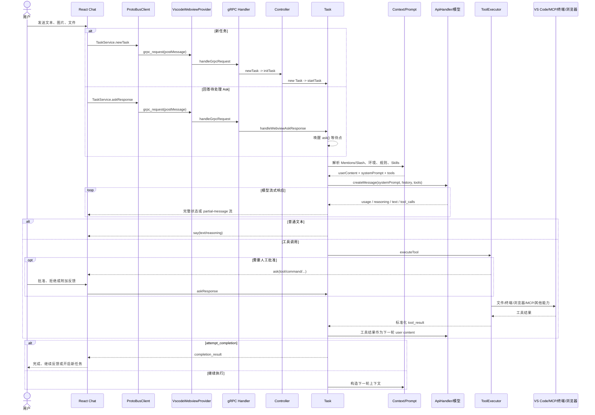

# Cline 用户消息后的智能体执行链路

> 分析对象：`apps/vscode` 当前源码
> 分析日期：2026-07-14
> 目标：说明用户发送一条消息以后，消息如何从 React Webview 进入扩展后端，如何形成模型请求、执行工具、回传界面，以及各主要分支如何改变执行流程。

## 1. 结论先行

Cline 不是“前端发消息 → 后端调用一次模型 → 返回一段文本”的普通聊天程序。它的真实执行模型是：

> **Proto/gRPC 驱动的前后端消息入口 + 有持久化状态的 Task 实例 + 递归 Agent 循环 + 流式内容解析与展示调度 + 带审批和 Hooks 的工具执行流水线。**

一次新消息的主链路可以压缩为：

```text
用户输入文本/图片/文件
  -> React Chat 输入组件
  -> TaskService.newTask 或 TaskService.askResponse
  -> Webview postMessage / ProtoBus
  -> VscodeWebviewProvider
  -> gRPC serviceHandlers
  -> Controller
  -> Task
  -> 构造用户上下文、环境信息、规则和系统提示词
  -> ApiHandler.createMessage()
  -> 模型流式输出 reasoning / text / tool_calls / usage
  -> 展示文本，或等待审批后执行工具
  -> 把工具结果组成下一条 user message
  -> 再次请求模型
  -> attempt_completion / 用户取消 / 不可恢复错误
```

其中最重要的源码入口是：

- 前端发送：`webview-ui/src/components/chat/chat-view/hooks/useMessageHandlers.ts`
- Webview RPC 客户端：`webview-ui/src/services/grpc-client-base.ts`
- VS Code 消息入口：`src/hosts/vscode/VscodeWebviewProvider.ts`
- RPC 分发：`src/core/controller/grpc-handler.ts`
- 新任务用例：`src/core/controller/task/newTask.ts`
- Ask 回复用例：`src/core/controller/task/askResponse.ts`
- 任务创建：`src/core/controller/index.ts` 的 `Controller.initTask()`
- Agent 主循环：`src/core/task/index.ts`
- 工具执行：`src/core/task/ToolExecutor.ts`
- 工具路由：`src/core/task/tools/ToolExecutorCoordinator.ts`
- UI/API 消息持久化：`src/core/task/message-state.ts`

## 2. 先理解三类“用户发送消息”

界面上的发送按钮相同，但 `useMessageHandlers.handleSendMessage()` 会依据当前会话状态走三条不同的后端路径。

| 当前状态 | RPC | 后端含义 |
| --- | --- | --- |
| `messages.length === 0` | `TaskServiceClient.newTask()` | 创建全新的 `Task`，进入完整 Agent 循环 |
| 当前有 `clineAsk` | `TaskServiceClient.askResponse()` | 回答正在等待的审批、追问、恢复、错误重试或完成结果 Ask |
| 已有消息、没有 `clineAsk`，且最后消息显示任务仍在运行 | `TaskServiceClient.askResponse(messageResponse)` | 把反馈写入当前 Task 的 Ask 响应状态；它本身不创建新 Task，也不直接发起新模型请求 |

这里有一个容易误解的源码事实：

- `askResponse.ts` 最终只调用 `Task.handleWebviewAskResponse()`；
- 该方法只写入 `TaskState.askResponse`、`askResponseText`、`askResponseImages`、`askResponseFiles`；
- 真正消费这些字段的是正在 `pWaitFor()` 中等待的 `Task.ask()`；
- 因而“运行中反馈”要在当前流程存在可消费的 Ask 边界时才会成为下一步输入。它不是一个通用的“立即中断流并重新请求模型”接口。

这与前端源码中“interruption/feedback”的注释相比更精确，也是改造消息中断能力时必须注意的边界。

## 3. 全链路时序图



## 4. 阶段一：React 前端收集并路由消息

### 4.1 输入组件到发送处理器

关键调用关系为：

```text
ChatView.tsx
  -> chat-view/components/layout/InputSection.tsx
  -> ChatTextArea.tsx
  -> messageHandlers.handleSendMessage(inputValue, selectedImages, selectedFiles)
  -> chat-view/hooks/useMessageHandlers.ts
```

`handleSendMessage()` 先做以下处理：

1. 对文本执行 `trim()`；
2. 文本、图片、文件至少有一种才认为有内容；
3. 如果用户引用了历史内容，把引用包装为 `[context] ... [/context]` 并放在消息前面；
4. 根据消息列表和 `clineAsk` 状态选择 `newTask` 或 `askResponse`；
5. RPC 成功后清空输入、引用、图片、文件，并临时禁用发送按钮；
6. 重置聊天自动滚动状态。

图片使用字符串数组传递，通常是 Data URL；文件使用路径字符串数组传递。附件尚未在浏览器端展开为正文，真正的文件正文提取发生在后端的 `processFilesIntoText()`。

### 4.2 待处理 Ask 的回复类型

前端把用户动作转换为三种 `responseType`：

| responseType | UI 行为 | 后端语义 |
| --- | --- | --- |
| `yesButtonClicked` | Approve、Proceed、Retry、Resume | 同意当前 Ask |
| `noButtonClicked` | Reject | 拒绝当前 Ask，可附带文字、图片、文件反馈 |
| `messageResponse` | 在输入框回答 | 用自然语言和附件回答当前 Ask |

`clineAsk` 可能是：

- `followup`
- `plan_mode_respond`
- `tool`
- `browser_action_launch`
- `command` / `command_output`
- `use_mcp_server`
- `use_subagents`
- `completion_result`
- `mistake_limit_reached`
- `api_req_failed`
- `new_task`
- `condense`
- `report_bug`
- `resume_task` / `resume_completed_task`

恢复任务是一个特例：即使输入框中有补充内容，也使用 `yesButtonClicked`，以保证回车发送和 Resume 按钮的后端行为一致。

### 4.3 取消和辅助操作

`executeButtonAction()` 还处理：

- Cancel：如果有后台命令，先调 `cancelBackgroundCommand()`，再调 `cancelTask()`；
- Condense：调用 `SlashServiceClient.condense()`；
- Report Bug：调用 `SlashServiceClient.reportBug()`；
- Start New Task：清理当前任务，或以最后一条任务内容创建新任务。

取消按钮用 `cancelInFlightRef` 防止重复点击并发触发。

## 5. 阶段二：消息穿过 Webview 与扩展边界

### 5.1 ProtoBusClient 封装请求

`webview-ui/src/services/grpc-client.ts` 是由 Proto 定义生成的服务客户端；公共传输逻辑位于 `grpc-client-base.ts`。生成文件在执行 Proto 生成任务后出现，清理构建产物后可能不在当前工作树中；协议事实应以 `proto/cline/*.proto` 和生成脚本为准，不应手工维护该文件。

一次一元请求会：

1. 生成 UUID `requestId`；
2. 给 `window` 注册只匹配该 ID 的 `message` 监听器；
3. 使用平台编码器序列化 Proto 消息；
4. 调用 `PLATFORM_CONFIG.postMessage()`；
5. 发送 `type: "grpc_request"`，其中包含 `service`、`method`、`message`、`request_id`、`is_streaming`；
6. 收到同 ID 的 `grpc_response` 后解码并 resolve/reject。

流式请求的机制相同，但监听器会保留到服务显式结束或客户端发送 `grpc_request_cancel`。状态订阅和局部消息订阅都使用该模式。

### 5.2 VS Code Webview 接收消息

`VscodeWebviewProvider.setWebviewMessageListener()` 通过 VS Code 的：

```ts
webview.onDidReceiveMessage(...)
```

接收浏览器上下文发来的请求。`handleWebviewMessage()` 只处理两类消息：

- `grpc_request` → `handleGrpcRequest()`
- `grpc_request_cancel` → `handleGrpcRequestCancel()`

回复则通过 `webview.webview.postMessage()` 返回 React 页面。

### 5.3 gRPC 分发到应用用例

`src/core/controller/grpc-handler.ts` 按 `is_streaming` 分成一元和流式请求，并依据：

```text
serviceHandlers[serviceName][methodName]
```

找到构建时生成的处理器。新任务最终进入：

```text
cline.TaskService/newTask
  -> src/core/controller/task/newTask.ts
  -> Controller.initTask()
```

对 Ask 的回答进入：

```text
cline.TaskService/askResponse
  -> src/core/controller/task/askResponse.ts
  -> Task.handleWebviewAskResponse()
```

RPC 层还会记录请求/响应，用 `GrpcRequestRegistry` 管理长期流订阅和取消清理，但它不承载 Agent 业务逻辑。

## 6. 阶段三：Controller 创建并装配 Task

`Controller.initTask()` 是任务级组合根。对于新任务，它依次执行：

1. 非阻塞刷新远程配置；
2. `clearTask()`，确保旧 Task 不与新 Task 并存；
3. 读取 Auto Approve、终端模式、输出行数、默认 Profile、任务历史等设置；
4. 初始化 `WorkspaceRootManager`，确定单根或多根工作区；
5. 计算主工作目录 `cwd`；
6. 新任务使用当前时间戳作为 `taskId`，历史任务复用原 ID；
7. 尝试获取任务目录锁；
8. 加载该任务的 Task Settings，并合并请求携带的临时设置；
9. 构造 `Task`，注入 Controller、MCP、状态、工作区、回调和终端配置；
10. 先把实例赋给 `controller.task`；
11. 新任务调用 `task.startTask()`，历史任务调用 `task.resumeTaskFromHistory()`。

第 10 步的顺序很重要：源码专门说明，必须先把 Task 赋给 Controller，再运行可能触发 Hooks 的启动逻辑，避免 Hook 运行时 `controller.task` 尚未就绪。

### 6.1 Task 构造时装配的核心对象

`Task` 构造函数不是简单保存参数，而是创建整个会话运行时：

| 对象 | 作用 |
| --- | --- |
| `TaskState` | Ask、流状态、工具状态、重试、错误计数和上下文删除区间等易变状态 |
| `MessageStateHandler` | 管理并持久化 UI 消息和 API 会话历史 |
| `ContextManager` | 上下文窗口计算、截断、压缩和文件读取优化 |
| `StreamResponseHandler` | 汇总 Reasoning 和原生 Tool Call 增量 |
| `TaskPresentationScheduler` | 合并高频流式更新，在本地/远程环境采用不同刷新节奏 |
| `ToolExecutor` | 工具校验、审批、Hooks、执行和结果格式化 |
| `CommandExecutor` | 命令执行、交互输出和后台命令控制 |
| `BrowserSession` / `UrlContentFetcher` | 浏览器和网页内容能力 |
| `DiffViewProvider` / `FileEditProvider` | 前台 Diff 编辑或后台文件编辑 |
| `FileContextTracker` | 跟踪读取文件及文件变化警告 |
| `ModelContextTracker` | 记录该任务使用过的 Provider/Model |
| `EnvironmentContextTracker` | 记录任务运行环境元数据 |
| `FocusChainManager` | 可选的任务进度列表和提醒 |
| Checkpoint Manager | 可选的影子 Git 检查点、比较与恢复 |

Task 还会根据当前 Plan/Act 模式调用 `buildApiHandler()`，选出本轮实际使用的模型 Provider 适配器。

## 7. 阶段四：新任务预处理

`Task.startTask()` 是新任务进入 Agent 循环前的预处理入口。

### 7.1 初始化显示状态

它先：

1. 初始化 `.clineignore`；
2. 清空内存中的 `clineMessages` 与 `apiConversationHistory`，避免扩展异常退出后显示旧消息；
3. 向 Webview 发布空任务状态；
4. 调用 `say("task", task, images, files)` 记录用户原始任务，供界面展示和历史持久化；
5. 标记 Task 已初始化。

这里已经出现两套不同用途的消息：

- `clineMessages`：面向 UI 的消息，如 task、text、reasoning、tool、error；
- `apiConversationHistory`：真正送给模型的 user/assistant/tool 内容。

两者相关，但结构和内容并不一一相同。

### 7.2 构造第一条模型用户内容

第一轮 API 用户内容以如下文本开头：

```xml
<task>
用户输入的任务
</task>
```

随后追加：

- 图片 → `formatResponse.imageBlocks(images)` 生成模型图片块；
- 文件 → `processFilesIntoText(files)` 读取并提取为文本块；
- Hook 注入上下文 → `<hook_context source="...">...</hook_context>`；
- 后续循环中再追加环境详情、Mentions、Slash/Workflow 展开结果等。

### 7.3 TaskStart 与 UserPromptSubmit Hooks

如果 Hooks 已启用：

1. 先执行 `TaskStart`；
2. Hook 可取消任务，也可返回 `contextModification`；
3. 未取消时，再执行初始任务的 `UserPromptSubmit`；
4. 该 Hook 同样可取消，或向本轮上下文追加内容；
5. 记录环境元数据；
6. 调用 `initiateTaskLoop(userContent)`。

两次 Hook 之间及之后都有 `taskState.abort` 防御检查，防止异步取消已经发生后仍继续请求模型。

## 8. 阶段五：进入 Agent 循环

### 8.1 外层循环

`initiateTaskLoop()` 的逻辑很短，但定义了整个 Agent 的运行方式：

```text
while (!abort):
    didEndLoop = recursivelyMakeClineRequests(nextUserContent)
    if didEndLoop:
        break
    nextUserContent = noToolsUsed 提醒
```

首轮 `includeFileDetails = true`，之后改为 `false`，避免每轮都把完整工作区文件结构重复加入上下文。

### 8.2 真正主链路：recursivelyMakeClineRequests()

该方法完成“一轮模型请求 + 一轮工具展示/执行 + 递归进入下一轮”。按执行顺序可分为：

1. 检查任务是否已取消；
2. 等待远程工作区检测完成，以确定 UI 流式刷新节奏；
3. 增加 API 请求计数、Focus Chain 计数；
4. 读取当前 Plan/Act 模式、Provider、Model 和 Prompt 模式；
5. 记录本任务使用的模型；
6. 检查连续错误次数；
7. 初始化首轮 Checkpoint；
8. 判断是否需要自动压缩上下文；
9. 调用 `loadContext()` 展开用户内容和环境上下文；
10. 写入 UI 的 `api_req_started` 占位消息；
11. 把本轮 user content 追加到 API 会话历史；
12. 调用 `attemptApiRequest()`；
13. 消费流式 usage、reasoning、text 和 tool_calls；
14. 通过调度器展示文本或执行工具；
15. 把完整 assistant 内容写入 API 会话历史；
16. 等待所有展示/工具块处理完；
17. 保存 Checkpoint；
18. 把工具结果作为下一轮 user content，再递归调用自身；
19. 没有任何可解析响应时走错误与重试分支。

因此，虽然方法名带有 `recursively`，它并不是无条件递归：每轮只有在收到可用 assistant 内容并完成当前块处理后，才用新生成的用户内容进入下一轮。

## 9. 阶段六：加载用户上下文

当本轮不走“仅请求模型总结”的压缩路径时，`loadContext()` 会处理以下内容。

### 9.1 Mentions 与 Slash/Workflow

对于带用户内容标记的文本块：

1. `parseMentions()` 解析文件、文件夹、URL、Problems、Git 等 Mentions；
2. `parseSlashCommands()` 展开 Slash Command、局部/全局 Workflow 和 MCP Prompt；
3. 必要时检查 `.clinerules` 的目录形态；
4. 对工具结果中的用户反馈标记也执行同类解析。

这意味着发送到模型的并非总是用户输入的原始字符串。例如 `@/src/a.ts` 可能会被替换或扩展为实际文件上下文，Workflow 命令也会变成完整指令。

### 9.2 环境详情

`getEnvironmentDetails()` 会生成当前运行环境信息，例如：

- 当前工作目录和多根工作区；
- 可见/打开文件；
- 活跃终端及终端输出；
- 文件结构（仅需要时）；
- 当前时间、模式和其他环境状态；
- 文件在会话期间被外部修改的警告。

环境详情作为独立文本块追加到本轮 user content，而不是修改原始用户文本。

### 9.3 Focus Chain

如果 Focus Chain 启用且到达需要提醒的时机，`loadContext()` 追加任务清单指令，并重置“自上次 Todo 更新后的请求数”。

## 10. 阶段七：上下文窗口与压缩分支

在请求模型前，`ContextManager` 会根据当前模型的上下文窗口、历史 Token 使用和设置选择不同策略。

### 10.1 正常路径

- 加载完整本轮上下文；
- 在 `attemptApiRequest()` 中调用 `getNewContextMessagesAndMetadata()`；
- 根据 `conversationHistoryDeletedRange` 得到当前有效历史；
- 必要时截去较旧轮次；
- 把截断后的历史传给 Provider。

### 10.2 文件读取优化

在决定压缩前，`attemptFileReadOptimization()` 可尝试重写历史中的重复大文件读取结果。若已经能节省足够 Token，就避免立即启动总结轮次。

### 10.3 自动总结路径

开启 Auto Condense 且模型属于支持的下一代模型族时：

- `shouldCompactContextWindow()` 判断是否接近阈值；
- 本轮跳过昂贵的完整环境加载；
- 向 user content 追加 `summarizeTask(...)` 指令；
- 模型通过 `summarize_task` 形成可继续工作的摘要；
- 后续更新 `conversationHistoryDeletedRange`，屏蔽已被摘要替代的旧消息。

### 10.4 首块即报上下文超限

如果 Provider 在第一块返回前报告 Context Window Exceeded：

1. 首次自动调用更激进的截断处理；
2. 再次失败时，如果仍有足够历史可删，向用户显示 Retry；
3. 历史已过短仍超限时，该会话可能无法继续，只能调整输入、模型或开启新任务。

## 11. 阶段八：生成系统提示词并调用模型

`attemptApiRequest()` 在真正发请求前会：

1. 最多等待 MCP 连接 10 秒；
2. 读取 IDE 类型、浏览器设置、偏好语言；
3. 加载全局和项目 `.clinerules`；
4. 加载 Cursor、Windsurf、AGENTS 等外部规则；
5. 注入 `.clineignore` 约束；
6. 发现当前可用 Skills；
7. 快照打开和可见的编辑器标签页；
8. 组合多根工作区、YOLO、Subagents、Web Tools、并行工具等能力开关；
9. 调用 `getSystemPrompt(promptContext)`，得到 `systemPrompt` 和原生工具定义 `tools`；
10. 通过 `ContextManager` 取得截断后的 API 会话历史；
11. 调用当前 Provider 实现的：

```ts
this.api.createMessage(systemPrompt, truncatedConversationHistory, tools)
```

`ApiHandler` 是统一模型边界。Agent 循环不直接依赖 Anthropic、OpenAI、Gemini 等某一供应商的返回格式；各 Provider 先将其流转换为项目内部统一的 `ApiStream`。

## 12. 阶段九：流式响应的四类事件

`StreamChunkCoordinator` 从 `ApiStream` 逐块取数据。主循环处理四类内部事件。

### 12.1 usage

累加：

- input tokens；
- output tokens；
- cache write/read tokens；
- total cost。

用量副作用进入串行 Promise 队列，流结束前统一 flush；`api_req_started` UI 消息会不断更新为最终 Token、Cost、取消原因或失败信息。

### 12.2 reasoning

`StreamResponseHandler` 中的 Reasoning Handler 汇总：

- reasoning 文本；
- signature；
- details / summary；
- redacted reasoning data。

在首个普通文本出现前，可通过 `say("reasoning", ..., partial=true)` 流式显示。完整 Reasoning 还会按 Provider 要求写入 API assistant 历史，以维持后续调用所需的签名或推理连续性。

这里保存和展示的只是 Provider 实际返回的 Reasoning 数据；Provider 从未返回的内部隐式推理不可能被此链路读取。

### 12.3 text

普通文本被追加到：

- `assistantMessage`：保留 XML 工具标签，用于 XML 解析和 UI；
- `assistantTextOnly`：不含 XML 工具正文，用于 API assistant 历史。

XML 模式下，`parseAssistantMessageV2()` 把混合输出解析为：

- `text` 块；
- `tool_use` 块；
- 未闭合块会标记 `partial: true`。

随后由 `TaskPresentationScheduler` 合并高频增量，调用 `presentAssistantMessage()`。

### 12.4 tool_calls

原生 Tool Call 由 Tool Use Handler 按 `call_id` 聚合：

- 合并函数名、参数增量、工具 ID 和签名；
- 将 MCP 原生工具名标准化；
- `processNativeToolCalls()` 把它们转换为统一的 `ToolUse[]`；
- 后续与 XML 工具调用共用同一个 `ToolExecutor`。

这正是“不同模型输出协议，统一进入同一工具执行内核”的关键适配点。

## 13. 阶段十：展示 Assistant 内容

`presentAssistantMessage()` 按 `currentStreamingContentIndex` 顺序处理解析出的内容块，并用锁防止同一块被并发展示或执行。

### 13.1 文本块

- 部分文本调用 `say("text", ..., partial=true)`；
- 后续增量更新同一条消息，时间戳保持不变，避免虚拟列表闪烁；
- 完整时改为 `partial=false` 并持久化；
- 如果前一个工具已被拒绝，或禁用并行工具后已有工具执行，则跳过后续不应展示的内容。

### 13.2 工具块

完整或部分 `tool_use` 块交给：

```text
Task.presentAssistantMessage()
  -> ToolExecutor.executeTool()
  -> ToolExecutorCoordinator
  -> 具体 Tool Handler
```

部分工具块主要用于实时 UI 预览，不产生最终 Tool Result；只有完整工具块才执行实际副作用并加入下一轮模型上下文。

### 13.3 当前轮完成条件

当所有内容块处理完且模型流已经结束，`userMessageContentReady = true`。主循环等待这个条件，以保证：

- UI 展示完成；
- 人工审批已经回答；
- 工具已经完成或被拒绝；
- 工具结果已完整写入 `taskState.userMessageContent`。

然后才可以进入下一轮模型请求。

## 14. 阶段十一：工具执行流水线

`ToolExecutorCoordinator` 把项目的内置工具名映射到 Handler。无论 XML 还是原生 Tool Call，完整工具执行大体遵循：

1. 工具名规范化；
2. 查找 Handler；
3. 规范化 `attempt_completion` 等兼容参数；
4. 如果此前工具已被用户拒绝，跳过当前工具；
5. 如果未启用并行工具且本轮已执行过工具，拒绝额外工具；
6. 严格 Plan 模式下阻止文件修改类工具；
7. 关闭与当前工具无关的浏览器会话；
8. 对 partial 块仅更新 UI；
9. 对完整块进行参数、路径、权限和 `.clineignore` 校验；
10. 判断 Auto Approve、YOLO 或人工审批；
11. 审批通过后运行 `PreToolUse` Hook；
12. 执行具体 Handler；
13. 把返回值标准化为 Tool Result；
14. 检查重复工具调用循环；
15. 运行 `PostToolUse` Hook；
16. 将 Hook 的上下文修改加入下一轮 user content；
17. 更新 Focus Chain；
18. 工具异常转换为模型可见的错误结果，而不是只写日志。

### 14.1 审批的结果如何进入模型上下文

如果用户拒绝工具，`ToolResultUtils`/Handler 会生成“工具被拒绝”的结果，并可能包含用户补充反馈。若用户批准，工具真实执行结果被包装为 `tool_result` 或兼容文本块。

所以对模型而言，下一轮不是凭空继续，而是收到类似：

```text
assistant: 请求调用工具 X
user:      工具 X 的执行结果 / 拒绝原因 / 用户反馈
```

### 14.2 主要工具分支

| 分支 | Handler/模块 | 特殊行为 |
| --- | --- | --- |
| 文件读写/补丁 | `ReadFileToolHandler`、`WriteToFileToolHandler`、`ApplyPatchHandler` | 路径校验、`.clineignore`、Diff、审批、Checkpoint |
| 命令 | `ExecuteCommandToolHandler`、`CommandExecutor` | 前台终端或后台执行、流式输出、交互 Ask、取消 |
| 浏览器 | `BrowserToolHandler`、`BrowserSession` | 图片能力检查、浏览器动作审批和截图 |
| MCP | `UseMcpToolHandler`、`AccessMcpResourceHandler` | 服务级/工具级 Auto Approve、通知、图片结果、400KB 截断 |
| Skill | `UseSkillToolHandler` | 按需发现并加载 `SKILL.md`，把技能说明作为 Tool Result 注入下一轮 |
| Subagent | `UseSubagentsToolHandler`、`SubagentRunner` | 最多 5 个并行子任务，聚合状态、用量和结果 |
| 追问 | `AskFollowupQuestionToolHandler` | 暂停循环等待用户文本/附件回答 |
| 模式响应 | `PlanModeRespondHandler`、`ActModeRespondHandler` | 等待计划确认或切换模式 |
| 压缩 | `CondenseHandler`、`SummarizeTaskHandler` | 创建摘要并调整有效历史范围 |
| 完成 | `AttemptCompletionHandler` | 展示结果、可执行收尾命令、保存 Checkpoint、运行完成 Hook |

## 15. 阶段十二：把工具结果送回模型

流结束后，Task 会先构造并持久化本轮 assistant 历史，内容可能包括：

- Reasoning/Thinking 块；
- 普通文本；
- 原生 Tool Use 块；
- 模型、请求 ID、Token 和 Cost 元数据。

接着：

1. 把未完成的 partial 块标为完成；
2. flush 最后一批展示任务；
3. 等待 `userMessageContentReady`；
4. 保存本轮后的 Checkpoint；
5. 检查 assistant 是否实际使用了工具；
6. 若用了工具，`taskState.userMessageContent` 已包含所有工具结果；
7. 递归调用 `recursivelyMakeClineRequests(userMessageContent)`；
8. 新一轮将这些结果写成 API 的 `role: "user"` 消息。

这形成了真正的自主循环：

```text
模型决定工具
  -> Cline 执行工具
  -> 工具结果反馈给模型
  -> 模型观察结果并决定下一步
  -> ...
```

## 16. attempt_completion 完成分支

模型认为任务完成时应调用 `attempt_completion`，由 `AttemptCompletionHandler` 处理。

### 16.1 普通完成

1. 校验 `result` 参数；
2. 运行 `PreToolUse` Hook；
3. 发送 `completion_result`；
4. 保存完成 Checkpoint；
5. 标记完成结果后是否仍有新文件变化；
6. 记录完成遥测；
7. 运行 `TaskComplete` Hook 和完成通知 Hook；
8. 显示完成后的操作按钮；
9. 用户可开启新任务，也可提供反馈继续旧任务。

### 16.2 带收尾命令

如果 `attempt_completion` 带 `command`：

- 先展示完成结果；
- 根据 Auto Approve 设置自动执行或询问用户；
- 执行命令并把输出加入结果；
- 用户拒绝时标记 `didRejectTool`。

### 16.3 Double-check Completion

开启 `doubleCheckCompletionEnabled` 后，第一次 `attempt_completion` 不会直接完成，而是返回错误型 Tool Result，要求模型重新对照原始任务检查：

- 是否完成所有要求；
- 是否遗漏步骤；
- 边界和错误处理是否充分；
- 输出格式是否精确；
- 指标是否达标。

模型确认后必须再次调用 `attempt_completion`，第二次才进入正常完成流程。

### 16.4 完成后反馈

如果用户在完成结果处输入文字、图片或文件：

1. UI 以 `messageResponse` 回答 `completion_result` Ask；
2. Task 记录 `user_feedback`；
3. 运行 `UserPromptSubmit` Hook；
4. 将反馈包装进完成工具结果；
5. Agent 循环继续，之后需要再次调用 `attempt_completion`。

## 17. 主要分支链路详解

### 17.1 新任务与历史恢复

新任务走 `startTask()`；历史任务走 `resumeTaskFromHistory()`。

恢复流程会：

1. 读取保存的 `clineMessages`；
2. 删除旧的重复 Resume Ask；
3. 清理没有 Cost/CancelReason 的悬空 `api_req_started`；
4. 读取 `apiConversationHistory` 和 Context History；
5. 根据最后消息显示 `resume_task` 或 `resume_completed_task`；
6. 用户点击恢复后执行 `TaskResume` Hook；
7. 将离开时间、恢复说明、用户新反馈、附件和文件变化警告组合成新 user content；
8. 执行 `UserPromptSubmit` Hook；
9. 重新进入 `initiateTaskLoop()`。

恢复不是把最后一条用户消息原样重发，而是对旧历史做修复，并追加任务恢复语义。

### 17.2 Plan 与 Act

- `getCurrentProviderInfo()` 每轮读取当前模式，因此 Plan 和 Act 可以用不同 Provider/Model；
- `Controller.togglePlanActMode()` 会重建 Task 的 `ApiHandler`；
- 若正等待计划响应，切换到 Act 会用 `PLAN_MODE_TOGGLE_RESPONSE` 或用户附带内容唤醒 Ask；
- 严格 Plan 模式下，`ToolExecutor` 禁止 `write_to_file`、编辑、新规则和补丁类工具；
- 非等待状态切换模式可能取消并重新组织当前任务，改造时不能只改前端开关。

### 17.3 人工批准、Auto Approve 与 YOLO

工具 Handler 根据工具类别、路径、命令风险、MCP 工具配置等判断：

- 人工批准：发 `ask(...)`，Agent 暂停；
- Auto Approve：发对应 `say(...)`，直接执行；
- YOLO：扩大自动执行范围，但仍受远程策略、工具校验和连续错误上限约束。

YOLO 下达到连续错误上限会直接以错误结束本轮任务；非 YOLO 则询问用户是否继续并允许用户给出纠正意见。

### 17.4 XML Tool Call 与原生 Tool Call

| 模式 | 来源 | 解析方式 | 后续执行 |
| --- | --- | --- | --- |
| XML | 模型文本中输出 `<read_file>...</read_file>` 等标签 | `parseAssistantMessageV2()` | `ToolExecutor` |
| Native | Provider 返回 function/tool call 增量 | Tool Use Handler + `processNativeToolCalls()` | 同一个 `ToolExecutor` |

系统提示词返回非空 `tools` 时，`useNativeToolCalls` 被设为真。对于 OpenAI Responses 格式，原生工具调用是必需路径；其他模型可由设置和模型能力决定。

### 17.5 单工具与并行工具

禁用并行工具时：

- 本轮第一个完整工具执行后设置 `didAlreadyUseTool`；
- 后续工具收到 `toolAlreadyUsed` 结果；
- 流可能提前中止，以便尽快把第一个结果送回模型。

启用并行工具时，可继续收集和处理同一 assistant 回合中的多个 Tool Use。Subagents 内部还会使用 `Promise.allSettled()` 并行运行最多五个子任务。

### 17.6 Hooks 取消与上下文注入

| Hook | 位置 | 可否取消 | 可注入上下文 |
| --- | --- | ---: | ---: |
| `TaskStart` | 新任务开始 | 是 | 是 |
| `TaskResume` | 用户确认恢复后 | 是 | 是 |
| `UserPromptSubmit` | 初始任务、恢复、反馈 | 是 | 是 |
| `PreToolUse` | 工具已批准、真正执行前 | 是 | 是 |
| `PostToolUse` | 工具执行后 | 可请求取消后续任务 | 是 |
| `PreCompact` | 截断/压缩前 | 是 | 是 |
| `TaskComplete` | 完成结果展示后 | 由完成流程管理 | 主要用于收尾 |
| `TaskCancel` | 有活跃工作被取消时 | 否 | 否 |

Hook 返回的 `contextModification` 会包装为 `<hook_context>`，成为后续模型可见内容，而不是仅显示在 UI。

### 17.7 MCP、Skill 与 Subagent

- MCP：等待连接完成，人工或自动批准后调用 `McpHub.callTool()`；服务器通知也写入聊天；
- Skill：模型先看到可用技能元数据，需要时调用 `use_skill`，完整技能说明作为结果注入下一轮；
- Subagent：为每个 Prompt 创建独立 Runner，聚合进度、Token、Cost 和结果，再把汇总结果交给主 Agent。

三者都不是绕过主循环的旁路，最终都以 Tool Result 回到主 Task 的下一轮上下文。

### 17.8 连续错误与重复工具循环

- 缺少工具参数、无工具调用、重复相同工具等会增加 `consecutiveMistakeCount`；
- 重复工具先软警告，达到硬阈值后把错误计数提升到最大值；
- 达到全局 `maxConsecutiveMistakes` 后，普通模式询问用户是否继续；
- 用户反馈被包装为 `tooManyMistakes(...)` 后成为下一轮输入；
- YOLO 模式不等待，直接失败结束。

### 17.9 API 首块失败

`attemptApiRequest()` 先单独读取第一块，因为第一块前失败时还没有执行工具，可安全重试。

分支为：

- Context Window Exceeded：先自动截断重试；
- 普通瞬时错误：最多 3 次指数退避，延迟 2/4/8 秒；
- 认证、额度、余额、组织权限、Spend Limit 等：跳过无意义的自动重试；
- 自动重试耗尽：显示 `api_req_failed` Ask，由用户决定；
- 用户批准后递归调用 `attemptApiRequest()`。

### 17.10 流中途失败

如果已经收到部分内容后流失败，状态可能包含已执行工具，因此不能简单重发同一个请求。源码会：

1. 停止 Stream Coordinator；
2. 将错误标准化为 `ClineError`；
3. 非 Spend Limit 最多安排 3 次 2/4/8 秒自动恢复；
4. 将 partial 消息封口；
5. 在 API 历史中记录“Response interrupted by API Error”；
6. `abortTask()` 清理可能处于不一致状态的资源；
7. 从已保存任务历史重新初始化 Task；
8. 自动或人工触发 Resume。

首块失败与流中失败是两套不同策略，原因就在于后者可能已经产生副作用。

### 17.11 用户取消

取消链路为：

```text
UI Cancel
  -> cancelBackgroundCommand（如有）
  -> TaskService.cancelTask
  -> Controller.cancelTask
  -> Task.abortTask
```

`abortTask()` 会：

1. 先判断是否存在值得触发 `TaskCancel` Hook 的活跃工作；
2. 设置 `abort = true`，阻止新工具和新请求；
3. 取消当前 Hook；
4. 取消后台命令；
5. 运行不可取消的 `TaskCancel` Hook；
6. 保存消息和 UI 状态；
7. 清理终端、浏览器、Diff、上下文跟踪、Focus Chain 和展示调度器；
8. 释放任务锁；
9. Controller 等待流停止，必要时把旧实例标记 `abandoned`；
10. 从历史重建 Task，显示 Resume，或在无历史时清空任务。

### 17.12 模型未调用工具

如果模型只返回普通文本、没有调用任何工具：

- Task 向 `userMessageContent` 追加 `formatResponse.noToolsUsed(...)`；
- 增加连续错误次数；
- 下一轮提醒模型继续执行或使用 `attempt_completion`。

这就是为什么纯文本回答后 Agent 常会自动继续，而不是立即结束任务。

### 17.13 空或不可解析响应

如果没有文本，也没有可识别 Tool Use：

1. 记录 Provider API Error；
2. UI 显示明确错误；
3. API 历史补一条 `Failure: I did not provide a response.`；
4. 自动按 2/4/8 秒重试最多 3 次；
5. 耗尽后询问用户是否重试；
6. 用户拒绝则结束当前循环。

### 17.14 Checkpoint

- 首次 API 请求前按设置初始化 Checkpoint Manager 并创建初始提交；
- 每个 assistant 回合的工具全部完成后保存 Checkpoint；
- 完成结果处保存完成 Checkpoint；
- 文件编辑和 Diff 与 Checkpoint 元数据关联；
- 用户恢复 Checkpoint 时会取消当前 Task、恢复文件及消息上下文，再重建任务。

多根工作区当前不支持完整 Checkpoint，会在 Task Header 显示警告。

## 18. 后端状态如何回到 React 界面

### 18.1 完整状态通道

`Controller.postStateToWebview()` 取得 `ExtensionState`，调用 `sendStateUpdate()` 广播给所有 `StateService.subscribeToState` 订阅者。

React 的 `ExtensionStateContext.tsx`：

1. 建立长期 State 流订阅；
2. 解析 `stateJson`；
3. 更新 Context State；
4. `ChatView` 读取新的 `clineMessages` 重新渲染。

完整状态适合任务切换、持久化消息、设置变化等低频或结构性更新。

### 18.2 局部消息通道

流式文本、Reasoning、工具预览不适合每个 Token 都发送整个 State，因此：

```text
Task.say()/ask()
  -> sendPartialMessageEvent()
  -> UiService.subscribeToPartialMessage
  -> ExtensionStateContext 按 ts 查找并替换消息
```

`ts` 同时是虚拟列表稳定 Key，所以 partial 更新必须保留原时间戳，否则 Chat Row 会反复卸载、重挂并闪烁。

### 18.3 UI 展示前还会合并序列

`ChatView` 使用共享辅助逻辑组合：

- 连续命令消息；
- API Request 序列；
- Hook 序列；
- partial/current message。

因此界面看到的“一张卡片”可能由多条底层 `clineMessages` 合并而成。

## 19. 一条“读取文件并修改”的具体例子

假设用户发送：“阅读 `src/a.ts`，修复错误并运行测试”。实际可能经历：

1. UI 发送 `newTask(text, images=[], files=[])`；
2. Controller 创建 Task；
3. Task UI 历史记录原始任务；
4. API user history 写入 `<task>...</task>`、环境详情和规则；
5. 模型返回 `read_file` Tool Call；
6. ToolExecutor 校验路径和 `.clineignore`；
7. 读取通常可按设置自动批准；
8. 文件内容作为 Tool Result 回到下一轮；
9. 模型返回 `write_to_file` 或 `apply_patch`；
10. 严格 Plan 模式下被阻止；Act 模式下进入 Diff/审批；
11. 用户批准后运行 PreToolUse Hook，再修改文件；
12. PostToolUse Hook 观察结果并可注入上下文；
13. 保存 Checkpoint；
14. 修改结果回到模型；
15. 模型返回 `execute_command` 运行测试；
16. 命令输出流式显示，最终结果回到模型；
17. 模型可能根据失败继续修改，也可能调用 `attempt_completion`；
18. 完成 Handler 展示总结、保存完成 Checkpoint、运行 TaskComplete Hook。

整个过程中，用户只发送了一条初始消息，但会产生多轮模型请求、多次工具调用和多种 UI 消息。

## 20. 改造这条链路时的关键扩展点

| 想改造的目标 | 首选扩展点 | 不建议直接改的位置 |
| --- | --- | --- |
| 修改发送规则 | `useMessageHandlers.ts`、Task Proto 用例 | 生成的 `grpc-client.ts` |
| 增加新的 RPC | `proto/cline/*.proto` + Controller 用例 + 生成脚本 | 手工修改生成的 serviceHandlers |
| 增加新工具 | `src/shared/tools.ts`、系统提示词 Tool 定义、Coordinator、Handler | 在 `Task.index.ts` 再加巨大 switch |
| 修改审批策略 | Auto Approve、具体 Handler、`ToolResultUtils` | 只隐藏前端 Approve 按钮 |
| 修改模型前上下文 | `loadContext()`、`ContextManager`、System Prompt | 修改 UI 展示消息冒充 API History |
| 修改流式展示 | `TaskPresentationScheduler`、`say/ask`、partial subscription | 每 Token 发布完整 State |
| 实现真正的运行中反馈中断 | 增加明确的反馈队列/Abort/Turn 边界 | 仅继续写 `TaskState.askResponse` |
| 增加生命周期拦截 | Hooks | 在每个工具 Handler 重复写旁路逻辑 |
| 修改完成规则 | `AttemptCompletionHandler` | 只改变完成按钮文案 |

新增工具至少要同时考虑：

1. Tool 枚举和模型可见定义；
2. XML 与原生调用的命名兼容；
3. 参数校验；
4. Plan/Act 权限；
5. Auto Approve 与人工 Ask；
6. `.clineignore` 和路径安全；
7. Pre/Post Tool Hooks；
8. partial UI；
9. 标准 Tool Result；
10. 测试和遥测。

## 21. 推荐源码阅读顺序

为了最快掌握本链路，建议按以下顺序阅读：

1. `webview-ui/src/components/chat/chat-view/hooks/useMessageHandlers.ts`
2. `webview-ui/src/services/grpc-client-base.ts`
3. `src/hosts/vscode/VscodeWebviewProvider.ts`
4. `src/core/controller/grpc-handler.ts`
5. `src/core/controller/task/newTask.ts`
6. `src/core/controller/task/askResponse.ts`
7. `src/core/controller/index.ts` 的 `initTask()`、`cancelTask()`、模式切换
8. `src/core/task/index.ts` 的构造函数、`startTask()`、`resumeTaskFromHistory()`
9. 同文件的 `initiateTaskLoop()`、`recursivelyMakeClineRequests()`
10. 同文件的 `attemptApiRequest()`、`presentAssistantMessage()`、`loadContext()`
11. `src/core/task/ToolExecutor.ts`
12. `src/core/task/tools/ToolExecutorCoordinator.ts`
13. 各 `src/core/task/tools/handlers/*.ts`
14. `src/core/task/message-state.ts`
15. `webview-ui/src/context/ExtensionStateContext.tsx`

## 22. 关键源码索引

| 职责 | 源码 |
| --- | --- |
| Chat 页面 | `webview-ui/src/components/chat/ChatView.tsx` |
| 输入区 | `webview-ui/src/components/chat/chat-view/components/layout/InputSection.tsx` |
| 发送、审批、取消 | `webview-ui/src/components/chat/chat-view/hooks/useMessageHandlers.ts` |
| ProtoBus 客户端 | `webview-ui/src/services/grpc-client-base.ts` |
| 前端生成客户端 | `webview-ui/src/services/grpc-client.ts`（构建生成，清理后可能不存在） |
| VS Code Webview 传输 | `src/hosts/vscode/VscodeWebviewProvider.ts` |
| RPC 分发 | `src/core/controller/grpc-handler.ts` |
| 新任务 RPC | `src/core/controller/task/newTask.ts` |
| Ask 回复 RPC | `src/core/controller/task/askResponse.ts` |
| Controller/Task 生命周期 | `src/core/controller/index.ts` |
| Agent 主循环 | `src/core/task/index.ts` |
| 易变执行状态 | `src/core/task/TaskState.ts` |
| 消息状态与持久化 | `src/core/task/message-state.ts` |
| 流式协调 | `src/core/task/StreamChunkCoordinator.ts` |
| Reasoning/Tool Call 汇总 | `src/core/task/StreamResponseHandler.ts` |
| 展示节流 | `src/core/task/TaskPresentationScheduler.ts` |
| XML Assistant 解析 | `src/core/assistant-message/parse-assistant-message.ts` |
| 工具公共流水线 | `src/core/task/ToolExecutor.ts` |
| 工具路由 | `src/core/task/tools/ToolExecutorCoordinator.ts` |
| 工具 Handler | `src/core/task/tools/handlers` |
| Context 管理 | `src/core/context/context-management/ContextManager.ts` |
| System Prompt | `src/core/prompts/system-prompt` |
| 模型统一接口与工厂 | `src/core/api/index.ts`、`src/core/api/providers` |
| 完整状态订阅 | `src/core/controller/state/subscribeToState.ts` |
| 局部消息订阅 | `src/core/controller/ui/subscribeToPartialMessage.ts` |
| React 状态接收 | `webview-ui/src/context/ExtensionStateContext.tsx` |

## 23. 最终总结

用户发送一条消息以后，Cline 的控制权会在四个边界之间循环流动：

```text
用户/UI
  -> Controller/Task
  -> 模型
  -> 工具/IDE
  -> Task
  -> 模型
  -> ...
  -> 用户/UI
```

`Controller` 管任务生命周期，`Task` 管 Agent 回合，`ContextManager` 管模型能看到什么，`ApiHandler` 管不同模型协议，`ToolExecutor` 管副作用和审批，`MessageStateHandler` 管记录与恢复，两个 gRPC 流把状态实时送回 React。

理解这几个职责边界后，绝大多数功能都可以定位到正确层级；若把 UI 消息、API 历史、工具结果和 Task 状态混为一谈，则很容易在改造时出现“界面看到了但模型没看到”“模型收到但历史没有”“审批按钮消失但工具仍执行”等问题。
