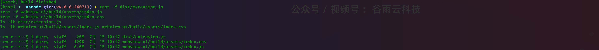
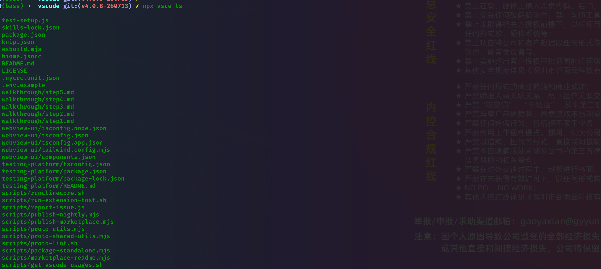
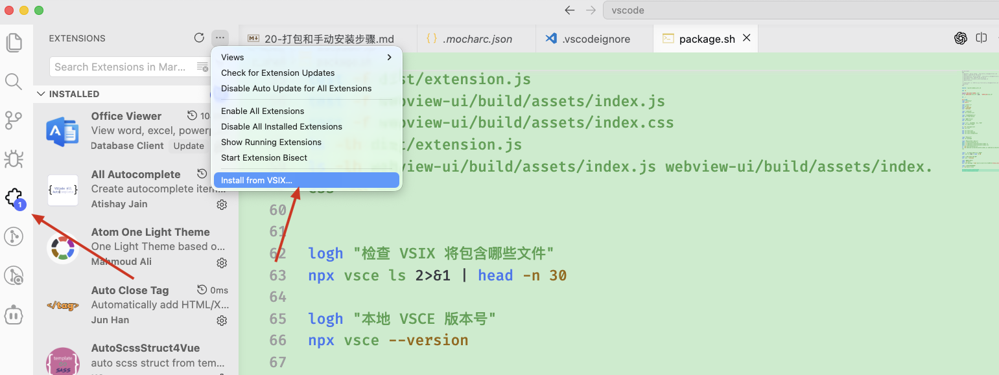

# 当前插件打包和本地手动安装完整步骤

# 0、直接运行shell脚本呢打包

```

# 运行
z_shell

#【 注意观察console日志 】不报错就代表正常
sh package.sh

```

## 1. 目标和结论

当前项目可以构建为标准 VS Code 扩展安装包 `.vsix`，然后通过 VS Code 图形界面或命令行手动安装，不需要发布到 Marketplace。

当前插件的关键元数据来自 `apps/vscode/package.json`：

| 项目            | 当前值                     | 作用                                   |
| --------------- | -------------------------- | -------------------------------------- |
| `publisher`   | `saoudrizwan`            | 扩展发布者 ID                          |
| `name`        | `claude-dev`             | 扩展内部名称                           |
| `displayName` | `Cline`                  | VS Code 界面显示名称                   |
| `version`     | `4.0.8`                  | 当前扩展版本                           |
| 完整扩展 ID     | `saoudrizwan.claude-dev` | VS Code 判断是否为同一个扩展的唯一标识 |
| 运行入口        | `dist/extension.js`      | 安装后由 Extension Host 加载的入口     |
| VS Code 要求    | `^1.84.0`                | 可安装的最低 VS Code 版本范围          |

最重要的限制：当前源码仍然使用官方 Cline 的扩展 ID `saoudrizwan.claude-dev`。因此，本地打包版本和 Marketplace 官方 Cline 会被 VS Code 视为同一个插件，不能在同一个 VS Code Profile 中作为两个独立插件共存。本地安装会覆盖当前 Profile 中的官方版本，Marketplace 自动更新也可能再次覆盖本地版本。

如果需要让官方 Cline 和自己的插件长期并存，应先完成插件身份改名，参考 `教程/6-转换成独立插件.md`；本文只说明如何打包和安装“当前身份”的插件。

## 2. 完整流程概览

```text
准备 Node 22 和依赖
  -> 生成 Proto
  -> 类型检查、Lint 和测试
  -> 生产构建 Extension 与 Webview
  -> 检查 VSIX 文件清单
  -> 使用 VSCE 生成 .vsix
  -> 使用 VS Code UI 或 CLI 安装
  -> Reload Window
  -> 验证插件、模型连接和智能体能力
```

## 3. 环境准备

### 3.1 进入正确目录

以下命令都应在 VS Code 插件目录执行：

```bash

# 运行
cd /Users/darcy/mwp/ala-platform-other/cline/apps/vscode

```

确认目录：

```bash

# 运行
pwd
test -f package.json
test -f esbuild.mjs
test -f .vscodeignore

```

### 3.2 使用 Node.js 22

仓库根目录 `.nvmrc` 指定 Node.js 22，建议严格使用该版本：

```bash

# 运行
nvm install 22
nvm use 22
node --version
npm --version

```

预期 `node --version` 输出 `v22.x.x`。

Node 24 虽然满足根项目 `node >=22` 的形式要求，但项目开发、CI 和依赖验证以 Node 22 为基准。打包时优先使用 Node 22，能减少原生依赖、构建工具和 VSCE 的兼容性差异。

### 3.3 安装依赖

当前项目的 Extension 后端和 Webview 前端各有一套依赖。首次构建或锁文件发生变化时执行：

```bash

# 运行
npm run install:all

```

该命令等价于：

```bash

npm install
npm --prefix webview-ui install

```

如果 `node_modules` 和 `webview-ui/node_modules` 已存在，并且刚刚成功执行过构建或测试，可以跳过本步骤。

需要严格按照锁文件重装时，可以改用：

```bash
npm ci
npm --prefix webview-ui ci
```

不要在每次小改动后都删除依赖。只有切换 Node 大版本、锁文件变化、原生模块加载异常或依赖树损坏时，才需要执行：

```bash
npm run clean:deps
npm run install:all
```

## 4. 打包前检查

### 4.1 检查工作区状态

```bash
# 运行
git status --short

```

确认准备打包的改动都符合预期，不要把临时密钥、调试输出、录制文件或无关生成文件带入安装包。

### 4.2 清理旧构建产物

推荐正式打包前清理一次构建目录：

```bash

# 运行
npm run clean:build

```

该命令会清理：

```text
dist/
webview-ui/build/
src/generated/
out/
```

清理后必须重新生成 Proto 和重新构建。

### 4.3 生成 Proto

```bash

# 运行
npm run protos

```

如果出现 `@generated`、Proto 类型或 gRPC Service 找不到等错误，首先重新执行该命令，不要手工创建空的生成文件。

## 5. 类型检查、代码检查和测试

正式安装前建议执行：

```bash

# 类型检查和测试
npm run check-types

rm -rf coverage-unit
npm run lint

npm run test:unit
npm run test:webview
npm run test:integration

```

各命令作用：

| 命令                         | 作用                                                    |
| ---------------------------- | ------------------------------------------------------- |
| `npm run check-types`      | 生成 Proto，并检查 Extension 和 Webview TypeScript 类型 |
| `npm run lint`             | 执行 Biome 和 Proto Lint                                |
| `npm run test:unit`        | 执行 Node/Mocha 单元测试                                |
| `npm run test:webview`     | 执行 React/Webview Vitest 测试                          |
| `npm run test:integration` | 在 VS Code Extension Host 中执行集成测试                |

判断集成测试是否通过，应同时查看测试汇总和退出码：

```bash

# 运行
npm run test:integration
echo $?

```

退出码 `0` 表示命令通过。当前清理后的 `npm run test:integration` 已能启动 Extension Host 并以 0 退出，不再出现由遥测/ErrorService 初始化造成的 `HostProvider not setup` 警告；但当前套件输出 `0 passing`，它仍只是宿主冒烟检查，不能替代单元测试和 E2E。

如果只是本地快速验证，可以先执行 `check-types`、`lint`、`test:unit` 和 `test:webview`；准备长期使用或分发前，应补跑集成测试和受影响功能的 E2E/手工冒烟测试。

## 6. 执行生产构建

### 6.1 正确的生产构建命令

```bash

# 运行
npm run package

```

该脚本会执行：

```text
check-types
  -> build:webview
  -> lint
  -> node esbuild.mjs --production
```

它会生成经过生产配置处理的 Extension Bundle 和 Webview 静态资源。

不要使用 `npm run ci:build` 代替最终生产构建。`ci:build` 使用 `node esbuild.mjs`，没有传入 `--production`；它适合 CI 编译和测试准备，不是本文推荐的最终 VSIX 构建入口。

### 6.2 检查关键产物

```bash

# 运行
test -f dist/extension.js
test -f webview-ui/build/assets/index.js
test -f webview-ui/build/assets/index.css
ls -lh dist/extension.js
ls -lh webview-ui/build/assets/index.js webview-ui/build/assets/index.css

```

至少应存在：

```text

dist/extension.js
webview-ui/build/assets/index.js
webview-ui/build/assets/index.css

```

`dist/extension.js` 是 VS Code Extension Host 的运行入口；`webview-ui/build` 是安装后聊天界面的静态资源。



## 7. 检查 VSIX 将包含哪些文件

当前 `.vscodeignore` 已排除 `.env`、大部分源码、测试、教程、开发配置和 Webview 源码，并保留运行所需的 Bundle、Webview Build、图标和 Codicon 资源。

执行：

```bash

# 运行
npx vsce ls

```

重点确认：

- 包含 `package.json`；
- 包含 `dist/extension.js`；
- 包含 `webview-ui/build/assets/index.js`；
- 包含 `webview-ui/build/assets/index.css`；
- 包含 `assets/icons`；
- 不包含 `.env`；
- 不包含真实 API Key、Token、Cookie 或私有 Endpoint；
- 不包含测试结果、录屏、临时目录和不需要的 Source Map。



### 7.1 教程和测试覆盖率产物不会打入 VSIX

当前 `.vscodeignore` 已明确加入：

```text
教程/**
.nyc_output/**
coverage/**
```

因此教程文档、NYC 临时覆盖率数据和覆盖率报告不会进入最终 VSIX。每次调整 `.vscodeignore` 后都应重新执行 `npx vsce ls --no-dependencies`，不要只检查工作区目录。

### 7.2 Secret 扫描原则

VSCE 3.x 会检查准备打包的文件中是否存在疑似 Secret。遇到报错时：

1. 先根据错误给出的文件路径和 Secret 名称检查内容；
2. 如果是真实凭据，必须从源码和构建产物中删除并立即轮换；
3. 如果确认是第三方依赖中的误报，只允许特定 Secret 名称；
4. 不要使用 `--allow-package-all-secrets` 绕过全部检查；
5. 不要使用 `--allow-package-env-file` 把 `.env` 打进 VSIX。

当前仓库的 E2E/发布脚本对已知的 `sendgrid` 检测使用了定向许可。如果严格打包命令只报明确的 `[sendgrid]` 误报，并且检查确认不存在真实 SendGrid Key，可以使用：

```bash

# 运行
npx vsce package \
  --allow-package-secrets sendgrid \
  --out dist/cline-local-4.0.8.vsix

```

不要在没有检查错误内容的情况下直接添加该参数。

## 8. 生成 VSIX 安装包

### 8.1 确认本地 VSCE

项目已将 `@vscode/vsce` 声明为开发依赖。确认版本：

```bash

# 运行
npx vsce --version

```

当前依赖环境实际可用的 VSCE 版本为 `3.7.1`。使用 `npx vsce` 会优先调用项目本地安装的命令，不需要全局安装 VSCE。

### 8.2 使用固定文件名生成安装包

```bash

# 运行
mkdir -p dist
npx vsce package --out dist/cline-local-4.0.8.vsix

```

也可以从 `package.json` 动态读取版本，避免每次手工修改命令：

```bash
VERSION=$(node -p "require('./package.json').version")
VSIX_PATH="dist/cline-local-${VERSION}.vsix"
npx vsce package --out "$VSIX_PATH"
echo "$VSIX_PATH"
```

VSCE 会读取 `package.json`，并自动执行：

```text
vscode:prepublish -> npm run package
```

因此，即使前面已经运行过 `npm run package`，生成 VSIX 时仍会再次执行一次生产构建。这是当前项目脚本的正常行为。

打包成功后检查：

```bash

# 运行
ls -lh dist/*.vsix

```

还可以检查 VSIX 内部文件：

```bash

# 运行
unzip -l dist/cline-local-4.0.8.vsix | less

```

VSIX 本质上是 ZIP 格式的扩展包。检查时应看到类似：

```text
extension/package.json
extension/dist/extension.js
extension/webview-ui/build/assets/index.js
extension/webview-ui/build/assets/index.css
```

## 9. 安装前处理官方 Cline 冲突

### 9.1 为什么会冲突

当前本地 VSIX 的扩展 ID 仍然是：

```text
saoudrizwan.claude-dev
```

如果当前 VS Code Profile 已安装官方 Cline，本地安装会把它视为同一插件的新安装、重装或降级，而不是新增一个独立插件。

### 9.2 推荐方案：单独建立 VS Code Profile

建议在 VS Code 中新建一个名为 `Cline Local` 的 Profile，专门安装和测试本地 VSIX：

1. 点击 VS Code 左下角账户/Profile 图标；
2. 选择 `Profiles`；
3. 选择 `Create Profile...`；
4. 创建 `Cline Local`；
5. 切换到该 Profile；
6. 在该 Profile 中安装本地 VSIX。

Profile 可以隔离大部分扩展安装和界面配置，但当前 Cline 的部分共享文件数据可能仍位于用户目录下，因此它不等同于完全隔离的数据沙箱。

### 9.3 防止 Marketplace 自动覆盖

本地安装后建议在该 Profile 中关闭扩展自动更新，或者至少对 Cline 禁用自动更新。否则 Marketplace 中更高版本的 `saoudrizwan.claude-dev` 可能覆盖本地构建。

可以在扩展详情页的齿轮菜单中关闭自动更新，也可以在测试 Profile 中设置：

```json
{
  "extensions.autoUpdate": false
}
```

如果需要让官方版和本地版真正同时安装，必须修改 `publisher`、`name`、View ID、Command ID、URI Scheme 等插件身份，不能仅修改 `displayName` 或 VSIX 文件名。

## 10. 通过 VS Code 图形界面安装

这是最通用的方法，不依赖终端中的 `code` 命令。

1. 打开要安装插件的 VS Code/Profile；
2. 打开左侧 `Extensions`；
3. 点击 Extensions 面板右上角 `...`；
4. 选择 `Install from VSIX...`；
5. 选择：

```text
/Users/darcy/mwp/ala-platform-other/cline/apps/vscode/dist/cline-local-4.0.8.vsix
```

6. 如果 VS Code 提示这是同一扩展的重装或降级，确认当前 Profile 中官方 Cline 已妥善处理后再继续；
7. 安装完成后点击 `Reload`；
8. 如果没有出现按钮，打开命令面板执行 `Developer: Reload Window`。

安装未签名的本地 VSIX 时，VS Code 可能显示来源或签名提示。只应安装由自己当前源码构建、并且已经核对文件内容的 VSIX。



## 11. 通过命令行安装

### 11.1 安装到普通 VS Code

```bash
cd /Users/darcy/mwp/ala-platform-other/cline/apps/vscode
code --install-extension "$PWD/dist/cline-local-4.0.8.vsix" --force
```

`--force` 用于强制重装同版本，或覆盖当前 Profile 中已安装的同 ID 版本。

使用动态版本路径：

```bash
VERSION=$(node -p "require('./package.json').version")
VSIX_PATH="$PWD/dist/cline-local-${VERSION}.vsix"
code --install-extension "$VSIX_PATH" --force
```

### 11.2 安装到指定 Profile

如果当前 VS Code CLI 支持 Profile 参数：

```bash
code --profile "Cline Local" \
  --install-extension "$PWD/dist/cline-local-4.0.8.vsix" \
  --force
```

### 11.3 安装到 VS Code Insiders

```bash
code-insiders --install-extension "$PWD/dist/cline-local-4.0.8.vsix" --force
```

### 11.4 终端找不到 `code`

当前终端环境不一定已安装 `code` Shell Command。如果提示：

```text
command not found: code
```

可以：

1. 使用前述 `Install from VSIX...` 图形界面安装；或者
2. 在 VS Code 命令面板执行 `Shell Command: Install 'code' command in PATH`；
3. 关闭并重新打开终端；
4. 再执行 `code --version` 验证。

## 12. 验证安装结果

### 12.1 验证扩展 ID 和版本

```bash
code --list-extensions --show-versions | rg '^saoudrizwan\.claude-dev@'
```

当前预期：

```text
saoudrizwan.claude-dev@4.0.8
```

也可以在 Extensions 中搜索 `Cline`，打开扩展详情页查看版本。

只检查版本号不能证明当前运行的一定是本地构建，因为官方版可能使用相同版本。建议同时在本地源码中加入明确、非敏感的版本标记或界面标记，再进行安装验证；长期方案仍然是改成独立扩展 ID。

### 12.2 验证插件已经运行

在 VS Code 中执行：

```text
Developer: Show Running Extensions
```

确认 `Cline` 已激活，并检查激活耗时及是否存在错误。

日志位置：

- `View -> Output -> Cline`：项目业务日志；
- `View -> Output -> Log (Extension Host)`：Extension Host 日志；
- `Developer: Open Webview Developer Tools`：Webview Console、Network、CSP 和资源错误；
- `Help -> Toggle Developer Tools`：VS Code 窗口级错误。

### 12.3 本地安装冒烟测试

至少检查：

- [ ] Activity Bar 中出现 Cline 图标；
- [ ] Sidebar 能正常打开，不是空白页；
- [ ] Settings、History、MCP、New Task 页面正常；
- [ ] 可以选择目标模型 Provider；
- [ ] API Key 可以保存并在重载后继续使用；
- [ ] 可以发送一条简单消息并获得模型响应；
- [ ] 读取文件、搜索文件、编辑文件和执行命令等智能体工具可以正常调用；
- [ ] Diff View 可以打开、接受和拒绝变更；
- [ ] Terminal 命令执行及用户批准流程正常；
- [ ] `Developer: Reload Window` 后插件可以重新激活；
- [ ] 关闭并重新打开 VS Code 后，配置和会话恢复符合预期；
- [ ] Output 中没有插件激活失败、资源找不到或持续未处理 Promise。

## 13. 修改后重新打包和覆盖安装

### 13.1 保持相同版本快速重装

开发阶段可以保持 `4.0.8`，重新构建并使用 `--force` 覆盖：

```bash
npm run package
npx vsce package --out dist/cline-local-4.0.8.vsix
code --install-extension "$PWD/dist/cline-local-4.0.8.vsix" --force
```

然后执行：

```text
Developer: Reload Window
```

### 13.2 提升本地版本

为了明确区分安装包，推荐每次准备长期使用的构建都提升版本：

```bash
npm version patch --no-git-tag-version
VERSION=$(node -p "require('./package.json').version")
npx vsce package --out "dist/cline-local-${VERSION}.vsix"
code --install-extension "$PWD/dist/cline-local-${VERSION}.vsix" --force
```

`npm version patch --no-git-tag-version` 会修改 `package.json` 和锁文件，但不会自动创建 Git Tag。执行前应确认这确实是需要保留的版本变更。

## 14. 卸载、回退和重新安装官方版本

### 14.1 命令行卸载

```bash
code --uninstall-extension saoudrizwan.claude-dev
```

指定 Profile 时：

```bash
code --profile "Cline Local" --uninstall-extension saoudrizwan.claude-dev
```

### 14.2 图形界面卸载

1. 打开 Extensions；
2. 找到 Cline；
3. 点击齿轮；
4. 选择 `Uninstall`；
5. Reload Window。

### 14.3 恢复 Marketplace 官方版

卸载本地版本后，可以在 Marketplace 搜索 Cline 重新安装，或者执行：

```bash
code --install-extension saoudrizwan.claude-dev --force
```

卸载插件通常不会自动删除所有聊天记录、共享文件、SecretStorage 或 `~/.cline` 下的数据。不要为了“卸载干净”直接删除用户数据目录；如确需清理，应先备份并确认每个目录的用途。

## 15. 常见问题

### 15.1 `vsce: command not found`

优先使用项目本地命令：

```bash
npm install
npx vsce --version
```

不需要全局安装 `vsce`。

### 15.2 `npm run package` 类型检查失败

```bash
npm run protos
npm run check-types
```

先修复第一个 TypeScript/Proto 错误，再重新打包。不要只删除报错类型或使用宽泛的 `any` 绕过检查。

### 15.3 Webview 安装后空白

检查：

```bash
test -f webview-ui/build/assets/index.js
test -f webview-ui/build/assets/index.css
npx vsce ls
```

然后打开：

```text
Developer: Open Webview Developer Tools
```

重点查看资源 `404`、CSP、JavaScript 初始化错误和 Proto/RPC 不匹配。

### 15.4 安装后还是旧代码

1. 确认 VSIX 的修改时间；
2. 使用 `--force` 重装；
3. 执行 `Developer: Reload Window`；
4. 检查 Marketplace 是否自动更新了同 ID 扩展；
5. 关闭自动更新；
6. 必要时提升 `package.json.version` 后重新打包。

### 15.5 本地版被官方版覆盖

原因是二者完整扩展 ID 都是 `saoudrizwan.claude-dev`。临时措施是关闭自动更新和使用独立 Profile；永久措施是完成插件身份改名。

### 15.6 VSIX 体积异常大

```bash
npx vsce ls
du -sh dist webview-ui/build node_modules
unzip -l dist/cline-local-4.0.8.vsix | less
```

重点检查：

- `教程/` 是否被打入；
- 旧 `.vsix` 是否被嵌套打入新 VSIX；
- 测试、录制、覆盖率和 Source Map 是否被打入；
- Webview 源码或整个 `node_modules` 是否意外进入包中。

重复打包前可以删除旧安装包：

```bash
rm -f dist/*.vsix
```

该命令只应在确认 `dist` 中的 VSIX 都是可重新生成的本地构建产物后执行。

### 15.7 VS Code 版本不兼容

当前 `package.json` 声明：

```json
{
  "engines": {
    "vscode": "^1.84.0"
  }
}
```

如果安装器报告版本不兼容，先升级 VS Code。不要在没有验证 API 兼容性的情况下只降低 `engines.vscode`。

### 15.8 模型连接失败

打包安装本身不会自动携带模型 API Key。安装后需要在 Cline Settings 中重新检查：

- Provider；
- Model ID；
- API Key/OAuth 状态；
- Base URL；
- 网络代理；
- Provider 对应的模型权限和额度。

不要把模型 Key 写入 `.env` 后打入插件。用户授权信息应继续通过插件现有设置和 SecretStorage 机制保存。

## 16. 推荐的一次性完整命令清单

下面是一套从干净构建到生成 VSIX 的推荐命令：

```bash
cd /Users/darcy/mwp/ala-platform-other/cline/apps/vscode

nvm use 22

# 首次运行或依赖变化时执行
npm run install:all

# 清理并重新生成
npm run clean:build
npm run protos

# 质量检查
npm run check-types
npm run lint
npm run test:unit
npm run test:webview
npm run test:integration

# 生产构建
npm run package

# 检查打包文件清单
npx vsce ls

# 生成 VSIX
VERSION=$(node -p "require('./package.json').version")
VSIX_PATH="dist/cline-local-${VERSION}.vsix"
npx vsce package --out "$VSIX_PATH"

# 检查产物
ls -lh "$VSIX_PATH"
unzip -l "$VSIX_PATH" | less
```

命令行安装：

```bash
code --install-extension "$PWD/$VSIX_PATH" --force
```

如果 `code` 命令不可用，直接使用 VS Code 的 `Extensions -> ... -> Install from VSIX...`。

## 17. 最短可用流程

如果依赖已经安装、测试已经完成，只想快速生成并本地安装当前插件：

```bash
cd /Users/darcy/mwp/ala-platform-other/cline/apps/vscode
nvm use 22
npm run package
npx vsce package --out dist/cline-local-4.0.8.vsix
```

然后在 VS Code 中：

```text
Extensions
  -> 右上角 ...
  -> Install from VSIX...
  -> 选择 dist/cline-local-4.0.8.vsix
  -> Reload Window
```

最后确认关闭自动更新，并执行本文第 12 节的安装冒烟测试。

## 18. 最终建议

对于当前插件，最稳妥的本地安装策略是：

1. 使用 Node 22；
2. 使用 `npm run package` 生成生产 Bundle；
3. 使用项目本地 `npx vsce package` 生成 VSIX；
4. 首次先检查 `npx vsce ls`，特别关注 Secret 和 `教程/`；
5. 在独立的 `Cline Local` Profile 中安装；
6. 关闭该 Profile 的扩展自动更新；
7. 通过 Output、Extension Host Log 和 Webview Developer Tools 完成冒烟测试；
8. 如果要和官方 Cline 并存，再执行完整的独立插件身份改造。
