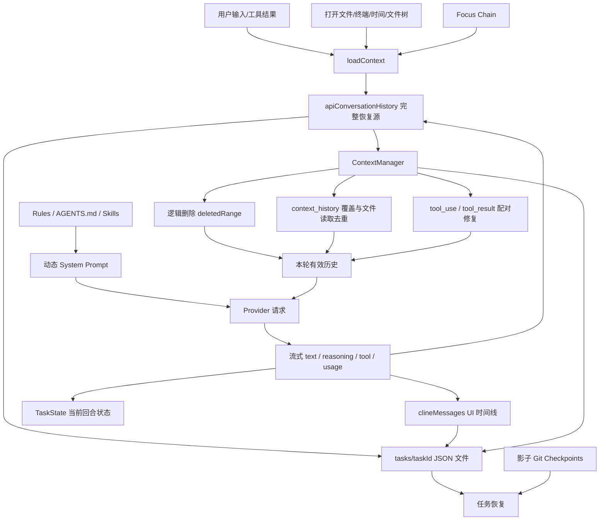
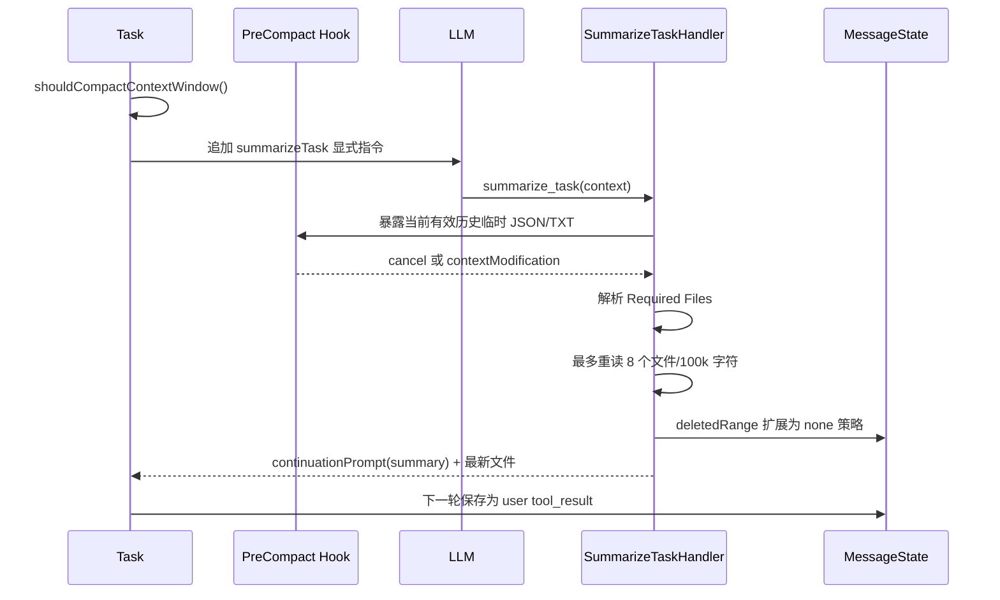

# coderX 智能体记忆管理机制：源码级分析

> 分析范围：`apps/vscode` 在 2026-07-17 的当前工作区源码。重点检查了 `src/core/task`、`src/core/context`、`src/core/storage`、`src/core/history`、`src/core/hooks`、`src/integrations/checkpoints`、规则/技能系统和子智能体实现。
>
> 本文中的“记忆”指：能够影响智能体后续推理、能够在进程重启后恢复，或者能够把任务状态带到未来回合/新任务的客户端状态。它不等于模型参数，也不等于 Provider 的 Prompt Cache。

## 1. 核心结论

当前项目没有独立的“智能体记忆库”，也没有自动事实抽取、Embedding、向量数据库、相似度检索或跨任务自动召回。它采用的是一套以对话重放为中心的分层记忆机制：

1. `TaskState` 保存当前回合的易失工作状态；
2. `apiConversationHistory` 保存可重放的任务内情景记忆；
3. `clineMessages` 保存 UI 时间线，并承担索引、Token 统计、规则条件判断和检查点映射；
4. `ContextManager` 在请求前对完整历史做逻辑删除、重复文件内容替换和协议修复；
5. 自动 `summarize_task` 或手动 `condense` 用模型生成的摘要代替旧上下文；
6. Focus Chain 保存“接下来要做什么”的前瞻性任务记忆；
7. Rules、`AGENTS.md`、Skills、Workflows 保存由用户显式维护的长期语义/程序性记忆；
8. 任务目录、任务索引和影子 Git 检查点提供跨重启恢复与回滚；
9. 子智能体拥有独立、临时的内存对话，只把结果摘要回传给父智能体。

一句话概括：

> coderX 当前是“本地持久化的任务内对话记忆 + 请求前上下文整理 + 显式规则型长期记忆”，不是“会自动学习用户和项目的长期记忆系统”。

## 2. 先区分几种容易混淆的“记忆”

| 层级                  | 主要对象                                                                            | 是否影响下一轮模型 | 是否持久化       | 典型用途                                   |
| --------------------- | ----------------------------------------------------------------------------------- | ------------------ | ---------------- | ------------------------------------------ |
| 当前回合工作记忆      | `TaskState.userMessageContent`、`assistantMessageContent`、工具 ID、重试/锁状态 | 是                 | 大多否           | 聚合流、执行工具、组装下一轮 user 消息     |
| 任务内情景记忆        | `MessageStateHandler.apiConversationHistory`                                      | 是                 | 是               | 重放用户、助手、工具调用和工具结果         |
| UI/控制时间线         | `MessageStateHandler.clineMessages`                                               | 间接影响           | 是               | 聊天展示、Token 阈值、规则条件、检查点映射 |
| 上下文覆盖层          | `ContextManager.contextHistoryUpdates`                                            | 是                 | 是               | 重复文件读取去重、截断提示、恢复覆盖版本   |
| 任务计划记忆          | Focus Chain checklist                                                               | 按提醒节奏影响     | 是               | 防止长任务遗漏步骤                         |
| 文件新鲜度记忆        | `FileContextTracker`、`task_metadata.json`                                      | 间接影响           | 是               | 告诉模型哪些文件被用户改过、需要重读       |
| 显式长期记忆          | Rules、`AGENTS.md`、Skills、Workflows、Agent 配置                                 | 是                 | 是               | 项目约束、用户偏好、标准流程、专门能力     |
| 任务目录索引          | `state/taskHistory.json`                                                          | 否，默认只供 UI    | 是               | 搜索、收藏、恢复历史任务                   |
| 工作区状态记忆        | Checkpoints 影子 Git                                                                | 不直接进入 Prompt  | 是               | 回滚文件和对话到旧时点                     |
| 可选审计副本          | History Path 下的 `chat.txt`                                                      | 否                 | 是               | 外部归档、排障、审计                       |
| Provider Prompt Cache | `cacheWrites`、`cacheReads`                                                     | 只影响成本/延迟    | 由 Provider 管理 | 复用相同 Prompt 前缀的计算结果             |

最后一项尤其容易被误解：Prompt Cache 不是智能体记忆。它不会主动召回旧事实，只是在请求前缀相同时减少重复计算。

## 3. 总体架构



这套设计有两个重要原则：

- 磁盘中的完整 API 历史是“恢复源”，请求时使用的是它的变换副本；
- UI 消息和 API 消息是两套不同的数据，不应根据聊天界面直接推断模型究竟看到了什么。

## 4. 存储布局与作用域

### 4.1 任务数据仍在 VS Code 扩展全局存储中

`ensureTaskDirectoryExists(taskId)` 使用 `HostProvider.get().globalStorageFsPath`。在 VS Code 中，这个值来自 `ExtensionContext.globalStorageUri.fsPath`，所以任务记录仍受 VS Code Profile 和扩展 ID 影响：

```text
<VS Code ExtensionContext.globalStorageUri.fsPath>/
├─ tasks/
│  └─ <taskId>/
│     ├─ api_conversation_history.json
│     ├─ ui_messages.json
│     ├─ context_history.json
│     ├─ task_metadata.json
│     ├─ settings.json
│     ├─ focus_chain_taskid_<taskId>.md
│     └─ conversation_history_<ts>.{json,txt}  # PreCompact 临时文件
├─ state/
│  └─ taskHistory.json
└─ checkpoints/
   └─ <cwdHash>/.git/
```

源码 `src/hosts/vscode/vscode-to-file-migration.ts` 明确标注：任务历史、任务数据和检查点尚未迁移到共享的 `~/.coderx/data`。

### 4.2 设置、Secrets 和 Workspace State 已迁移到共享文件存储

`createStorageContext()` 管理：

```text
${CODERX_DIR:-~/.coderx}/data/
├─ globalState.json
├─ secrets.json                         # 创建时使用 0o600
└─ workspaces/<workspaceHash>/
   └─ workspaceState.json
```

`StateManager` 启动时把这些文件读入内存，后续读取默认只访问缓存；写入先更新缓存，再以 500ms debounce 批量落盘。`taskHistory` 是特例，它被路由到 VS Code 全局存储下单独的 `state/taskHistory.json`，并带文件 watcher。

### 4.3 显式长期记忆位于用户或项目目录

| 类型              | 位置示例                                                               | 作用域         |
| ----------------- | ---------------------------------------------------------------------- | -------------- |
| 全局 coderX Rules | `~/Documents/coderX/Rules`                                           | 所有项目       |
| 项目 Rules        | `<cwd>/.coderxrules`                                                 | 当前项目       |
| 外部规则          | `AGENTS.md`、`.cursorrules`、`.cursor/rules`、`.windsurfrules` | 当前项目       |
| 全局 Skills       | `~/.coderx/skills/<name>/SKILL.md`                                   | 所有项目       |
| 项目 Skills       | `.coderx/skills`、`.coderxrules/skills`                            | 当前项目       |
| 全局 Workflows    | `~/Documents/coderX/Workflows`                                       | 所有项目       |
| 项目 Workflows    | `.coderxrules/workflows`                                             | 当前项目       |
| 自定义子智能体    | `~/Documents/coderX/Agents/*.yaml`                                   | 所有项目可发现 |

这些内容是用户维护的“外部脑”，不是运行过程中自动学习生成的记忆。

## 5. 一次任务如何形成记忆

### 5.1 新任务初始化

`Controller.initTask()` 用 `Date.now().toString()` 创建新 `taskId`，构造 `Task`、`TaskState`、`MessageStateHandler`、`ContextManager`、各种 Context Tracker 和可选 Checkpoint Manager。

`Task.startTask()` 随后执行：

1. 清空内存中的 `clineMessages` 与 `apiConversationHistory`；
2. 通过 `say("task")` 将原始任务放入 UI 时间线；
3. 构造 `<task>...</task>` API user block；
4. 把图片变成 base64 image block，把普通附件提取为文本；
5. 运行 `TaskStart` 和 `UserPromptSubmit` Hook，允许 Hook 追加 `<hook_context>`；
6. 记录环境元数据；
7. 进入递归智能体循环。

注意：UI 中的初始消息和 API 中的初始消息内容并不完全相同。API 版本已经包含 XML 包装、附件提取、Hook 注入和后续环境信息。

### 5.2 每轮请求前追加 user 情景

`Task.recursivelyMakeClineRequests()` 会把当前轮的 `userContent` 加工为：

- 用户反馈或工具结果；
- `@file`、URL、Git、Problems 等 mentions 的展开内容；
- Slash Command/Workflow 展开的指令；
- 当前可见文件、Open Tabs、终端新增输出；
- 最近被外部修改的文件；
- 当前时间和时区；
- 首轮文件树、Workspace 配置、可用 CLI；
- 按节奏注入的 Focus Chain 提醒。

这些内容随后作为新的 `role: "user"` 消息追加到 `apiConversationHistory` 并立即写盘。

因此，项目的工作区感知并不是“模型记住了 IDE 状态”，而是客户端每轮重新采集并写入用户消息。

### 5.3 助手响应如何入记忆

流结束后，`Task` 将 Provider 返回内容规范化为一个 assistant 消息。典型顺序是：

```text
redacted_thinking* -> thinking? -> text? -> tool_use*
```

消息还可能带有：

- Provider response/request id；
- `modelInfo`；
- 输入/输出/缓存 Token；
- 成本；
- 时间戳；
- reasoning summary、signature 或加密/脱敏 block。

`modelInfo`、`metrics`、`ts` 等是 coderX 的本地元数据，发送给 Provider 前会被转换器清理。Provider 没有返回的隐藏思考、内部草稿或采样过程永远不会进入本地记忆。

### 5.4 工具调用和工具结果的记忆时序

assistant 的 `tool_use` 先写入 API 历史，工具结果先放在 `TaskState.userMessageContent`，下一次递归请求时才作为 user `tool_result` 写入历史：

```text
assistant: text + tool_use(id=A)
user:      tool_result(tool_use_id=A) + 新环境信息
assistant: 后续推理
```

这个结构与 Anthropic 风格的 user/assistant 交替协议兼容，也由各 Provider transform 转换为 OpenAI、Gemini、Responses 等目标格式。

风险是：如果进程恰好在工具执行后、下一轮 user 消息写入前崩溃，磁盘上可能只有 assistant tool call，没有真实 tool result。`ContextManager.ensureToolResultsFollowToolUse()` 会在请求副本中补一个 `result missing`，但它不能恢复真实结果。

## 6. 两套对话历史为什么要分开

### 6.1 `apiConversationHistory`：模型的情景记忆

类型为 `ClineStorageMessage[]`，文件是 `api_conversation_history.json`。它保存：

- 用户任务、反馈和附件上下文；
- 动态环境详情；
- assistant 文本与可回传 reasoning；
- `tool_use` 和 `tool_result`；
- continuation summary；
- 本地模型、Token、成本和时间元数据。

这是恢复智能体循环和构造下一次模型请求的主要来源。

### 6.2 `clineMessages`：界面与控制记忆

类型为 `ClineMessage[]`，文件是 `ui_messages.json`。它包含许多不应直接发送给模型的状态：

- `api_req_started` 请求卡片；
- Ask/Approve/Reject UI；
- 命令、浏览器、MCP、Hook 状态；
- partial/final 展示消息；
- checkpoint hash；
- `conversationHistoryIndex`；
- Token/cost 数据；
- Subagent 状态。

虽然它不是主要 Prompt 历史，但会间接影响模型：

1. `ContextManager` 从上一个 `api_req_started` 读取 Token 使用量；
2. `RuleContextBuilder` 从用户 UI 消息、工具请求和工具结果中提取路径，决定条件规则是否激活；
3. 检查点通过 `conversationHistoryIndex` 把 UI 时点映射回 API 历史；
4. `HistoryItem` 的标题、成本、模型和删除范围由 UI/API 两套状态共同计算。

### 6.3 消息级索引如何支持回滚

每次新增 `ClineMessage` 时，`MessageStateHandler.addToClineMessages()` 写入：

```ts
message.conversationHistoryIndex = this.apiConversationHistory.length - 1
message.conversationHistoryDeletedRange = this.taskState.conversationHistoryDeletedRange
```

检查点恢复时，以 `(conversationHistoryIndex || 0) + 2` 为 slice 终点，恢复到对应 user/assistant 边界，同时恢复当时的 deleted range。这是 UI 记忆与模型记忆之间的关键连接。

## 7. 上下文容量与“遗忘”策略

项目不会把完整任务历史原样无限发送给模型，而是分三步节省 Context。

### 7.1 第一步：重复文件读取去重

`ContextManager` 扫描 `read_file`、`write_to_file`、`replace_in_file` 和 `<file_content>`，按文件路径识别重复内容：

- 保留同一文件最新一次内容；
- 将较旧的内容替换为 `duplicateFileReadNotice()`；
- 替换记录写入 `context_history.json`；
- 原始 `apiConversationHistory` 不被直接修改；
- 如果去重估算能节省至少约 30% 字符，可能暂不做大范围截断。

这是一种针对编码智能体非常实用的领域压缩，因为文件全文通常是上下文中最大的重复项。

此外，`TaskState.fileReadCache` 记录 `{readCount, mtime, imageBlock}`：

- 不缓存文本正文，命中时仍从磁盘重读；
- mtime 改变则淘汰；
- 第三次及以后重复读取会向模型发出强提醒；
- 写文件会删除对应项，执行任意命令后会清空整个 cache。

这部分是易失的“行为记忆”，主要用于抑制智能体循环读取同一文件。

### 7.2 第二步：程序式逻辑截断

`ContextManager.getNextTruncationRange()` 使用一个连续区间 `[start, end]` 表示被逻辑删除的消息：

- 固定从 index 2 开始；
- 保留交替协议结构；
- 每次删除偶数个 user/assistant 消息；
- 支持 `half`、`quarter`、`none`、`lastTwo`；
- 连续多次截断时扩大同一个 prefix deleted range。

请求时实际发送：

```text
messages[0..1] + messages[deletedRange.end + 1 .. latest]
```

但“保留首个 pair”主要是结构意义上的保留。第一次标准截断会通过 `context_history.json`：

- 把首个 user 的第一个文本块替换为 `[Continue assisting the user!]`；
- 把首个 assistant 的第一个文本块替换为“部分历史已删除”的提示。

因此原始任务和首轮回答的主要正文实际上也可能不再进入模型。源码提示语却写着“initial user task has been retained”，与实际替换行为存在语义不一致，这是当前实现中明显的信息质量问题。

### 7.3 有效上下文上限

`getContextWindowInfo()` 不等窗口真正满了才截断，而是预留输出、工具和系统提示空间：

| 模型声明窗口 | `maxAllowedSize`                                |
| ------------ | ------------------------------------------------- |
| 64k          | 37k，即 `64k - 27k`                             |
| 128k         | 98k，即 `128k - 30k`                            |
| 200k         | 160k，即 `200k - 40k`                           |
| 其他         | `max(contextWindow - 40k, contextWindow * 0.8)` |

上下文判断主要使用上一请求报告的：

```text
tokensIn + tokensOut + cacheWrites + cacheReads
```

关闭自动摘要时：

- 达到 `maxAllowedSize` 通常删除剩余历史的一半；
- 如果 `totalTokens / 2` 仍大于新模型允许值，则只保留约四分之一尾部；
- 这主要处理从 200k 模型切到 64k/128k 模型的情况。

这不是精确的本轮预计算：它依赖上一轮 Provider usage，且系统提示、工具 schema、用户本轮新增内容可能已经变化。

### 7.4 第三步：模型生成摘要

只有同时满足以下条件，主任务才自动走 `summarize_task`：

- `useAutoCondense` 开启；
- 当前模型属于 `isNextGenModelFamily()`；
- 上一请求 Token 达到阈值；
- 当前有效消息不至于变成“摘要的摘要”；
- 重复文件去重仍不足以腾出空间。

执行流程：



摘要 Prompt 要求覆盖用户意图、技术概念、文件、问题、待办、任务演化、当前工作、下一步和 Required Files。`SummarizeTaskHandler` 还会：

- 最多解析 10 个 Required Files 候选；
- 最多真正加载 8 个；
- 总文件字符上限 100,000；
- 遵守 `.coderxignore`；
- 只有自动批准的路径才读取；
- 把 PreCompact Hook 返回的 context modification 附在 continuation 后。

摘要完成后，旧消息并没有从 `api_conversation_history.json` 物理删除，而是被 `conversationHistoryDeletedRange` 屏蔽；模型主要依赖新的 continuation summary 继续工作。

### 7.5 手动 Condense 与错误兜底

- `/compact`、`/smol` 触发 `CondenseHandler`，先向用户展示摘要；用户接受后按 `none` 或 `lastTwo` 更新 deleted range；
- Provider 返回 Context Window Exceeded 时，代码执行更激进的 `quarter` 截断并自动重试一次；
- 再次失败且仍有足够消息时，要求用户手动 Retry；
- `PreCompact` Hook 可以取消压缩；Hook 失败通常降级为继续压缩。

有一个实现不一致：

- `SummarizeTaskHandler` 会消费并追加 `PreCompact.contextModification`；
- `handleContextWindowExceededError()` 的标准截断分支只等待 Hook，未使用返回的 `contextModification`；
- 常规的旧式阈值截断发生在 `ContextManager.getNewContextMessagesAndMetadata()` 内，也没有执行 PreCompact Hook。

因此 PreCompact 扩展点并没有覆盖所有压缩路径。

### 7.6 工具协议修复

截断可能切掉 `tool_use`，留下孤立的 `tool_result`。请求前代码会：

- 删除截断边界后的孤立 tool results；
- 按 tool use id 重排 results；
- 对缺失 result 插入 `result missing`；
- 确保 tool result 位于对应 assistant tool use 后的 user 消息中。

这提高了 Provider 兼容性，但插入的 `result missing` 是修复值，不是真实历史。

## 8. `context_history.json`：可逆的上下文覆盖层

`ContextManager.contextHistoryUpdates` 的核心结构是：

```text
Map<messageIndex,
    [EditType,
     Map<blockIndex,
         Array<[timestamp, updateType, replacementContent, metadata]>>]>>
```

它不是另一份聊天记录，而是针对 API 历史的版本化 overlay。请求时：

1. 先选首个 pair 和 deleted range 之后的尾部；
2. 根据原 API message index 找到对应覆盖；
3. 对每个 block 应用最新一条更新；
4. 深拷贝被修改的消息，尽量不破坏原数组；
5. 修复工具配对后返回 Provider 请求副本。

每条更新带时间戳，是为了检查点恢复时执行 `truncateContextHistory(message.ts)`，删除目标时点之后的覆盖版本。

这个设计的价值是：Prompt 中可以“忘记”大文本，但磁盘恢复源仍保留原内容；代价是 API 历史 index 成为强耦合主键，任何中间插入、删除、跨文件不同步都会使覆盖映射更难维护。

## 9. Focus Chain：任务进度型记忆

Focus Chain 不是历史摘要，而是“尚未完成什么”的计划记忆。

启用后：

- checklist 保存在 `focus_chain_taskid_<taskId>.md`；
- 模型通过工具参数 `task_progress` 更新；
- 用户可以直接编辑 Markdown；
- chokidar 监听 add/change/unlink；
- 进度按 `remindClineInterval`、模式切换、用户修改等条件重新注入 user context；
- `TaskState.currentFocusChainChecklist` 保存当前进程内副本。

优点是计划不必完全依赖长对话，自动摘要时也要求携带 checklist。当前实现仍有一个恢复缺口：

- watcher 使用 `ignoreInitial: true`；
- 构造 FocusChainManager 时不主动读取现有文件；
- 只有文件之后发生变化，或某个工具完成并调用 `updateFCListFromToolResponse()`，才会从磁盘读取；
- 因此恢复任务后的第一次请求可能尚未包含磁盘中已有的 checklist。

这是“文件已持久化，但内存恢复不及时”的典型问题。

## 10. Rules、Skills 和 Workflows：显式长期记忆

### 10.1 Rules 是每轮重注入的语义记忆

`Task.attemptApiRequest()` 每次请求都会重新扫描和组装：

- 全局 coderX Rules；
- 项目 `.coderxrules`；
- Cursor/Windsurf Rules；
- 递归发现的 `AGENTS.md`；
- 首选语言和 `.coderxignore` 指令。

它们进入 System Prompt 的 `USER'S CUSTOM INSTRUCTIONS` 区段，而不是写入 API 对话历史。

项目 Rules 支持 YAML frontmatter 条件。`RuleContextBuilder` 从以下来源提取最多 100 个路径候选：

- 最近一条用户 task/user_feedback；
- Visible/Open Tabs；
- 已完成文件工具的 UI 消息；
- 尚未执行的工具请求；
- `apply_patch` 的文件头。

然后根据 `paths` 等条件决定是否激活规则。这个机制比“所有规则无条件塞入 Prompt”更节省，但仍是路径启发式，不是语义检索。

### 10.2 Skills 是按需加载的程序性记忆

系统提示初始只放 skill 的 `name + description`。模型判断匹配后调用 `use_skill`，才读取完整 `SKILL.md` 并把内容作为 tool result 带入当前任务。

这是一种良好的 Progressive Disclosure：

- 减少基础 System Prompt；
- 只加载与任务相关的流程；
- 项目和全局可分别开关；
- 同名时当前实现是全局 skill 覆盖项目 skill。

它仍依赖模型正确选择 skill，没有确定性路由器、Embedding 检索或使用效果反馈学习。

### 10.3 Workflows 和 Agent 配置

Workflows 通过 Slash Command 显式展开；自定义 Agent YAML 定义子智能体名称、描述、模型、工具、Skills 和 System Prompt，并由 watcher 更新内存 cache。

它们属于“用户定义的程序性记忆/角色模板”，不会从任务成功或失败中自动演化。

## 11. 跨任务记忆的真实边界

### 11.1 `taskHistory.json` 只是目录，不会自动召回

`HistoryItem` 主要保存：

- `id`、ULID、时间、任务标题；
- Token、缓存 Token、成本、目录大小；
- 初始化 cwd；
- deleted range；
- 收藏状态、模型 ID、checkpoint 错误。

历史页面可以按标题搜索、Workspace 过滤、收藏、成本或 Token 排序。但代码没有在新任务开始时搜索旧任务并把相关内容放入 Prompt。

所以“历史里存在一个相似任务”不代表智能体知道它。用户必须打开并恢复旧任务，或手动把旧内容带入新任务。

### 11.2 `new_task` 是显式的跨任务摘要传递

当用户请求新任务时，模型被要求生成详细 context；用户确认后，Webview 使用这个 context 调用 `TaskServiceClient.newTask()`。新任务把摘要当作新的初始任务文本。

这提供了受用户控制的任务切分，但存在两次有损转换：

1. 旧任务由模型总结为文本；
2. 新任务把该文本当作普通用户请求，而不是结构化、带来源的 memory item。

### 11.3 没有用户画像或自动偏好学习

项目不会从多次对话自动推断并保存“用户喜欢 pnpm”“偏好简洁回复”“项目使用某架构”等事实。长期保存这些信息的推荐现有方式是由用户显式创建 Rules 或 Skills。

这降低了隐私和错误学习风险，但个性化程度有限。

## 12. 子智能体的记忆隔离

`SubagentRunner.run()` 每次创建新的：

- `TaskState`；
- `ContextManager`；
- `conversation: ClineStorageMessage[]`；
- Token/Context 统计。

初始 conversation 只包含调用方提供的 subagent prompt 和 Workspace Metadata，不复制父任务完整历史。子智能体内部循环会保存自己的 assistant/tool/result 消息，但只存在内存中。

完成时：

- `attempt_completion.result` 返回给父工具；
- UI 的 subagent status item 可以保存完整 result；
- 真正进入父智能体 API tool result 的汇总，对每个子任务只保留最多 1,200 字符的 `excerpt()`；
- reasoning 内容不会回传父历史；
- 子智能体对话不写入独立任务目录。

优点是并行探索不会污染父上下文，且天然隔离；缺点是深层证据可能在 1,200 字符摘要边界丢失，失败后也没有可恢复的子会话。

子智能体也会按 Context Window 做文件去重和 `quarter` 截断，但不会使用主任务的持久化 `context_history.json`，压缩状态随 runner 结束消失。

## 13. 任务恢复与检查点

### 13.1 普通 Resume

`resumeTaskFromHistory()` 会：

1. 读取 `ui_messages.json`；
2. 删除重复 resume 尾巴和无 usage/cancelReason 的空请求卡片；
3. 读取 `api_conversation_history.json`；
4. 初始化 `context_history.json`；
5. 从 `HistoryItem` 恢复 `conversationHistoryDeletedRange`；
6. 询问用户是否继续；
7. 把恢复反馈或 Hook context 合并到下一条 user 消息；
8. 重新进入智能体循环。

这使“关闭 VS Code 后继续同一任务”成为现有记忆系统最可靠的能力。

### 13.2 Checkpoint 是工作区记忆，不只是聊天记忆

`CheckpointTracker` 为每个 Workspace 创建独立影子 Git：

```text
globalStorage/checkpoints/<cwdHash>/.git
```

它用 `core.worktree` 指向真实 Workspace，通过 commit 记录文件状态，不干扰用户原有 Git 仓库。Checkpoint 支持：

- `task`：只回滚对话；
- `workspace`：只回滚文件；
- `taskAndWorkspace`：两者一起回滚。

回滚对话时：

- 恢复目标消息记录的 deleted range；
- slice API 历史；
- 按时间戳回滚 context overlay；
- slice UI 历史；
- 把被删除请求的 Token/成本聚合为 `deleted_api_reqs`；
- 重新初始化任务。

回滚文件时使用 shadow Git `reset --hard`。Checkpoint 会排除 `.git`、`.coderxrules`、构建目录、媒体、环境文件、数据库、大型数据等，因此它不是 Workspace 的完整字节级快照。当前 `Task` 对多根 Workspace 显示“不支持 Checkpoints”的警告并不创建普通管理器，虽然代码中已有部分 `MultiRootCheckpointManager` 基础设施。

## 14. `task_metadata.json` 和动态环境记忆

`task_metadata.json` 包含：

```ts
{
  files_in_context: FileMetadataEntry[],
  model_usage: ModelMetadataEntry[],
  environment_history: EnvironmentMetadataEntry[]
}
```

### 文件上下文追踪

`FileContextTracker` 记录文件来自 read、mention、coderX edit 还是 user edit，并保存读取/编辑时间。它还为已跟踪文件创建 watcher：

- coderX 自己刚编辑的变化不提示；
- 用户外部编辑会加入 `recentlyModifiedFiles`；
- 下一次 `getEnvironmentDetails()` 告诉模型文件已变，建议重读；
- 只恢复任务对话而不恢复 Workspace 时，会保存 pending stale-file warning。

### 模型和环境追踪

`ModelContextTracker` 记录模型/Provider/mode 变化，`EnvironmentContextTracker` 记录 OS、Host 和 coderX 版本变化。它们主要用于诊断和任务可移植性，不会自动作为长期知识召回给模型。

三个 tracker 都对同一 `task_metadata.json` 做 read-modify-write，写入使用普通 `fs.writeFile`，没有共享 mutex 或原子 rename。在并发更新时存在最后写入覆盖前一更新的风险。

## 15. 可选 History Path：审计副本，不是可恢复记忆

用户配置 `historyPath` 后，`ConversationHistoryRecorder` 会按项目和 session 追加 JSONL：

```text
<historyPath>/<projectName>/<taskId>/
├─ chat.txt
└─ attachments/
```

它记录：

- 原始用户消息及复制的附件；
- API conversation message；
- 实际发送给模型的完整 `systemPrompt + messages + tools`；
- 模型配置、请求序号；
- assistant raw response text。

写入通过进程级 `historyWriteChain` 串行化。另一个“Backup History”操作只把 `taskHistory` 索引导出为带时间戳的 `-chat.txt`，并校验 session 数和 ID。

当前源码没有读取这些外部 `chat.txt` 来恢复任务或检索旧知识的路径。因此它们是审计/备份输出，不是智能体的主动记忆来源。

## 16. 一致性、原子性与故障恢复

### 16.1 做得较好的部分

- `api_conversation_history.json` 使用临时文件 + rename；
- `ui_messages.json` 使用临时文件 + rename；
- `taskHistory.json` 使用临时文件 + rename；
- `MessageStateHandler` 用 `p-mutex` 串行化同一实例中的数组修改；
- `ConversationHistoryRecorder` 用全局 Promise chain 保持 JSONL 顺序；
- `taskHistory.json` 损坏时有从任务目录重建的路径；
- Checkpoint overlay 带时间戳，可跟随对话回滚。

### 16.2 仍然存在的边界

1. API 历史、UI 历史、taskHistory、contextHistory 和 metadata 不是同一个事务；
2. 进程可能在 user API 已写、UI 尚未写，或 assistant 已写、tool result 尚未写时退出；
3. `saveApiConversationHistory()` 和 `saveClineMessages()` 捕获错误后只记录日志，任务继续运行，用户可能不知道记忆没有落盘；
4. `saveApiConversationHistory()` 只有数组非空才写文件；如果某条路径需要把已有历史明确覆盖为空数组，内存会变空，但旧磁盘文件可能继续存在；
5. `context_history.json`、`task_metadata.json`、Focus Chain 和任务 `settings.json` 使用普通写入；
6. mutex 只保护一个 `MessageStateHandler` 实例，不保护多个 VS Code 窗口或外部进程；
7. `StateManager` 大多数状态只在初始化时读盘，只有 task history 有专门 watcher；
8. `conversationHistoryDeletedRange` 依赖稳定数组 index，跨文件不同步或错误插入会放大恢复难度；
9. 逻辑截断不缩小 `apiConversationHistory`，长任务的进程内数组和 JSON 文件仍持续增长。

## 17. 当前明确没有的能力

阅读源码后，可以明确排除以下能力：

- 没有基于 Embedding 的对话或代码语义检索；
- 没有 Vector DB、知识图谱或 RAG memory store；
- 没有从对话自动抽取事实、偏好、决策并去重合并；
- 没有跨任务自动召回；
- 没有 memory item 的 confidence、provenance、TTL 或版本冲突处理；
- 没有自动遗忘/删除磁盘中的旧任务正文；
- 没有把成功/失败经验训练回模型或规则；
- 没有恢复 Provider 未返回的隐藏思考；
- 没有自动读取 History Path 审计日志继续任务；
- 没有持久化子智能体内部会话。

## 18. 优点分析

### 18.1 架构简单且 Provider 无关

统一使用扩展后的 Anthropic 消息形态作为本地恢复源，各 Provider 只在边界转换。记忆管理不必绑定某个模型厂商的 thread/session API，切换模型后仍能继续任务。

### 18.2 恢复源与 Prompt 工作集分离

完整历史留在 API 数组，`ContextManager` 对请求副本逻辑删除和覆盖。相比直接破坏原数组，这更利于 Resume、Checkpoint 和排障。

### 18.3 对编码场景有针对性的压缩

重复文件全文通常占据大量 Token。保留最新文件读取、替换旧读取，比通用摘要更确定，也不容易丢失最近代码状态。

### 18.4 多级降级策略

项目不是只依赖一种压缩：

```text
重复文件去重 -> half/quarter 截断 -> 自动 summary -> Context Error 激进重试
```

即使 Hook 或摘要失败，任务通常还能退回程序式截断。

### 18.5 工具协议完整性处理较细

截断后主动删除孤儿 result、补缺失 result、重排配对，显著降低 Anthropic/OpenAI 等 Provider 因工具消息不合法而拒绝请求的概率。

### 18.6 用户对长期记忆有明确控制权

Rules、Skills、Workflows、Focus Chain 都是可见 Markdown/YAML；用户可以编辑、禁用、版本控制，不会在后台悄悄形成不可解释的用户画像。

### 18.7 本地优先且可回滚

任务正文和检查点默认保存在本机。对话回滚和 Workspace 回滚可以组合，适合代码智能体需要同时恢复“说到哪里”和“文件改到哪里”的场景。

### 18.8 子智能体上下文隔离

子智能体不复制父对话，能降低并行探索对父 Context 的污染，也减少无关历史带来的注意力干扰和成本。

### 18.9 可观测性较强

UI 记录请求 Token/成本、模型、检查点、Hook 和子智能体状态；可选 History Path 还能记录实际请求快照，便于定位“模型为什么没看到某内容”。

## 19. 缺点与风险分析

### 19.1 不是完整的长期记忆系统

最大的能力缺口是：新任务不能自动利用历史任务。任务再多也只是历史列表，无法回答“以前在这个项目里为什么选择该方案”这类跨会话问题，除非信息已被用户写进 Rules/Skills，或用户手动恢复/搬运旧任务。

### 19.2 逻辑遗忘不等于物理释放

`conversationHistoryDeletedRange` 只影响发送给模型的切片：

- 内存数组继续增长；
- `api_conversation_history.json` 继续增长；
- 图片 base64 和旧工具大结果仍占磁盘；
- 每次保存都重写整个 JSON；
- 长任务的序列化、目录大小计算和恢复成本会越来越高。

它解决的是模型 Context 上限，不是客户端内存、I/O 和存储上限。

### 19.3 标准截断非常有损

旧式截断没有语义选择：它按位置删除一半或四分之三。关键架构决策、用户纠正、失败原因可能与闲聊一起消失；首个 user/assistant 正文又会被通用提示覆盖。模型只能依赖尾部消息猜测缺失内容。

### 19.4 模型摘要有幻觉和遗漏风险

`summarize_task` 虽然 Prompt 很详细，但摘要仍由当前模型生成：

- 没有与原消息逐项对账；
- 没有 source message id 或引用；
- 没有事实/决策/待办的独立 schema；
- 没有 confidence；
- 没有自动验证 Required Files 是否真的足够；
- 多次摘要后可能积累误差。

一旦旧范围被屏蔽，遗漏事实很难在当前 Prompt 中自行恢复。

### 19.5 Token 阈值是滞后启发式

使用上一请求 usage 判断下一请求是否超限，会受到以下变化影响：

- 本轮新增大文件或终端输出；
- System Prompt/Rules/Skills 改变；
- MCP tools schema 改变；
- Provider 对缓存 Token 的统计口径不同；
- 用户切换模型；
- 某些 Provider 不返回完整 usage。

所以仍需要 Context Window Exceeded 错误兜底。

### 19.6 显式长期记忆可能造成 Prompt 膨胀和冲突

Rules 每轮重新读入并拼接；多个规则源可能重复或冲突。当前代码主要规定拼接顺序，没有统一的优先级冲突解析、Token 预算、内容哈希快照或规则效果评估。

Skills 使用 lazy load 改善了这一点，但 skill 选择仍由模型完成，同名规则中“全局覆盖项目”的策略也可能不符合一般人对项目局部覆盖全局的预期。

### 19.7 动态环境既重复又可能过时

每轮环境详情写入 API 历史，旧的 Open Tabs、时间、终端输出和文件树仍可能留在较早消息中；新消息虽然更新状态，但模型同时看到多个时间切片时可能混淆。

文件 watcher 能提示外部修改，却不会自动替换所有旧文件正文。模型是否重读仍取决于其行为。

### 19.8 子智能体信息回传有损

每个子智能体只向父 Prompt 返回最多 1,200 字符结果，内部证据和完整工具轨迹不持久化。对于复杂分析，父智能体可能只得到结论而缺少验证依据。

### 19.9 持久化不是端到端事务

原子 rename 只能保证单文件不会写半截，不能保证多个文件处于同一逻辑时点。UI/API/context/task index 的短暂不一致，会在崩溃、并发窗口或磁盘错误时表现为恢复缺消息、覆盖错位或历史项消失。

### 19.10 Focus Chain 恢复不够及时

Checklist 文件虽然存在，Resume 首轮却可能没有读入。这会削弱 Focus Chain 最重要的价值：在中断后立即告诉模型剩余任务。

### 19.11 审计副本与运行记忆割裂

History Path 记录了更完整的实际请求，但运行时完全不读取。出现主任务 JSON 损坏时，系统不能自动从审计 JSONL 恢复；备份功能导出的又主要是 HistoryItem 索引，不是完整会话恢复包。

### 19.12 隐私与生命周期控制不足

- 任务 JSON 默认是明文；
- 图片可能以内嵌 base64 长期存在；
- 工具结果可能包含源码、终端输出和环境信息；
- History Path 还会保存完整 System Prompt、Tools 和 raw response；
- PreCompact Hook 可读取当前有效对话的临时 JSON/TXT；
- 没有统一 TTL、自动清理、字段级脱敏或任务级加密；
- 任务文件不像 `secrets.json` 那样显式设置 `0o600`。

“本地优先”降低了默认云同步风险，但不等于具备完整的数据保护机制。有效 Context 仍会发送给用户选择的模型 Provider，Hook/MCP 也可能按配置访问外部系统。

### 19.13 恢复与测试仍有细节缺口

`reconstructTaskHistory()` 可以从任务目录重建索引，但它从 `say === "text"` 查找首条任务描述，而正常新任务使用 `say === "task"`，可能把重建标题降级为 `Untitled Task`。当前测试覆盖了 ContextManager、历史记录器和部分组件，但跨文件崩溃一致性、完整 Resume + Condense + Checkpoint 组合仍缺少端到端事务验证。

## 20. 改进建议

### 20.1 P0：先解决正确性和可恢复性

1. **引入统一事件序号。**为 user、assistant、tool、UI、context update 分配单调递增 `eventSeq`，不要只靠数组 index 和毫秒时间戳关联。
2. **建立跨文件提交清单。**每轮先写各临时文件，再原子发布一个 manifest；或者直接使用 SQLite/WAL，把消息、覆盖、指标和任务索引放入事务。
3. **区分持久化失败与任务失败。**保存失败应在 UI 明确提示“当前会话可能无法恢复”，并提供重试，而不是只写 Logger。
4. **Resume 时立即加载 Focus Chain。**在 `setupFocusChainFileWatcher()` 前主动 `readFocusChainFromDisk()`，不要等待下一次工具调用。
5. **串行化 `task_metadata.json` 更新。**使用任务级 mutex 或字段级事务，所有写入改为原子 rename。
6. **统一 PreCompact 语义。**所有标准截断、错误截断和模型摘要都执行同一 hook pipeline，并明确 contextModification 如何进入新 Context。
7. **修正截断提示。**如果首个 task 已被替换，就不能告诉模型“initial task retained”；或者真正保留一份精简后的原始任务。

### 20.2 P1：提高记忆质量

1. **把不可变事件与 Prompt 工作集分开。**完整历史采用 append-only event log；Prompt 使用 materialized view。物理归档旧事件后，不必每次重写整个大 JSON。
2. **结构化摘要。**至少拆成：
   - 用户目标与不可变约束；
   - 已确认事实；
   - 设计决策及理由；
   - 已完成修改；
   - 未解决问题；
   - 待办；
   - 关键文件及版本/hash；
   - 每项来源 message/event id。
3. **摘要校验。**压缩前后自动检查用户要求、未完成 checklist、最近决策和错误是否仍存在；关键字段缺失则拒绝发布摘要。
4. **本轮 Token 预估。**在 Provider 调用前同时估算 System Prompt、Tools、有效历史和当前 user 内容，而不是只使用上一轮 usage。
5. **支持固定/Pin 记忆。**允许用户把某条约束、决定或文件标记为不可截断，避免位置截断误删。
6. **减少环境历史重复。**动态 IDE 状态使用可替换 snapshot block，不要每轮作为永久消息无限追加。
7. **保留子智能体产物。**完整结果写成 artifact，并给父智能体返回摘要 + artifact id/path；父智能体需要时可以继续读取，而不是固定 1,200 字符截断。

### 20.3 P2：补充真正的长期记忆，但必须可控

如果产品确实需要跨任务学习，建议新增独立的 Memory Item Store，而不是直接把所有旧对话做向量搜索：

```ts
type MemoryItem = {
  id: string
  scope: "task" | "workspace" | "global"
  kind: "fact" | "decision" | "preference" | "procedure" | "warning"
  content: string
  sourceEventIds: string[]
  confidence: number
  createdAt: number
  updatedAt: number
  validUntil?: number
  tags: string[]
  status: "active" | "superseded" | "deleted"
}
```

推荐原则：

- 仅从用户明确确认或可验证项目文件中提取；
- 每条都展示来源，可编辑、可删除、可禁用；
- Workspace memory 默认不跨项目；
- 召回先做 metadata/path/filter，再做语义排序；
- 只把少量高相关条目注入 Prompt；
- 新事实与旧事实冲突时标记 superseded，不静默覆盖；
- 敏感内容默认不进入长期 memory；
- 提供“本轮使用了哪些记忆”的可解释 UI。

### 20.4 P2：隐私与生命周期

1. 为任务记录和 History Path 提供加密选项及严格文件权限；
2. 提供按任务、Workspace、时间范围的 TTL/清理策略；
3. 保存前对环境变量、Token、密钥模式和用户配置路径做可配置脱敏；
4. PreCompact Hook 使用最小权限和明确授权，避免默认暴露全部有效历史；
5. 导出/备份中记录 schema version、完整性 hash 和包含范围；
6. 删除任务时统一清理 task、checkpoint、history archive、attachments 和未来 memory items。

## 21. 综合评价

| 维度                  | 评价           | 说明                                                |
| --------------------- | -------------- | --------------------------------------------------- |
| 任务内连续性          | 较强           | API 历史、本地写盘、Resume 和 Context overlay 完整  |
| 长任务抗 Context 溢出 | 较强           | 文件去重、程序截断、摘要、错误兜底多层结合          |
| 工作区回滚            | 较强           | 影子 Git 与对话回滚关联，但排除项多且多根支持未完成 |
| 跨任务知识复用        | 弱             | 只有手动 Rules/Skills/new_task 摘要，无自动召回     |
| 记忆准确性            | 中等           | 原文恢复源较完整，但截断和模型摘要都有损            |
| 可解释性              | 中上           | 文件和状态可见，但摘要无来源引用、规则冲突不透明    |
| 一致性与耐久性        | 中等           | 单文件原子，跨文件非事务，部分错误被吞掉            |
| 存储效率              | 偏弱           | 逻辑删除不缩小完整历史，长任务反复全量 JSON 重写    |
| 隐私治理              | 中等偏弱       | 本地优先是优点，但任务明文、无统一 TTL/脱敏/加密    |
| 子智能体记忆          | 隔离好、保真弱 | 不污染父任务，但只回传截断摘要且不可恢复            |

最终判断：现有机制非常适合“在一个编码任务内持续工作、Context 满后继续、关闭 VS Code 后恢复、必要时回滚文件”；不适合“自动记住用户长期偏好、跨会话复用项目决策、对历史做语义召回、提供审计级完整事件回放”。

## 22. 关键源码索引

| 文件                                                               | 记忆职责                                                   |
| ------------------------------------------------------------------ | ---------------------------------------------------------- |
| `src/core/task/index.ts`                                         | 新建/恢复任务、每轮 Context 组装、请求、响应入库、自动压缩 |
| `src/core/task/TaskState.ts`                                     | 当前回合工作记忆、工具缓冲、重复读取和循环检测             |
| `src/core/task/message-state.ts`                                 | API/UI 两套历史、mutex、写盘、HistoryItem 更新             |
| `src/core/context/context-management/ContextManager.ts`          | deleted range、overlay、文件读取去重、工具配对、阈值判断   |
| `src/core/context/context-management/context-window-utils.ts`    | Context Window 有效上限                                    |
| `src/core/task/tools/handlers/SummarizeTaskHandler.ts`           | 自动摘要、Required Files、continuation                     |
| `src/core/task/tools/handlers/CondenseHandler.ts`                | 用户确认的手动压缩                                         |
| `src/core/prompts/contextManagement.ts`                          | 摘要 Prompt 与 continuation Prompt                         |
| `src/core/hooks/precompact-executor.ts`                          | 压缩前临时历史快照、Hook 取消/上下文修改                   |
| `src/core/task/focus-chain/*`                                    | Checklist 持久化、Watcher、提醒注入                        |
| `src/core/context/context-tracking/*`                            | 文件新鲜度、模型和环境元数据                               |
| `src/core/context/instructions/user-instructions/*`              | Rules、外部规则、Skills、Workflows                         |
| `src/core/prompts/system-prompt/components/user_instructions.ts` | 长期规则进入 System Prompt 的顺序                          |
| `src/core/task/tools/subagent/SubagentRunner.ts`                 | 子智能体独立内存历史和上下文裁剪                           |
| `src/core/task/tools/handlers/SubagentToolHandler.ts`            | 子智能体并发状态和父任务结果摘要                           |
| `src/core/storage/disk.ts`                                       | 任务文件路径、读写、原子文件、PreCompact 临时文件          |
| `src/core/storage/StateManager.ts`                               | 设置/索引内存缓存、500ms 批量持久化、task history watcher  |
| `src/shared/storage/storage-context.ts`                          | `~/.coderx/data` 文件存储布局                            |
| `src/core/history/ConversationHistoryRecorder.ts`                | 可选 History Path 请求/响应审计 JSONL                      |
| `src/core/history/ConversationHistoryBackup.ts`                  | HistoryItem 索引备份与校验                                 |
| `src/integrations/checkpoints/index.ts`                          | 对话/Workspace 检查点编排与恢复                            |
| `src/integrations/checkpoints/CheckpointTracker.ts`              | 影子 Git commit/reset/diff                                 |
| `src/core/commands/reconstructTaskHistory.ts`                    | 从任务目录重建损坏的任务索引                               |

## 23. 最后总结

从源码看，coderX 把智能体记忆管理拆成了四个问题分别解决：

```text
“这一回合正在做什么”       -> TaskState
“这个任务之前发生了什么”   -> API conversation history
“有限窗口内现在该看到什么” -> ContextManager + summary
“跨重启/回滚如何继续”      -> task files + taskHistory + checkpoints
```

Rules、Skills、Workflows 和 Focus Chain 又补上了可控的长期约束与计划。这个方向务实、可解释、适合 IDE 编码智能体；但如果产品目标升级为真正的跨会话长期智能体，还需要在现有恢复层之上增加结构化、带来源、可治理、可检索的 Memory Item 层，而不能把无限增长的聊天 JSON 或模型摘要直接当作长期知识库。
