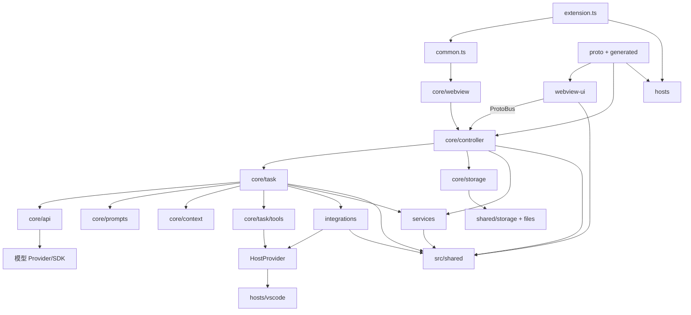
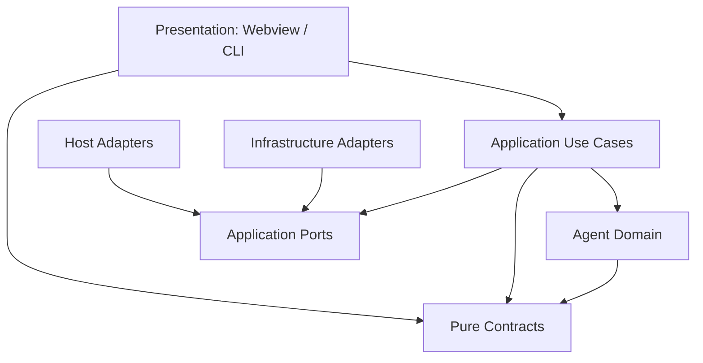

# Cline VS Code 模块功能、关联与依赖关系

> 本文把“模块”定义为具有独立职责的源码包/目录，而不是逐个文件罗列。  
> 依赖结论来自全量源码导入扫描，并结合运行时对象装配和 RPC 调用链复核。

## 1. 模块关系总图



最重要的依赖主干是：

```text
组合根
  -> WebviewProvider
  -> Controller
  -> Task
  -> API / Prompt / Context / Tools
  -> Services / Integrations
  -> HostProvider
  -> VS Code Adapter
```

`src/shared` 和 Proto 契约位于所有模块共同依赖的底部。

## 2. 依赖方向约定

### 2.1 编译时依赖

指 TypeScript `import/export`。例如 `Task` 导入 `ApiHandler`，则 `core/task -> core/api`。

### 2.2 运行时调用

有些模块通过回调、注册表、生成代码或单例调用，静态导入不能完整体现。例如：

- Webview Client 通过消息协议调用 Controller Handler；
- Controller 通过 `sendStateUpdate()` 反向推送 Webview；
- Task 通过注入回调更新 Controller State；
- HostProvider 在组合根注入，Core 运行时再取具体实现；
- Prompt Registry 和 Tool Registry 按名称选择实现。

### 2.3 数据依赖

即使没有直接函数调用，模块仍可能通过共享状态耦合：

- `StateManager` 的 Settings；
- Task Message 文件；
- MCP/Rules/Skills 配置文件；
- Proto State JSON；
- 本地模型和工具配置。

## 3. 组合根与顶层模块

| 模块 | 功能 | 直接依赖 | 被谁使用 |
| --- | --- | --- | --- |
| `src/extension.ts` | VS Code 激活、命令注册、URI、迁移、Host 装配 | `common`、Controller UI Events、VS Code Hosts、Services、Storage | VS Code Extension Host |
| `src/common.ts` | 插件公共初始化和销毁 | HostProvider、StateManager、Webview、MCP、Workspace | VS Code 组合根 |
| `src/registry.ts` | Extension ID、命令 ID、View ID、Host 信息 | `package.json`、HostProvider | Extension、Hosts、请求 Headers |
| `src/config.ts` | production/staging/local/selfHosted Endpoint | Shared Config、文件系统 | MCP、模型专属认证、Providers |
| `src/exports` | 对其他 VS Code 扩展暴露 Cline API | Controller/Task | `activate()` 返回值、第三方扩展 |

### 3.1 组合关系

VS Code：

```text
extension.activate
  -> setupHostProvider(VS Code implementations)
  -> createStorageContext
  -> common.initialize
  -> VscodeWebviewProvider
  -> Controller
```

当前只有上述 VS Code 组合链，不存在第二个 Core Server 入口。

## 4. `src/core` 模块

## 4.1 `core/controller`

### 功能

- 应用服务和 RPC 用例入口；
- 持有当前 Task；
- 管理当前 Task、MCP、Workspace、模型设置和模型专属认证；
- 组装 Extension State；
- 按 Account、Browser、Checkpoints、File、MCP、Models、State、Task、UI、Web、Worktree 等领域拆 Handler。

### 依赖

强依赖：

- `src/shared`：Proto、状态、模型、消息类型；
- `core/storage`：配置和历史；
- `core/task`：当前 Agent 任务；
- `core/api`：模型 Handler 构建；
- `services/auth/oca`、`services/mcp`；
- `core/workspace`、`core/context`；
- HostProvider 和 Integrations。

### 被依赖

- WebviewProvider；
- ProtoBus/gRPC Handler 生成代码；
- 模型专属认证等需要反向推送状态的 Service；
- Extension Commands；
- Tests 和 Export API。

### 关系特征

Controller 是最高扇入和扇出模块之一，是系统应用层门面，也是主要耦合中心。

## 4.2 `core/task`

### 功能

- Agent 生命周期和多轮循环；
- 流式模型响应处理；
- Ask/Say UI 消息；
- 工具执行；
- Hooks、Context、Checkpoint、审批；
- 重试、取消、并发调度；
- 对话和 Task Message 持久化。

### 子模块

| 子模块 | 功能 |
| --- | --- |
| `TaskState.ts` | 当前 Agent 状态字段 |
| `message-state.ts` | API History 与 UI Message 的原子更新/落盘 |
| `StreamChunkCoordinator.ts` | Usage 与内容流分离 |
| `StreamResponseHandler.ts` | Reasoning/Tool 增量组装 |
| `TaskPresentationScheduler.ts` | UI 刷新合并与串行化 |
| `ToolExecutor.ts` | 工具公共执行管线 |
| `tools/handlers` | 具体工具命令 |
| `tools/subagent` | 子 Agent 构建和执行 |
| `focus-chain` | Todo/Focus Chain |

### 依赖

- `core/api`、`core/prompts`、`core/context`；
- `core/hooks`、`core/storage`、`core/workspace`；
- `services/browser`、`services/mcp`；
- `services/telemetry/index.ts` 仅为旧调用点提供无网络空门面；
- `integrations/editor`、`terminal`、`checkpoints`、`misc`、`notifications`；
- HostProvider 和 Shared Types。

### 被依赖

- Controller；
- Checkpoint Manager；
- Hooks；
- Tests。

### 关系特征

Task 是领域编排中心，依赖面最宽。它通过构造函数和 callback 接收 Controller、State、UI、Checkpoint 等能力，但仍直接创建部分 Service/Manager。

## 4.3 `core/api`

### 功能

- 定义统一 `ApiHandler`；
- 创建 Provider；
- 模型流格式转换；
- Retry、Cost、Reasoning、Tool Call 适配；
- 单次 Prompt Completion。

### 子模块

| 子模块 | 功能 |
| --- | --- |
| `providers` | 各模型供应商策略 |
| `adapters` | 通用 API/SDK 适配 |
| `transform` | Message/Stream 格式转换 |
| `utils` | Retry、参数和模型辅助 |

### 依赖

- Shared API/Message/Tool Types；
- 各模型 SDK；
- 模型专属 Auth；
- EnvUtils 和 Config；
- 少量 VS Code LM API。

### 被依赖

- Task；
- Controller Models；
- Prompt/Context；
- Commit Message Generator 等单次模型调用功能。

## 4.4 `core/prompts`

### 功能

- 系统 Prompt Registry、Builder、Template、Variants；
- 工具描述与 Tool Schema；
- Deep Planning 和 Slash Prompt Commands；
- Response 文本格式；
- Context Summarization Prompt；
- 旧模型 Prompt 兼容。

### 依赖

- Shared Tool/Prompt/Model Types；
- Context 数据；
- MCP Tool 元数据；
- Model Utils。

### 被依赖

- Task 每次模型请求；
- Context Management；
- Tool Handlers；
- Prompt Tests。

## 4.5 `core/context`

### 功能

- 上下文窗口计算、截断和总结；
- 文件、模型、环境跟踪；
- Rules、Workflows、Skills 和外部规则；
- 用户指令拼装。

### 依赖

- Storage/StateManager；
- API Model Info；
- Prompt Types；
- Controller（FileContextTracker 需要推送 UI）；
- Utils 和 Shared。

### 被依赖

- Task；
- Hooks 获取模型上下文；
- Checkpoint；
- Controller File/State Handler。

### 关系特征

`context <-> controller`、`context <-> storage` 存在双向依赖，是未来拆分时应优先处理的环。

## 4.6 `core/storage`

### 功能

- `StateManager` 内存状态与 Write-behind；
- Task 文件、历史、模型 Cache、Rules/MCP 路径；
- 旧状态迁移。

Remote Config 的联网读取和持久化已经删除；当前只剩固定空读取的兼容类型。

### 依赖

- `shared/storage`；
- Shared State Keys；
- AgentConfigLoader；
- 本地安装 ID 和状态迁移；
- Chokidar。

### 被依赖

几乎全部 Core、模型专属 Auth、MCP、Controller 和 Task。

### 关系特征

StateManager 是系统的状态基础设施，但由于 Settings 被广泛直接读取，它也形成了“共享全局状态”耦合。

## 4.7 `core/hooks`

### 功能

- Hook 发现、工厂和执行；
- 生命周期输入/输出；
- Process Registry 与取消；
- UI 状态和流式日志；
- Hook Model Context。

### 依赖

- Task MessageState；
- Storage Settings；
- Proto Hook Types；
- 子进程与文件系统。

### 被依赖

- Task 生命周期；
- ToolExecutor 前后置拦截；
- Controller File RPC；
- Common 清理。

### 关系特征

`hooks <-> task` 是明显双向关系：Task 调 Hook，Hook 又需要 Task 的 MessageState 类型和 UI 回调。

## 4.8 `core/workspace`

### 功能

- 单根/多根工作区发现；
- Root Manager；
- Primary Root；
- 路径解析和相对路径格式；
- 本地 Multi-root 开关。

### 依赖

- HostProvider Workspace Port；
- StateManager；
- Shared Multi-root Types；
- Path Utils。

### 被依赖

- Controller 初始化；
- Task 文件工具；
- Checkpoints；
- Mentions；
- Env Headers。

## 4.9 `core/assistant-message`

### 功能

解析模型文本中的 Assistant Content Block 和 XML Tool Use，输出统一 `text | tool_use` 结构。

### 依赖

主要依赖 Shared Tool Names 和纯解析逻辑。

### 被依赖

Task、Stream Handler、ToolExecutor、相关测试。

它是相对纯净、低耦合的核心模块。

## 4.10 `core/ignore`

功能：读取和监听 `.clineignore`，判断文件访问权限。依赖文件系统和 `ignore` 库，被 ToolValidator、Task 和文件搜索使用。

## 4.11 `core/permissions`

功能：Shell 命令解析、允许/拒绝决策和安全规则。被 ExecuteCommand Tool 与 Auto Approve 流程使用。

## 4.12 `core/mentions`

功能：解析 `@file`、`@folder`、`@url`、`@problems`、Git 等上下文。依赖 Workspace、File/Diagnostics、Misc Extractor，被 Task 在提交用户内容前调用。

## 4.13 `core/slash-commands`

功能：发现与解析 Slash Commands。依赖 Prompt Commands 和 Shared Slash Types，被 Controller Slash、Task 和 Chat UI 使用。

## 4.14 `core/webview`

功能：抽象 Webview 容器、HTML/CSP/HMR、创建 Controller。依赖 Controller、HostProvider、Extension Context；由 VS Code Webview Adapter 实现。

## 5. `src/services` 模块

| 模块 | 功能 | 主要依赖 | 主要调用者 |
| --- | --- | --- | --- |
| `services/auth/oca` | OCA Token、登录、刷新和认证状态 | Controller、State、Config、Host | OCA Provider、UI RPC |
| `services/mcp` | MCP 连接、OAuth、配置 Watcher、工具/资源 | StateManager、Host、MCP SDK | Controller、Task、Prompt、Tool Handlers |
| `services/browser` | Chrome 发现、会话、网页内容 | Puppeteer、State | Task、Browser/Web Controller |
| `services/telemetry/index.ts` | 旧调用点兼容空实现 | 无远程 Provider | 旧核心调用点；不采集、不联网 |
| `services/error` | 本地错误分类与序列化 | `serialize-error`、Logger | API/Task/Common |
| `services/search` | 文件模糊搜索 | Ripgrep/FZF/Shared | File RPC、Mentions UI |
| `services/ripgrep` | 获取/运行 RG | Host Binary Port | Search Tool/Service |
| `services/glob` | 文件枚举 | globby、ignore | ListFiles Tool、Task |
| `services/tree-sitter` | AST 定义提取 | WASM Parsers | ListCodeDefinition Tool |
| `services/uri` | Deep Link/OAuth 路由 | Controller/Webview/Auth | Extension URI Handler |
| `services/temp` | 临时目录和周期清理 | 文件系统 | Common 生命周期、附件处理 |
| `services/test` | Test Mode、Mock Server、Git Fixture | VS Code、Shared | Integration/E2E |
| `services/logging` | 稳定安装 ID | Storage、Machine ID | Hooks、Host Registry、Common |
| `services/EnvUtils.ts` | Cline Header 与平台信息 | HostProvider、Registry | API Providers |

### 5.1 Service 层的关系特点

Service 并不是完全独立的基础设施层：

- OCA Auth 需要 Controller 以推送模型认证状态；
- MCP 直接读取 StateManager；
- Controller 又依赖这些 Service。

原 `controller <-> Cline account/auth/banner/telemetry` 热点已删除；当前主要双向热点集中在 Controller、Task、State 和 OCA/MCP 生命周期。

## 6. `src/integrations` 模块

| 模块 | 功能 | 依赖 | 被谁使用 |
| --- | --- | --- | --- |
| `integrations/editor` | Diff 抽象、后台编辑、评论审查、遗漏检测 | Shared Proto、文件系统、Misc | Task、Tool Handlers、VS Code Host |
| `integrations/terminal` | Command Executor/Orchestrator | Shared、VS Code Terminal/Shell | Task、ExecuteCommand Handler、Hosts |
| `integrations/checkpoints` | Shadow Git、Checkpoint、Diff/Restore | Task State、MessageState、Workspace、Git | Task、Controller Checkpoints |
| `integrations/misc` | 文件/图片/文档提取、Markdown 导出、Link Preview、Notebook | Shared、文件处理库 | Task、Controller File/Web、UI |
| `integrations/notifications` | 系统通知 | Host Window、Settings | Task 审批/完成/错误 |
| `integrations/diagnostics` | VS Code Diagnostics 格式化 | Shared Proto | Mentions、Diff、Commands |
| `integrations/claude-code` | Claude Code 子进程与消息过滤 | Process/Shared | Claude Code Provider |
| `integrations/openai-codex` | OpenAI Codex OAuth | Auth/HTTP/Storage | OpenAI Codex Provider、模型认证 RPC |

### 6.1 Checkpoint 的双向关系

`Task -> CheckpointManager` 保存检查点；Checkpoint 又需要 `TaskState`、`MessageStateHandler` 和 `cancelTask` callback。静态扫描因此出现 `task <-> integrations/checkpoints`。理想边界应让 Checkpoint 依赖 Task Port，而不是具体 Task 类型。

## 7. `src/hosts` 模块

## 7.1 `hosts/host-provider.ts`

功能：宿主能力 Service Locator/Factory，定义 Webview、Diff、Comment、Terminal 和 Host Bridge 端口。

依赖：抽象 Integration Types 和生成的 Host Client Interface。

被依赖：Core、Services、Utils、Integrations、VS Code 组合根。

## 7.2 `hosts/vscode`

功能：

- Webview、Diff、Terminal、Review 的 VS Code 实现；
- Host Bridge Window/Workspace/Env/Diff Handler；
- Command Context、Commit Message；
- VS Code Storage Migration。

依赖：VS Code API、Shared Proto、Controller UI Events、Integrations。

被依赖：`extension.ts` 和生成的 Host Bridge Client/Service 配置。

## 8. `src/shared` 模块

### 功能分类

| 子区域 | 功能 |
| --- | --- |
| `shared/api.ts` | Provider、Model、Price、Context Window 配置 |
| `shared/messages` | API 对话内容和 Metrics |
| `ExtensionMessage.ts` | Extension State、Cline Ask/Say、后端到 UI 消息 |
| `WebviewMessage.ts` | UI 到 Extension 的消息 |
| `shared/proto` | 构建生成的 Proto Type |
| `proto-conversions` | 领域对象与 Proto 相互转换 |
| `shared/storage` | File Storage、Memento、StorageContext |
| `shared/remote-config` | 仅存量兼容 Schema；联网获取已删除 |
| `shared/services` | Logger、Session、配置 |
| `shared/mcp.ts` | MCP 类型 |
| `shared/tools.ts` | 内置和动态工具名 |
| 其他 Pure Utils | Array、String、Cost、Metrics、Message 合并 |

### 依赖关系

Shared 被后端、Webview、Hosts、Services、Integrations 广泛依赖，是系统稳定契约层。

但其中并非所有代码都是纯领域类型：`shared/storage`、Worker、Logger 具有基础设施行为。若未来拆包，可进一步分为：

- `contracts`：类型和 Proto；
- `domain-shared`：纯函数；
- `infrastructure-shared`：Storage/Logger/Worker。

## 9. Webview UI 模块

## 9.1 UI 根与 Context

| 模块 | 功能 | 依赖 | 被谁使用 |
| --- | --- | --- | --- |
| `main.tsx` | React Mount | App、CSS | Webview HTML |
| `App.tsx` | 页面选择和顶层导航 | Context、各 Feature View | main |
| `Providers.tsx` | Provider 组合 | Platform/State | App |
| `context/ExtensionStateContext` | 后端状态、订阅、导航、模型/MCP Cache | Proto Clients、Shared Conversions | 几乎全部 UI |
| `context/PlatformContext` | VS Code/外部平台差异配置 | Platform Config | Components/Proto Client |
| `services/grpc-client-base.ts` | Unary/Streaming ProtoBus Client | Platform Config、UUID | 生成的 Service Clients |

## 9.2 UI Feature 模块

| 模块 | 功能 | 主要依赖 |
| --- | --- | --- |
| `components/chat` | Chat、消息、工具、输入、Task Header、Auto Approve | Context、Shared、RPC、Common/UI |
| `components/settings` | Provider 和功能设置 | Context、Model/State RPC、Shared API |
| `components/mcp` | MCP 配置、Marketplace、Rich Response | Context、MCP RPC、Chat/Common |
| `components/history` | 历史列表和预览 | Task RPC、Context、Shared |
| `components/onboarding` | 首次启动与模型选择 | State/Model RPC、Provider 专属认证 |
| `components/welcome` | Quick Wins | Task/State RPC、Assets |
| `components/worktrees` | Worktree CRUD/Merge | Worktree RPC、Shared |
| `components/cline-rules` | Rules/Hooks 开关和文件管理 | File RPC、Shared |
| `components/browser` | Browser 设置 | State/Browser RPC |
| `components/common` | Markdown、Code、Dialog、Checkpoint | Shared、UI Primitives、Context |
| `components/ui` | Radix/HeroUI 风格基础组件 | UI Lib/Assets |
| `hooks` | Menu 可访问性、Auto Approve | Context/RPC |
| `utils` | 格式化、Mention、Slash、平台判断 | Shared Pure Types |

### 9.3 UI 依赖热点

全量扫描中：

- Settings 大量依赖 Shared 和 ExtensionStateContext；
- Chat 大量依赖 Shared、Common、Context、RPC Services；
- MCP 和 Chat 存在双向组件引用；
- Chat 直接引用部分 Settings 组件；
- `ExtensionStateContext` 是 UI 最大共享依赖。

UI 当前按“页面功能”组织，但 Common、Chat、Settings、MCP 的边界并不完全单向。

## 10. Proto 与生成模块

| 模块 | 功能 | 依赖/生成目标 |
| --- | --- | --- |
| `proto/cline` | Webview 调用 Core 的业务协议 | 生成 Shared Type、Webview Client、VS Code Handler Map |
| `proto/host` | Core 调用 VS Code 的宿主协议 | 生成 Host Interface、VS Code Handler |
| `scripts/build-proto.mjs` | 调用 protoc/ts-proto | 生成 `src/shared/proto`、`src/generated` |
| `generate-protobus-setup.mjs` | 生成 Client/Handler Map | Webview、VS Code |
| `generate-host-bridge-client.mjs` | 生成 Host Bridge Interface/本地服务表 | HostProvider、VS Code Host |
| `generate-state-proto.mjs` | State Keys 同步 Proto | StateManager、Webview State |

### 10.1 协议依赖方向

```text
state-keys.ts / *.proto
  -> 生成 TypeScript Contracts
  -> Webview Client
  -> Controller Handler Map
  -> VS Code Host Bridge Client/Handler
```

生成文件不得作为手工修改入口。

## 11. Scripts、Testing 与 Runtime 模块

| 模块 | 功能 | 依赖 |
| --- | --- | --- |
| `scripts` | Proto、构建、发布、VSIX、测试编排 | Package/Proto/Source Tree |
| `src/test` | VS Code 集成、E2E、Mocks | Core、Hosts、VS Code Test API |
| 模块内 `__tests__` | 单元测试 | 被测模块、Sinon/Chai/Vitest |

## 12. 关键运行时关联链

## 12.1 新任务链

```text
ChatTextArea
  -> TaskServiceClient.newTask
  -> ProtoBus
  -> controller/task/newTask
  -> Controller.initTask
  -> WorkspaceRootManager + TaskLock
  -> new Task
  -> Task.startTask
  -> Hooks + Context + Prompt
  -> ApiHandler
```

## 12.2 模型流链

```text
ApiHandler.createMessage
  -> ApiStream
  -> StreamChunkCoordinator
  -> StreamResponseHandler
  -> TaskPresentationScheduler
  -> MessageStateHandler
  -> subscribeToPartialMessage / subscribeToState
  -> ExtensionStateContext
  -> Chat Renderer
```

## 12.3 工具链

```text
Assistant Tool Call
  -> ToolExecutor
  -> ToolValidator / Plan Restriction / AutoApprove
  -> PreToolUse Hook
  -> ToolExecutorCoordinator
  -> Concrete Handler
  -> Service / Integration / HostProvider
  -> PostToolUse Hook
  -> Checkpoint
  -> Tool Result
  -> 下一轮模型请求
```

## 12.4 状态链

```text
UI updateSettings RPC
  -> Controller State Handler
  -> StateManager Cache
  -> 500ms Debounced File Persistence
  -> Controller.postStateToWebview
  -> sendStateUpdate
  -> ExtensionStateContext
  -> React Render
```

## 12.5 IDE 能力链

VS Code 内嵌：

```text
Task/Integration -> HostProvider -> vscodeHostBridgeClient
  -> 本地 Host Handler -> VS Code API
```

## 13. 依赖热点与环

全量静态导入扫描中最显著的依赖集中在：

- `core/controller -> shared`；
- `core/api -> shared`；
- `core/task -> shared`；
- `core/task -> assistant-message/prompts/context`；
- `ui/settings -> shared/context`；
- `ui/chat -> shared/common/context/services`；
- `hosts/vscode -> shared`。

主要双向关系包括：

| 双向关系 | 原因 | 风险 |
| --- | --- | --- |
| Controller ↔ OCA Auth | Controller 持有模型专属 OCA Auth，认证状态又推送 Controller | 初始化顺序、测试替换困难 |
| Controller ↔ Storage | Controller 读写 State，Storage callback 推 UI | 状态层依赖应用层 |
| Controller ↔ Context | Controller 创建/使用 Tracker，Tracker 需要 Controller | Context 难独立复用 |
| Task ↔ Hooks | Task 调 Hook，Hook 依赖 MessageState/Task 类型 | 生命周期耦合 |
| Task ↔ Checkpoints | Task 保存，Checkpoint 依赖 TaskState/Callbacks | 恢复流程复杂 |
| UI Chat ↔ MCP | Chat 展示 MCP，MCP Rich Display 复用 Chat 组件 | Feature 边界模糊 |
| UI Chat ↔ Settings | Chat 内嵌 Provider/设置入口 | 重渲染和改动传播 |

这些不是必然的运行时循环错误，但会增加模块单测和重构成本。

## 14. 建议的理想依赖方向

若对项目继续改造，可以逐步收敛为：



具体措施：

1. 把 Controller RPC Handler 视为 Application Use Case；
2. 为 Auth、Checkpoint、MCP、State Projection 定义 Port；
3. Task 只依赖 Port 和纯领域类型；
4. Service 不再持有 Controller，改发布事件；
5. Shared 拆为纯 Contracts 和 Infrastructure Shared；
6. UI Feature 只能依赖 `components/ui`、`common` 和 Services，不互相深层导入；
7. 用 lint/依赖规则禁止新的逆向依赖。

## 15. 模块修改影响面

| 修改模块 | 常见连带影响 |
| --- | --- |
| `proto` | 生成文件、Webview Client、Controller Handler、HostBridge、Tests |
| `shared/state-keys.ts` | State Proto、StateManager、UI Default State、Settings |
| `core/api` | Provider Settings、Model Controller、Prompt Tool Format、Tests |
| `core/task` | Chat Message、Tool、Checkpoint、State、E2E |
| `core/prompts` | 模型输出格式、Tool Parser、Snapshot Tests |
| `core/task/tools` | Tool Spec、Prompt、Auto Approve、UI Row、Hooks |
| `services/auth/oca` | OCA Provider、认证回调和状态 UI |
| `services/mcp` | MCP UI、Tool Schema、Prompt、Remote Policy |
| `core/storage` | 所有设置、迁移、多窗口一致性、测试 |
| `hosts/vscode` | Extension Commands、真实 IDE 行为、HostBridge 实现 |
| `webview context` | 几乎全部 UI 页面和订阅生命周期 |
| `components/settings` | Provider 配置转换、Proto、State Keys |

## 16. 模块定位原则

遇到需求时可以按以下规则确定归属：

- 只涉及页面显示：`webview-ui/components/<feature>`；
- UI 要调用后端：先改 `proto/cline`，再加 `core/controller/<domain>`；
- Agent 如何思考：`core/prompts` 或 `core/context`；
- Agent 如何循环：`core/task`；
- Agent 新动作：`core/task/tools`；
- 外部模型差异：`core/api/providers/transform`；
- IDE 差异：`hosts` 或 `integrations` 的 Port；
- 通用外部服务：`services`；
- 状态字段：`shared/storage/state-keys.ts` + State Proto；
- 跨前后端类型：Proto 或 `shared`；
- 运行环境装配：`extension.ts`、`common.ts`。

## 17. 最终总结

项目模块不是简单的“UI 调 Controller，Controller 调 Service”三层结构。它实际形成了三个中心：

1. **Controller 中心**：承接协议用例和全局生命周期；
2. **Task 中心**：承接 Agent 流程、工具和长期状态；
3. **Shared/Proto 中心**：承接 Webview、Extension Host 和宿主能力间的稳定契约。

外围的 API Providers、Services、Integrations 和 Hosts 围绕这三个中心工作。快速理解依赖关系时，应先抓住这三个中心，再沿“新任务链、模型流链、工具链、状态链、IDE 能力链”追踪，而不应从 1,000 多个文件逐个平铺阅读。
