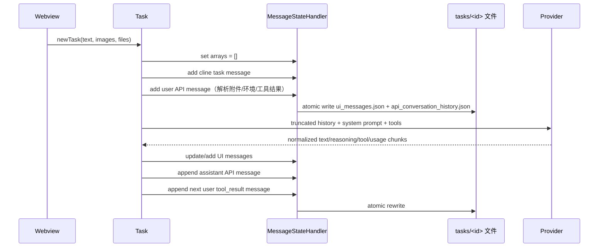

# 聊天记录存储机制

> 分析范围：`apps/vscode` 当前源码，重点是 `src/core/task`、`src/core/storage`、`src/core/context`、`src/core/api`、Hooks 和工具执行器。
> 结论日期：2026-07-14。本文区分“界面时间线”“模型请求历史”“上下文改写记录”和“运行时状态”，不能把它们当成同一个聊天表。

## 1. 结论先行

项目当前保存的是一套“可恢复的当前状态”，不是不可变审计日志：

1. **`ui_messages.json`（`clineMessages`）**保存 Webview 能显示的时间线，包括用户任务、审批询问、模型文字/Reasoning 展示、工具状态、命令输出、Hook 状态等。它会被更新、重排、截断和删除，因此不能保证保留每一个流式中间版本。
2. **`api_conversation_history.json`（`apiConversationHistory`）**保存供下一次模型请求重放的 Cline 扩展 Anthropic 消息格式。它通常包含用户内容、图片、工具结果、助手文字、结构化 `tool_use`、部分可见/可回传的 reasoning block 以及 token/cost 元数据；发送给供应商前会转换并删除 Cline 私有字段。
3. **`context_history.json`**不保存另一份完整对话，而是保存对 API 历史某些消息/内容块的“覆盖操作”（例如重复文件读取替换成提示、压缩提示）。模型请求时把原始 API 历史按删除范围切片，再套用这些覆盖操作。
4. **`TaskState`**主要是流式执行锁、审批响应、工具结果缓冲、重试、取消和压缩标记的内存对象。绝大多数字段进程重启即丢失；少数值被投影到 `ClineMessage`、`HistoryItem`、任务设置或检查点状态。
5. **服务端隐式思考不在项目可控范围内。**只有 Provider 通过协议返回的 reasoning/summary/encrypted block 才可能被保存；模型没有返回的隐藏 CoT、内部草稿、采样中间 token、服务端路由/检索过程无法从这些文件恢复。

因此，对“是否包含全部记录”的直接回答是：**包含大部分已被 Cline 观测到并用于恢复的最终语义记录，但不是完整事件审计；存在明确未记录、被覆盖、被截断、只保留摘要或只存在临时文件的内容。**

## 2. 源码中的四层对象

| 层 | 内存对象/类型 | 持久化位置 | 用途 | 是否审计日志 |
| --- | --- | --- | --- | --- |
| UI 时间线 | `MessageStateHandler.clineMessages: ClineMessage[]` | `tasks/<taskId>/ui_messages.json` | 恢复聊天界面、显示审批和工具状态 | 否，会 update/delete/overwrite |
| API 历史 | `MessageStateHandler.apiConversationHistory: ClineStorageMessage[]` | `tasks/<taskId>/api_conversation_history.json` | 组成下一次模型输入、恢复 Agent 循环 | 否，可 overwrite/slice |
| 上下文变更 | `ContextManager.contextHistoryUpdates` | `tasks/<taskId>/context_history.json` | 对保留消息做文本替换、去重和压缩标记 | 是变更映射，但不含完整原文 |
| 任务运行态 | `TaskState`、`StreamResponseHandler`、`Session` | 通常不落盘 | 流式、工具执行、锁、重试、审批 | 否 |

关键实现：

- `src/core/task/message-state.ts`：两个数组、互斥锁、保存和恢复入口。
- `src/core/task/TaskState.ts`：运行时字段定义。
- `src/core/storage/disk.ts`：文件名、路径、JSON 读取/原子写入、Hook 临时文件。
- `src/core/context/context-management/ContextManager.ts`：删除范围、覆盖历史、文件读取去重和工具配对修复。
- `src/core/task/index.ts`：在每个请求前后向两个数组追加内容。
- `src/shared/messages/content.ts`：`ClineStorageMessage` 和 Provider 清洗函数。

## 3. 文件拓扑和格式

### 3.1 任务目录

`ensureTaskDirectoryExists(taskId)` 将目录解析到 `HostProvider.get().globalStorageFsPath/tasks/<taskId>`：

```text
<VS Code ExtensionContext.globalStorageUri.fsPath>/
├─ tasks/
│  └─ <taskId>/
│     ├─ ui_messages.json
│     ├─ api_conversation_history.json
│     ├─ context_history.json
│     ├─ task_metadata.json
│     ├─ settings.json
│     ├─ focus_chain_taskid_<taskId>.md       # 启用 Focus Chain 时
│     └─ conversation_history_<ts>.{json,txt} # PreCompact Hook 期间临时存在
├─ state/taskHistory.json
└─ checkpoints/                               # 文件/工作区检查点，不是聊天正文
```

VS Code 形态的根来自 `src/extension.ts` 调用 `HostProvider.initialize(..., context.globalStorageUri.fsPath)`。Standalone 形态在 `src/standalone/vscode-context.ts` 中把根设为 `${CLINE_DIR || ~/.cline}/data`。因此实际绝对路径随宿主、发行版和用户配置变化，不应在业务代码中硬编码。

### 3.2 `ui_messages.json`

`saveClineMessages()` 使用 `atomicWriteFile()` 写入 `JSON.stringify(uiMessages)`；旧版 `claude_messages.json` 在读取时迁移并删除。元素是 `ClineMessage`，典型字段如下：

```json
{
  "ts": 1710000000000,
  "type": "say",
  "say": "text",
  "text": "模型输出",
  "partial": false,
  "modelInfo": {
    "providerId": "anthropic",
    "modelId": "claude-sonnet-4",
    "mode": "act"
  },
  "conversationHistoryIndex": 3,
  "conversationHistoryDeletedRange": [2, 5]
}
```

`ClineMessage` 还可以携带 `ask`、`reasoning`、`images`、`files`、`commandCompleted`、检查点哈希、`api_req_started` 的 JSON 文本等。`images` 通常是 `data:<mime>;base64,...` 数据 URL，`files` 是文件路径，不是文件本体。

### 3.3 `api_conversation_history.json`

`saveApiConversationHistory()` 只在数组非空时写入，并使用原子临时文件 + rename。数组元素是扩展后的 `ClineStorageMessage`：

- `role: "user" | "assistant"`；
- `content` 可以是字符串或 text/image/document/tool_use/tool_result/thinking/redacted_thinking block；
- `id`、`ts`、`modelInfo`、`metrics` 是 Cline 为恢复和统计添加的字段；
- `reasoning_details`、Gemini `signature` 等 Provider 互操作字段可能存在于 block 上。

`convertClineStorageToAnthropicMessage()` 在发送给 Anthropic 前会删除 `modelInfo`、`metrics`、`ts`、`id`，并按 Provider 清洗 `reasoning_details`、`call_id`、Gemini `signature`。OpenAI/Gemini/Responses 等转换器同样只读取 `role/content`，所以磁盘文件比实际线上的消息更丰富。

### 3.4 其它文件

| 文件 | 内容 | 对聊天正文的意义 |
| --- | --- | --- |
| `context_history.json` | 序列化的 `Map<messageIndex, [EditType, Map<blockIndex, ContextUpdate[]>]>` | 保存“替换了哪一块文本”，不保存被删消息的完整快照 |
| `task_metadata.json` | `files_in_context`、`model_usage`、`environment_history` | 文件新鲜度、模型和环境诊断，不是模型消息 |
| `settings.json` | 任务级设置 | 影响下一次运行，不是聊天内容 |
| `state/taskHistory.json` | `HistoryItem`（任务标题、token/cost、大小、删除范围等） | 历史列表索引，不含正文 |
| `focus_chain_taskid_<id>.md` | Focus Chain 清单 | 可被下一次 system/context 提示引用，不等于消息历史 |
| `conversation_history_<ts>.json/txt` | PreCompact Hook 当前上下文快照 | Hook 运行期间临时文件，`finally` 会删除 |

### 3.5 可选远程同步

`saveApiConversationHistory()` 在本地写入前调用 `syncWorker().enqueue(taskId, "api_conversation_history.json", data)`。配置了 S3/R2/Azure Blob 时，后台 Worker 将**仅这一文件**上传到 `tasks/<userDistinctId>/<taskId>/api_conversation_history.json`。`ui_messages.json`、`context_history.json`、附件和 Hook 输出没有通过这条队列同步。当前删除任务流程也没有调用 `SyncQueue.removeTask()` 或远程 Blob 删除，因此“本地删除”不自动等于“远端副本删除”。

## 4. 写入和恢复时序



### 4.1 新任务

`Controller.initTask()` 以 `Date.now().toString()` 生成 taskId（恢复任务则复用历史 ID），创建 `Task` 和 `MessageStateHandler`，然后 `startTask()`：

1. 清空两个内存数组并刷新 Webview；
2. `say("task", task, images, files)` 追加 UI 任务消息；
3. 创建 `<task>...</task>` text block、图片 blocks、`processFilesIntoText(files)` 的文本快照；
4. 运行 `TaskStart`、`UserPromptSubmit` Hook，并将 Hook context modification 加入 user content；
5. `loadContext()` 解析 `@` mention/slash command，并加入环境详情；
6. `addToApiConversationHistory({ role: "user", content: userContent, ts })` 保存真正发给模型的用户消息。

### 4.2 流式助手输出

`Task.recursivelyMakeClineRequests()` 创建 `api_req_started` UI 占位消息，再调用 Provider。`ApiStreamChunk` 只保留四种归一化事件：`text`、`reasoning`、`tool_calls`、`usage`。

- text：累积到 `assistantTextOnly`，同时解析 XML/结构化 tool block 用于 UI；
- reasoning：由 `StreamResponseHandler.ReasoningHandler` 聚合文本、summary、signature、redacted data；
- tool_calls：由 `ToolUseHandler` 聚合 JSON 参数，完整后执行工具；
- usage：只更新 `api_req_started` 的 token/cost JSON 和遥测，不进入 API message content。

流结束后，代码一次性构造 assistant `ClineStorageMessage`，其 content 顺序通常是：

```text
redacted_thinking* → thinking? → text? → tool_use*
```

然后追加到 `apiConversationHistory`。UI 的 partial 消息会被 `updateClineMessage()` 覆盖为最终值；中间 partial 版本没有独立记录。

### 4.3 工具结果和下一轮

工具执行器 `ToolExecutor` 把结果推入 `TaskState.userMessageContent`：

- native 工具使用 `tool_result`，通过 `tool_use_id/call_id` 与 assistant tool_use 配对；
- XML/旧格式或找不到 ID 时退化为普通 text；
- 图片和文件反馈可能成为额外 image/text blocks；
- 工具显示、审批、错误、MCP 通知等 UI 消息通过 `say/ask` 写入 `clineMessages`。

下一次递归请求才把这些 blocks 作为新的 `role: user` API 消息追加。**所以工具调用本身在 assistant 消息中，工具结果通常在紧随其后的 user 消息中。**如果任务在工具执行后进程崩溃，已保存的 assistant 消息可能存在，但尚未追加的 tool result 可能缺失。

### 4.4 恢复、编辑和检查点

`resumeTaskFromHistory()` 读取两个 JSON 文件，移除重复的 `resume_task/resume_completed_task` 尾部消息，清理没有 cost/cancelReason 的未开始 API 请求，然后恢复 `context_history.json`。

检查点恢复 `src/integrations/checkpoints/index.ts` 会：

1. 用 `conversationHistoryIndex` 将 API 历史切到目标 user/assistant 边界；
2. 截断 `context_history` 中目标时间之后的覆盖；
3. 将 `clineMessages` slice 到目标消息并重写两个文件；
4. 追加 `deleted_api_reqs` 统计消息。

因此用户编辑历史消息或恢复检查点后，原来的尾部记录会从当前状态中消失；它们不在项目内形成不可变删除日志。

## 5. 各类内容到底是否被记录

下表中的“API 历史”指当前 `api_conversation_history.json`；“UI 历史”指当前 `ui_messages.json`。两者都可能被覆盖或裁剪。

| 内容 | UI 历史 | API 历史 | 结论与限制 |
| --- | --- | --- | --- |
| 初始用户文字 | 是，`say("task")` | 是，包在 `<task>` text block | 经过 Hook、mention、slash、环境注入后，API 版本不再是原始字符串 |
| 后续用户文字/反馈 | 通常是 `user_feedback` 或 ask 对应消息 | 通常在下一轮 user/tool_result 中 | 纯“同意/拒绝”按钮只有语义结果，原始按钮事件不单独存储 |
| 用户图片 | `ClineMessage.images` 数据 URL | image block 的 base64 | 会重复占用 JSON；不是原始文件路径/文件 inode |
| 用户普通附件 | `files` 路径 | `processFilesIntoText()` 生成的 `<file_content>` 文本 | 原文件没有复制到任务目录；路径失效后仍可能留有旧文本快照 |
| PDF/DOCX/XLSX/IPYNB 等附件 | 路径 | 提取器文本（IPYNB 会去掉大部分输出） | 不是原始二进制，且受 20MB/400KB 等限制 |
| `@file`/URL/diagnostics/git mention | 通常只保留用户输入和展示文本 | `parseMentions()` 追加的内容 | 每次解析时读取的快照可能与原文件/网页不同 |
| 可见文件、Open Tabs、终端新输出、时间 | 间接显示在 `api_req_started.request` | 每轮 user content 的 `<environment_details>` | 动态环境内容不是独立的系统消息 |
| 模型最终文字 | `say("text")` | assistant text block | XML 旧工具格式可能仍作为文字保存在 API 历史 |
| Provider 返回的 reasoning 明文 | `say("reasoning")`（UI 会清理部分标签） | `thinking` block 或 reasoning details | 只有 Provider 返回才有；某些模型/配置不返回或被跳过 |
| reasoning summary/signature | UI 通常只显示文本 | `summary`/`signature`/`reasoning_details` | 主要为下一次 Provider 重放服务，未必是完整思考过程 |
| redacted/encrypted thinking | UI 可能显示占位 | `redacted_thinking.data` 或空 thinking + summary | 保存的是密文/占位符，不是可读 CoT；转换器可能按 Provider 丢弃 |
| native tool call 名称/参数 | `say("tool")` 展示 JSON | assistant `tool_use` block | 参数流被聚合为最终 JSON，不保存每个 delta |
| XML tool call | 工具 UI 消息 | assistant text 中的 XML | 旧协议无独立结构化 tool_use |
| 工具执行结果 | 工具、命令、MCP、浏览器等 `say` 消息 | 下一 user message 的 `tool_result` 或普通 text | 不同工具自行格式化；结果可能截断、去重或只留摘要 |
| 审批/拒绝原因 | ask/tool/user_feedback 消息 | `toolDenied`/错误/反馈作为结果 | 无文字的按钮点击没有独立原始事件 |
| 命令完整 stdout/stderr | 小输出通常有 command_output | 通常只有摘要文本 | 超大输出写到系统临时 `.log`，UI/API 只留首尾和路径；临时文件约 50 小时后清理 |
| MCP 工具/资源结果 | `mcp_server_response` | 返回文本/图片，先经过 `truncateContent`（约 400KB） | 原始 MCP JSON、通知和网络时序不完整 |
| Browser 截图/动作 | browser action/result 消息 | 支持图片时进入 tool result | 截图是否进入 API 取决于模型能力和 handler 分支 |
| Hook 状态/输出 | `hook_status`、`hook_output_stream` | 默认不进入模型 | Hook 的 `contextModification` 会作为 `<hook_context>` 进入下一轮 |
| Subagent 内部对话 | 只存父任务的 `subagent` 状态/最终摘要 | 父任务只得到 `subagent` tool result | `SubagentRunner` 的内部 conversation 在内存中，reasoning delta 甚至只更新 request id，不写父任务历史 |
| token/cost/请求 ID | `api_req_started` JSON、`subagent_usage` | `metrics`/`id` 私有字段 | Provider 请求前会删除私有字段；usage 不作为模型正文 |
| system prompt、规则、Skills、MCP schema | 不作为聊天消息保存 | 不写入 `api_conversation_history` | 每次 `getSystemPrompt()` 动态生成；可选 prompt artifact 才会另存 system prompt |
| 模型服务端隐式思考 | 否 | 否 | API 未返回的内部状态无法取得，也不应通过日志猜测 |

## 6. 附件的特殊边界

### 6.1 图片

`src/integrations/misc/process-files.ts` 选择图片后立即读成 `data:image/...;base64,...`。`formatResponse.imageBlocks()` 拆成 Anthropic image block；因此：

- UI JSON 和 API JSON 都可能包含完整 base64，任务目录会很大；
- 没有原始文件名、mtime、哈希等可靠元数据；
- OpenAI/Gemini 转换器会改成 `image_url`/inlineData；不保证每个 Provider 都支持；
- 当前删除消息不会单独清理图片，因为图片内嵌在 JSON。

### 6.2 普通文件

`processFilesIntoText()` 只保存路径和提取后的文本。它会检查 20MB 文件上限，并在 `callTextExtractionFunctions()` 最终执行约 400KB 文本截断；IPYNB 会主动去除大部分输出。原始 PDF、DOCX、XLSX、CSV、二进制文件不会自动复制到 task 目录。

### 6.3 工具中重新读取的文件

`FileContextTracker` 把路径、读取/编辑时间和来源写入 `task_metadata.json`，但不把每次文件完整内容作为独立档案保存。API 历史可能有当时的 `<file_content>`，并且 `ContextManager` 后续会把旧重复读取替换为 `duplicateFileReadNotice()`。

## 7. Reasoning 与“隐式思考”的边界

### 7.1 能被保存的 reasoning

Provider 适配器把不同协议归一化为 `ApiStreamChunk.type = "reasoning"`：

- Anthropic/Vertex：`thinking_delta`、`redacted_thinking`、signature；
- Gemini：`part.thought`、thought signature；
- OpenAI Responses/Codex：reasoning summary、encrypted content；
- OpenRouter/Cline：`reasoning` 和 `reasoning_details`；
- DeepSeek/Qwen/Groq 等 OpenAI-compatible：供应商返回的 `reasoning_content`/parsed reasoning。

`StreamResponseHandler.ReasoningHandler` 会把 delta 拼成一个 thinking block，并把 summary/details 附着到助手文字或 tool use。保存的是“协议允许客户端看到的 reasoning representation”，不是采样器所有内部轨迹。

### 7.2 明确不会有的内容

以下内容在当前源码中没有可靠持久化来源：

- Provider 未返回的隐藏 CoT、内部草稿、logit/beam/token 选择；
- 服务端安全分类、检索、路由、prompt cache 内部命中细节；
- 被 Provider 只报告为 `thoughtsTokenCount` 的 token 文本；
- 被 `shouldSkipReasoningForModel()` 跳过的 reasoning（例如部分 Grok 变体）；
- stream 中每个原始 SSE/WebSocket 事件的顺序和未映射字段；
- `SubagentRunner` 内部 reasoning（其循环没有把 reasoning 内容写入父任务）。

即使 `api_conversation_history.json` 中存在 `thinking`，也不能据此声称记录了“完整思考过程”。服务端返回的 encrypted/redacted block 只能在供应商协议允许时原样回传，无法在本地解密。

## 8. 会被压缩、截断或改写的内容

1. `ContextManager.getNextTruncationRange()` 从第 3 条消息开始按 user/assistant pair 删除 half/quarter/none，始终保留首个 pair（但可能用提示替换首条文字）。
2. `context_history.json` 对首个 assistant 写入“部分历史已删除”提示；显式压缩还会把首个 user 替换为 `[Continue assisting the user!]`。
3. 重复 `read_file`、`write_to_file`、`replace_in_file` 内容会被替换为“请参考最新读取”的短提示，只有覆盖映射保留。
4. 截断后 `ensureToolResultsFollowToolUse()` 会重排 tool result；找不到结果时插入 `result missing`，这不是原始工具输出。
5. 终端 `CommandOrchestrator` 超过阈值后将全部输出写入系统临时日志，仅把首尾摘要和日志路径放入结果；`ClineTempManager` 会按约 50 小时和 2GB 总量清理。
6. MCP/resource 结果调用 `truncateContent()`；文件、ripgrep、列表、网页等工具也有各自上限。
7. 流式 partial UI 消息通过 update 覆盖，取消时会把助手内容补成“Response interrupted”；这会改变原始模型输出。

## 9. 恢复、删除和一致性风险

### 9.1 原子性

`ui_messages.json`、`api_conversation_history.json` 和 `taskHistory.json` 使用临时文件 + rename，避免读到半个 JSON；`context_history.json`、`task_metadata.json`、Focus Chain 文件仍是普通 `writeFile`。`MessageStateHandler` 用 `p-mutex` 串行化数组修改，但 UI/API 两个文件不是一个跨文件事务：进程在两次写入之间退出时可能短暂不一致。

### 9.2 当前状态而非事件历史

`MessageStateHandler.updateClineMessage()`、`deleteClineMessage()`、`overwriteClineMessages()` 会直接改变数组；`overwriteApiConversationHistory()` 可移除尾部 user message；检查点恢复会 slice 两个数组。即使每次修改都写盘，旧值也没有版本链。

### 9.3 删除

删除任务通常移除四个已知文件和空目录；若目录中还有 Focus Chain、临时文件或未来新增附件，目录可能残留。远端 Blob、同步队列也没有在这些流程中统一删除。做合规删除时，必须额外扫描本地 archive、队列和远程副本。

## 10. 直接回答用户关心的问题

### 是否包含所有用户发送的消息？

**大部分正文包含，但不是所有交互事件。**初始任务、带文字的反馈、作为工具反馈传递给模型的内容通常同时出现在 UI/API 层。纯按钮“批准/拒绝/继续”保留的是 ask/tool 语义，不一定保留一个独立的原始点击事件；取消、进程崩溃和恢复重写也可能让尾部消息缺失。

### 是否包含附件？

**图片通常包含 base64；普通附件通常只包含路径和提取文本，不包含原始文件。**提取会受文件类型、大小、编码、Notebook 输出过滤和 400KB 截断影响。

### 是否包含模型思考和输出？

**可见最终输出包含；协议返回的 reasoning 可能包含；完整隐式 CoT 不包含。**Reasoning 可能是明文、summary、signature 或加密/脱敏 block，取决于 Provider、模型和配置。

### 是否包含工具调用和结果？

**结构化 native 工具调用与大多数最终结果包含。**旧 XML 调用以 assistant text 保存；工具结果经过 handler 格式化、去重、截断、文件化和模型能力适配，不能保证原始 stdout、原始 MCP JSON 或每个中间 delta 都在 JSON 中。

### 是否有未被记录的中间过程？

有，至少包括：流式 delta 原始事件、被覆盖的 partial 版本、TaskState 内存字段、Subagent 内部对话、Hook/Provider 未映射字段、超大命令临时日志过期后的内容，以及模型服务端隐式思考。若需要审计级“全部输出”，必须新增独立的 append-only 记录器，不能只导出这两个 JSON 文件。

## 11. 复核入口（便于改造）

```text
src/core/task/message-state.ts                    # 两套消息数组、互斥和写盘
src/core/task/TaskState.ts                        # 非持久化运行态
src/core/task/index.ts                            # start/resume、请求、流、工具结果追加
src/core/storage/disk.ts                          # 文件名、路径、原子写、Hook 快照
src/core/context/context-management/ContextManager.ts
                                                    # 删除范围、覆盖、文件去重、配对修复
src/core/task/tools/ToolExecutor.ts               # 工具执行、结果入 userMessageContent
src/core/task/tools/utils/ToolResultUtils.ts      # tool_result/text 退化规则
src/core/task/StreamResponseHandler.ts             # reasoning/tool delta 聚合
src/core/api/transform/stream.ts                  # Provider 统一事件类型
src/shared/messages/content.ts                    # 存储消息及 Provider 清洗
src/integrations/terminal/CommandOrchestrator.ts  # 大输出转临时日志
src/core/hooks/precompact-executor.ts             # PreCompact 临时上下文快照
src/core/task/tools/subagent/SubagentRunner.ts    # 不落父任务盘的子 Agent 内存历史
src/integrations/checkpoints/index.ts             # 恢复时 slice/overwrite
src/core/controller/task/deleteTasksWithIds.ts    # 当前删除范围
```

## 12. 小结

现有机制适合“关闭 VS Code 后继续当前任务”，不适合合规审计、逐 token 回放或完整会话导出。改造时应把三件事分开：

- **恢复源**：继续使用 API/UI JSON，但接受它们会被压缩和重写；
- **审计源**：新增不可变、带序号的事件流，覆盖 user input、Provider chunk、tool/hook/subagent 和压缩事件；
- **导出视图**：从审计源生成按会话名组织的 Markdown，并明确哪些内容因 Provider 隐式不可见而不存在。
