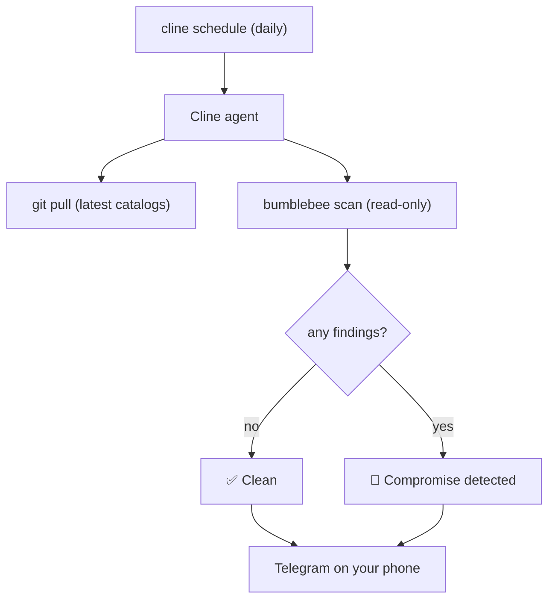

像 Shai-Hulud 这样的 npm 蠕虫通过安装脚本传播：当你运行 `npm install` 时，`preinstall` 钩子会立即执行，并窃取你的 npm、GitHub、AWS 和 SSH 凭据。几乎每周都会有新的攻击活动被报告。

本指南将三个部分连接起来，使你的机器能够自动自检，并且仅在重要情况发生时通知你的手机：

- [Bumblebee](https://github.com/perplexityai/bumblebee)，Perplexity 开源的只读供应链扫描器。它维护近期攻击活动的目录，并检查磁盘上是否存在任何被攻陷的软件包或版本。
- Cline CLI 调度器，按照 cron 计划运行智能体。
- Cline CLI Telegram 连接器，将结果发送到聊天中。

最终效果是：每天早晨，Cline 智能体都会拉取最新的威胁情报、运行只读扫描；如果没有风险，就向你发送绿色对勾，如果你已暴露在风险中，则发送包含详细信息的红色警报。



## Bumblebee 的工作原理

Bumblebee 能够快速回答一个具体问题：当安全公告指出某个软件包和版本时，它现在是否存在于这台机器上？

其重要的设计选择在于它是只读的。如果扫描器运行 `npm`、`pnpm` 或 `pip` 来枚举依赖项，反而会触发它正在寻找的安装脚本载荷。Bumblebee 绝不会这样做。它只会直接读取元数据文件：

| 检查范围 | 读取内容 |
|---|---|
| npm / pnpm / yarn / bun | 锁文件和已安装的 `package.json` 元数据 |
| PyPI | `*.dist-info/METADATA`、`*.egg-info/PKG-INFO` |
| Go 模块 | `go.sum`、`go.mod` |
| RubyGems | `Gemfile.lock`、已安装的 gemspec |
| Composer | `composer.lock`、`vendor/composer/installed.json` |
| MCP 服务器 | `mcp.json`、`claude_desktop_config.json` 及类似配置 |
| 编辑器扩展 | VS Code 系列扩展清单 |
| 浏览器扩展 | Chromium 系列和 Firefox 扩展清单 |

它绝不会运行包管理器，绝不会执行安装脚本或生命周期钩子，也绝不会读取你的应用程序源代码。它同样不附带任何内置威胁情报：你需要将其指向一个暴露风险目录，它会报告精确的 `(ecosystem, name, version)` 匹配项。

这些目录位于仓库的 `threat_intel/` 下，由 Perplexity 维护，并随着新攻击活动的报告通过拉取请求进行更新。因此，这项自动化会在每次扫描前直接拉取最新内容：只需一次 `git pull` 即可保持最新。

阅读公告：[Perplexity 正在开源 Bumblebee](https://www.perplexity.ai/hub/blog/perplexity-is-open-sourcing-bumblebee)。

## 前置要求

- Node.js 22 或更高版本（用于 Cline CLI）。
- Go 1.22 或更高版本（用于构建 Bumblebee）。
- Telegram 账户。
- AI 提供商密钥或 Cline 账户。

## 1. 安装 Cline CLI

```bash
npm install -g cline
cline # run once to configure inference provider and model
```

## 2. 克隆并构建 Bumblebee

将仓库克隆到一个稳定的位置。该克隆既是扫描器，也是目录来源，因此计划任务将在其中运行。

```bash
mkdir -p ~/tools
git clone https://github.com/perplexityai/bumblebee.git ~/tools/bumblebee
cd ~/tools/bumblebee
go build -o bumblebee ./cmd/bumblebee
```

使用内置自检确认它可以正常工作；该自检运行内置测试夹具，不会发起网络调用：

```bash
./bumblebee selftest
# selftest OK (2 findings in 1ms)
```

## 3. 手动运行扫描

将 `--exposure-catalog` 指向整个 `threat_intel/` 目录，即可一次使用所有维护的目录。`--findings-only` 标志会隐藏完整清单，因此你只会得到匹配项。

```bash
cd ~/tools/bumblebee
./bumblebee scan --profile deep --root "$HOME" \
  --exposure-catalog ./threat_intel/ \
  --findings-only
```

输出采用 NDJSON 格式，每行一个 JSON 对象。匹配项如下所示：

```json
{ "record_type": "finding", "severity": "critical", "ecosystem": "npm",
  "package_name": "example-pkg", "version": "1.2.3",
  "source_file": "/Users/you/code/app/pnpm-lock.yaml",
  "evidence": "exact name+version match (version=1.2.3)" }
```

如果没有风险，就不会得到任何 `finding` 记录。成功运行时退出码为 `0`，扫描遇到错误时为 `1`，参数错误时为 `2`。

<Note>
扫描配置控制 Bumblebee 的检查位置。`baseline` 检查标准的全局工具、编辑器和浏览器位置。`project` 扫描你的开发目录（传入 `--root ~/code`）。`deep` 会遍历你指定的所有根目录，通常是整个主目录。使用 `deep` 可进行最彻底的“我是否在任何位置暴露于风险中”检查，使用 `project` 则可更快地对仓库执行日常扫描。
</Note>

## 4. 创建 Telegram 机器人并启动连接器

<Steps>
  <Step title="创建机器人">
    打开 Telegram，开始与 [@BotFather](https://t.me/BotFather) 聊天，发送 `/newbot`，然后按照提示操作。复制它提供给你的机器人 token（看起来类似 `7123456789:AAH...`）。请像对待密码一样保护它。
  </Step>

  <Step title="启动连接器">
    运行连接器，并将其工作目录指向你的 Bumblebee 克隆，以便计划运行的智能体在那里执行：

    ```bash
    cline connect telegram -k "<BOT-TOKEN>" --cwd ~/tools/bumblebee
    ```

    保持此进程运行。它会轮询 Telegram 并传递计划运行的结果，因此必须保持活跃。
  </Step>

  <Step title="打开聊天">
    在 Telegram 中搜索你的机器人用户名，并向它发送任意消息（例如 `/whereami`）。这会创建传递所需的会话绑定。
  </Step>
</Steps>

<Warning>
默认情况下，任何找到你机器人的人都可以向它发送消息，而它会在你的机器上运行任务。让连接器持续运行之前，请限制其访问权限。`cline connect` 向导可以指导你完成 Telegram 用户 ID 设置；或者，你可以向 [@userinfobot](https://t.me/userinfobot) 发送消息，然后使用允许的用户 ID 重新启动连接器：

```bash
cline connect telegram -k "<BOT-TOKEN>" --cwd ~/tools/bumblebee \
  --allowed-user-id 12345
```

将 `12345` 替换为你的 Telegram 用户 ID。
</Warning>

## 5. 安排扫描

有两种方式可以创建计划扫描。两者都会运行同一个智能体并将结果发送到 Telegram，因此请选择你偏好的方式。

### 选项 A：通过 Telegram 聊天

从聊天中创建计划会自动将该会话设为传递目标，因此结果会直接返回给你。将以下内容作为一条消息发送给你的机器人：

```text
/schedule create "supply-chain-watch" --cron "0 8 * * *" --prompt "Pull the latest Bumblebee catalogs and scan this machine for compromised packages. Run: git pull --quiet && go build -o bumblebee ./cmd/bumblebee && ./bumblebee scan --profile deep --root $HOME --exposure-catalog ./threat_intel/ --findings-only. Read the NDJSON output. If any line has record_type set to finding, reply starting with '🚨 COMPROMISE DETECTED' and list each package name, version, ecosystem, and source_file. If there are no findings, reply with exactly '✅ Clean: no compromised packages found.'"
```

机器人会回复新的计划，其中包括其 id。

### 选项 B：通过终端

在同一台机器上使用 Cline CLI 创建计划，并显式传入传递方式。正在运行的 Telegram 连接器会将结果传递到它的聊天中：

```bash
cline schedule create "supply-chain-watch" \
  --cron "0 8 * * *" \
  --workspace ~/tools/bumblebee \
  --delivery-adapter telegram \
  --delivery-bot <bot-username> \
  --prompt "Pull the latest Bumblebee catalogs and scan this machine for compromised packages. Run: git pull --quiet && go build -o bumblebee ./cmd/bumblebee && ./bumblebee scan --profile deep --root \$HOME --exposure-catalog ./threat_intel/ --findings-only. Read the NDJSON output. If any line has record_type set to finding, reply starting with '🚨 COMPROMISE DETECTED' and list each package name, version, ecosystem, and source_file. If there are no findings, reply with exactly '✅ Clean: no compromised packages found.'"
```

无论采用哪种方式，都会安排每天上午 8 点进行扫描。

## 绿色对勾为何重要

计划传递始终会发送此次运行的最终回复，因此提示词经过专门编写，使该回复无论在何种情况下都具有明确意义：

- 无风险运行：一行 `✅ Clean: no compromised packages found.`。你会收到每日心跳消息，确认扫描确实已经运行。
- 存在暴露风险：`🚨 COMPROMISE DETECTED` 后跟软件包、版本以及发现它的文件，以便你立即采取行动（轮换凭据、移除软件包、锁定安全版本）。

## 测试

立即触发扫描，而无需等到上午 8 点。

首先找到计划 id。创建步骤会返回它（Telegram 机器人的回复会显示 `id=...`），你也可以随时列出计划：

```bash
cline schedule list
```

然后使用该 id 触发计划。通过终端：

```bash
cline schedule trigger <schedule-id>
```

或者通过 Telegram：`/schedule trigger <schedule-id>`。几秒钟内，你应该会在聊天中收到结果。

若要查看真实警报，请在临时项目的锁文件中添加与目录条目匹配的软件包和版本，然后对其运行扫描。Bumblebee 会报告匹配项，智能体则向你发送红色警报消息。

## 保持运行

- 连接器进程（`cline connect telegram`）必须保持运行，传递功能才能正常工作。请在进程管理器（systemd、launchd、`pm2` 或 `tmux`/`screen` 会话）下运行它，使其能够在重启后继续运行。
- Hub 负责运行计划，并会在你创建计划时自动启动。如果它没有运行，请使用 `cline hub start` 启动。
- 随时可以使用 `cline schedule list`、`cline schedule pause <id>`、`cline schedule resume <id>` 和 `cline schedule delete <id>` 管理计划。

## 自定义

- 频率：更改 cron 表达式。`0 */6 * * *` 每六小时扫描一次；`0 8 * * MON-FRI` 仅在工作日运行。
- 范围：将 `--profile deep --root $HOME` 替换为 `--profile project --root ~/code`，以便只对仓库进行更快的扫描；或使用 `--profile baseline` 扫描全局工具、编辑器和浏览器扩展。
- 渠道：相同的传递模式也适用于 Slack、Discord、WhatsApp 和 Google Chat。请参阅[连接器](/cli/connectors)。
- 设备群使用：如果你希望集中处理多台机器上的发现，Bumblebee 可以通过 `POST` 将 NDJSON 发送到接收端点，并使用 `--output http --http-url <url>`。

## 致谢

Bumblebee 由 Perplexity 构建并开源。请参阅[公告](https://www.perplexity.ai/hub/blog/perplexity-is-open-sourcing-bumblebee)和[仓库](https://github.com/perplexityai/bumblebee)。
