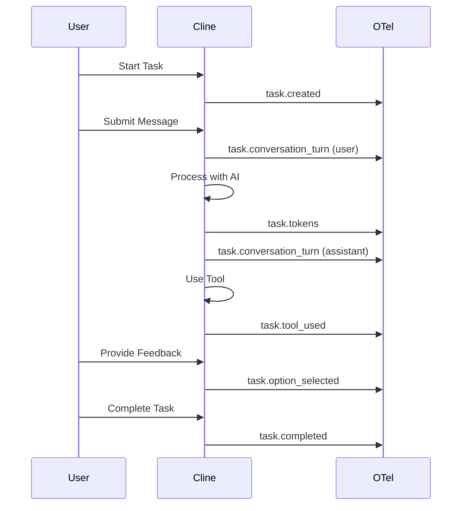

本页记录了目前在 Cline 中已进行插桩的所有 OpenTelemetry 日志事件。启用 OpenTelemetry 集成后会发出这些事件，从而提供有关用户行为、任务执行和系统操作的详细洞察。

<Info>
仅在启用 OpenTelemetry 时才会发出事件。有关配置说明，请参阅 [OpenTelemetry](/enterprise-solutions/monitoring/opentelemetry)。
</Info>

## 事件类别

Cline 会发出多个类别的事件，每个类别都带有命名空间前缀：

<CardGroup cols={3}>
  <Card title="user.*" icon="user">
    身份验证、遥测控制、扩展生命周期
  </Card>
  
  <Card title="task.*" icon="list-check">
    任务执行、对话轮次、工具使用、令牌
  </Card>
  
  <Card title="workspace.*" icon="folder-tree">
    工作区初始化、VCS 检测、路径解析
  </Card>
  
  <Card title="ui.*" icon="window">
    用户界面交互和模型选择
  </Card>
  
  <Card title="hooks.*" icon="webhook">
    Hook（钩子）的发现、执行和上下文修改
  </Card>
  
  <Card title="worktree.*" icon="code-branch">
    Git worktree 操作和合并处理
  </Card>
  
  <Card title="host.*" icon="computer">
    宿主环境检测
  </Card>
  
  <Card title="test.*" icon="flask">
    诊断和连接测试
  </Card>
</CardGroup>

## 用户事件

与用户身份验证、遥测偏好和扩展生命周期相关的事件。

| 事件 | 描述 | 关键属性 |
|-------|-------------|----------------|
| `user.opt_out` | 用户明确选择退出遥测 | user_id, timestamp |
| `user.opt_in` | 用户明确选择加入遥测 | user_id, timestamp |
| `user.telemetry_enabled` | 遥测服务已启用/初始化信号 | enabled, timestamp |
| `user.extension_activated` | 扩展激活事件 | extension_version, host_type |
| `user.extension_storage_error` | 读取/写入扩展存储状态时出错 | error_type, error_message |
| `user.auth_started` | 身份验证流程已开始 | provider, timestamp |
| `user.auth_succeeded` | 身份验证流程成功 | provider, user_id |
| `user.auth_failed` | 身份验证流程失败 | provider, error_reason |
| `user.auth_logged_out` | 用户已退出登录 | reason, provider |
| `user.onboarding_progress` | 新用户引导步骤/操作进度 | step, action, completed |

### 示例：user.auth_succeeded

```json
{
  "event": "user.auth_succeeded",
  "timestamp": "2026-03-05T10:30:00Z",
  "attributes": {
    "provider": "github",
    "user_id": "user_abc123",
    "session_id": "sess_xyz789"
  }
}
```

## 工作区事件

与工作区初始化、版本控制检测和多根工作区操作相关的事件。

| 事件 | 描述 | 关键属性 |
|-------|-------------|----------------|
| `workspace.initialized` | 工作区初始化完成 | roots_count, vcs_type, duration_ms |
| `workspace.init_error` | 工作区初始化失败 | error_type, fallback_used |
| `workspace.vcs_detected` | 版本控制系统检测事件 | vcs_type, root_path_hash |
| `workspace.multi_root_checkpoint` | 多根工作区检查点操作遥测 | operation, roots_count, duration_ms |
| `workspace.path_resolved` | 工作区路径解析 | hint, fallback_used, cross_workspace |

### 示例：workspace.initialized

```json
{
  "event": "workspace.initialized",
  "timestamp": "2026-03-05T10:32:15Z",
  "attributes": {
    "roots_count": 2,
    "vcs_type": "git",
    "duration_ms": 145,
    "multi_root_enabled": true
  }
}
```

## 任务事件

跟踪任务生命周期、对话轮次、工具使用和执行详情的核心事件。

### 任务生命周期

| 事件 | 描述 | 关键属性 |
|-------|-------------|----------------|
| `task.created` | 新任务/对话已开始 | task_id, mode, model, provider |
| `task.restarted` | 现有任务已重新启动/重新打开 | task_id, time_since_last_message |
| `task.completed` | 任务已完成 | task_id, duration_ms, model, provider, tokens_total |
| `task.feedback` | 用户对任务的反馈 | task_id, feedback_type (thumbs_up/thumbs_down) |
| `task.historical_loaded` | 从存储中加载历史任务 | task_id, age_days |
| `task.retry_clicked` | 用户对失败的操作/请求点击重试 | task_id, action_type |

### 对话与令牌

| 事件 | 描述 | 关键属性 |
|-------|-------------|----------------|
| `task.conversation_turn` | 对话轮次事件 | role (user/assistant), provider, model, tokens_in, tokens_out |
| `task.tokens` | 令牌使用事件 | tokens_in, tokens_out, cached_tokens, cost |
| `task.mode` | Plan/Act 模式切换事件 | previous_mode, new_mode, task_id |

### 工具使用

| 事件 | 描述 | 关键属性 |
|-------|-------------|----------------|
| `task.tool_used` | 工具调用及结果遥测 | tool_name, success, duration_ms, auto_approved |
| `task.mcp_tool_called` | MCP 工具调用生命周期事件 | status (started/success/error), tool_name, server_name |
| `task.browser_tool_start` | 浏览器工具/会话已启动 | url, action |
| `task.browser_tool_end` | 浏览器工具/会话结束及统计信息 | duration_ms, actions_count, success |
| `task.browser_error` | 浏览器工具错误事件 | error_type, url |
| `task.terminal_execution` | 终端执行捕获成功/失败事件 | success, command_hash, duration_ms |
| `task.terminal_output_failure` | 终端输出捕获失败 | reason |
| `task.terminal_user_intervention` | 终端执行期间的用户干预 | intervention_type |
| `task.terminal_hang` | 终端挂起/卡住检测事件 | duration_ms, command_hash |

### 功能与选项

| 事件 | 描述 | 关键属性 |
|-------|-------------|----------------|
| `task.checkpoint_used` | 使用了检查点操作 | action (create/restore/compare), task_id |
| `task.option_selected` | 用户选择了 AI 提供的选项之一 | option_index, total_options |
| `task.options_ignored` | 用户忽略 AI 选项并输入自定义内容 | options_count |
| `task.slash_command_used` | 使用了斜杠命令或 MCP 提示词命令 | command_name |
| `task.mention_used` | 提及解析成功 | mention_type (file/url/folder/terminal/problems/git) |
| `task.mention_failed` | 提及解析失败 | mention_type, error_reason |
| `task.mention_search_results` | 提及搜索查询结果遥测 | query, results_count |
| `task.workspace_search_pattern` | 工作区搜索策略/模式遥测 | pattern_type, files_scanned |

### 高级功能

| 事件 | 描述 | 关键属性 |
|-------|-------------|----------------|
| `task.focus_chain_enabled` | 已启用 Focus Chain 功能 | task_id |
| `task.focus_chain_disabled` | 已禁用 Focus Chain 功能 | task_id |
| `task.focus_chain_progress_first` | 发出首个 Focus Chain 检查清单/进度 | items_count |
| `task.focus_chain_progress_update` | 后续 Focus Chain 检查清单/进度更新 | items_total, items_completed |
| `task.focus_chain_incomplete_on_completion` | 任务完成时 Focus Chain 检查清单仍未完成 | items_remaining |
| `task.focus_chain_list_opened` | 用户打开 Focus Chain markdown/列表 | task_id |
| `task.focus_chain_list_written` | 写入/保存 Focus Chain markdown/列表 | task_id |
| `task.subagent_enabled` | 已启用子智能体功能 | task_id |
| `task.subagent_disabled` | 已禁用子智能体功能 | task_id |
| `task.subagent_started` | 子智能体执行已开始 | subagent_id, prompt_length |
| `task.subagent_completed` | 子智能体执行已完成 | subagent_id, duration_ms, success |
| `task.skill_used` | 技能调用事件 | skill_name, task_id |

### 自动压缩与上下文

| 事件 | 描述 | 关键属性 |
|-------|-------------|----------------|
| `task.summarize_task` | 因上下文压力触发自动压缩/总结 | conversation_length, estimated_tokens |
| `task.auto_condense_toggled` | 自动精简设置已切换 | enabled |

### 设置与功能

| 事件 | 描述 | 关键属性 |
|-------|-------------|----------------|
| `task.feature_toggled` | 通用功能开关已更改 | feature_name, enabled |
| `task.rule_toggled` | Cline 规则已开启/关闭 | rule_name, enabled, is_global |
| `task.yolo_mode_toggled` | YOLO 模式已切换 | enabled |
| `task.cline_web_tools_toggled` | Cline web tools 设置已切换 | enabled |

### API 与性能

| 事件 | 描述 | 关键属性 |
|-------|-------------|----------------|
| `task.gemini_api_performance` | Gemini 专用 API 性能遥测 | duration_ms, tokens, cache_hit |
| `task.provider_api_error` | API 提供商错误事件 | provider, model, error_code, error_message |
| `task.diff_edit_failed` | Diff/replace 编辑失败 | file_path_hash, error_type |
| `task.initialization` | 任务初始化计时/元数据事件 | duration_ms, mode |

### AI 输出反馈

| 事件 | 描述 | 关键属性 |
|-------|-------------|----------------|
| `task.ai_output.accepted` | AI 生成的文件编辑已接受 | lines_added, lines_removed, file_count |
| `task.ai_output.rejected` | AI 生成的文件编辑已拒绝 | lines_added, lines_removed, file_count |

### 示例：task.tool_used

```json
{
  "event": "task.tool_used",
  "timestamp": "2026-03-05T10:35:22Z",
  "attributes": {
    "task_id": "task_1234567890",
    "tool_name": "write_to_file",
    "success": true,
    "duration_ms": 125,
    "auto_approved": false,
    "model": "claude-sonnet-4",
    "provider": "anthropic"
  }
}
```

## UI 事件

跟踪用户界面交互的事件。

| 事件 | 描述 | 关键属性 |
|-------|-------------|----------------|
| `ui.model_selected` | 在 UI 中选择了模型 | model, provider, previous_model |
| `ui.model_favorite_toggled` | 模型收藏状态已切换 | model_id, is_favorited |
| `ui.button_clicked` | UI 按钮点击事件 | button_id, context |
| `ui.rules_menu_opened` | 规则/技能菜单/模态框已打开 | menu_type |

### 示例：ui.model_selected

```json
{
  "event": "ui.model_selected",
  "timestamp": "2026-03-05T11:20:00Z",
  "attributes": {
    "model": "claude-sonnet-4",
    "provider": "anthropic",
    "previous_model": "gpt-4o",
    "mode": "act"
  }
}
```

## Hooks 事件

与 Hook 发现、执行生命周期和上下文修改相关的事件。

| 事件 | 描述 | 关键属性 |
|-------|-------------|----------------|
| `hooks.enabled` | 已启用 Hooks 功能 | user_id |
| `hooks.disabled` | 已禁用 Hooks 功能 | user_id |
| `hooks.cancel_requested` | Hook 请求取消 | hook_name, task_id |
| `hooks.context_modified` | Hook 修改了上下文 | hook_name, modification_type |
| `hooks.discovery_completed` | Hook 发现已完成 | hooks_count, global_count, workspace_count |
| `hooks.execution` | 统一的 Hook 执行生命周期 | hook_name, status (started/completed/failed/cancelled), duration_ms |

### Hook 执行生命周期

`hooks.execution` 事件使用 `status` 属性跟踪完整的生命周期：

- **started**：Hook 执行已开始
- **completed**：Hook 已成功完成
- **failed**：Hook 遇到错误
- **cancelled**：Hook 被用户或系统取消

### 示例：hooks.execution

```json
{
  "event": "hooks.execution",
  "timestamp": "2026-03-05T10:40:15Z",
  "attributes": {
    "hook_name": "preToolUse",
    "status": "completed",
    "duration_ms": 234,
    "task_id": "task_1234567890",
    "context_modified": false
  }
}
```

## Worktree 事件

与 Git worktree 操作相关的事件。

| 事件 | 描述 | 关键属性 |
|-------|-------------|----------------|
| `worktree.view_opened` | Worktree 视图已打开 | user_id |
| `worktree.created` | Worktree 创建事件 | success, branch_name, duration_ms |
| `worktree.merge_attempted` | Worktree 合并尝试事件 | has_conflicts, delete_option_chosen |

### 示例：worktree.created

```json
{
  "event": "worktree.created",
  "timestamp": "2026-03-05T14:22:00Z",
  "attributes": {
    "success": true,
    "branch_name_hash": "abc123",
    "duration_ms": 1250,
    "parent_branch": "main"
  }
}
```

## 宿主事件

与宿主环境检测相关的事件。

| 事件 | 描述 | 关键属性 |
|-------|-------------|----------------|
| `host.detected` | 宿主环境检测事件 | host_type (vscode/jetbrains/cli), version |

### 示例：host.detected

```json
{
  "event": "host.detected",
  "timestamp": "2026-03-05T09:00:00Z",
  "attributes": {
    "host_type": "vscode",
    "version": "1.95.0",
    "platform": "darwin"
  }
}
```

## 测试事件

诊断和连接测试事件。

| 事件 | 描述 | 关键属性 |
|-------|-------------|----------------|
| `cline.test.connection` | 来自 "Test OTEL Connection" 流程的 OTEL 连接测试事件 | success, exporter_type, endpoint |

### 示例：cline.test.connection

```json
{
  "event": "cline.test.connection",
  "timestamp": "2026-03-05T15:30:00Z",
  "attributes": {
    "success": true,
    "exporter_type": "otlp",
    "endpoint": "https://api.datadoghq.com:4317",
    "protocol": "grpc"
  }
}
```

## 事件属性指南

### 通用属性

大多数事件都包含以下标准属性：

| 属性 | 类型 | 描述 |
|-----------|------|-------------|
| `timestamp` | ISO 8601 | 事件发生时间 |
| `user_id` | string | 匿名化用户标识符（已通过身份验证时） |
| `session_id` | string | 当前会话标识符 |
| `extension_version` | string | Cline 扩展版本 |
| `host_type` | string | vscode、jetbrains 或 cli |

### 隐私与哈希

敏感信息会经过哈希或匿名化处理：

- **文件路径**：经过哈希处理以保护隐私
- **命令内容**：经过哈希处理，不会逐字记录
- **用户标识符**：匿名化令牌
- **分支名称**：在 worktree 事件中经过哈希处理

<Warning>
文件路径、命令参数和代码内容**绝不会**以原始形式包含在内。只会使用哈希值或匿名化标识符。
</Warning>

## 深入了解任务事件

任务事件是最详细的类别。以下是一个典型的任务执行流程：



### 任务令牌跟踪

令牌事件提供详细的成本和使用情况信息：

```json
{
  "event": "task.tokens",
  "timestamp": "2026-03-05T10:35:30Z",
  "attributes": {
    "task_id": "task_1234567890",
    "tokens_in": 2500,
    "tokens_out": 850,
    "cached_tokens": 1200,
    "cost": 0.0043,
    "model": "claude-sonnet-4",
    "provider": "anthropic"
  }
}
```

## 使用事件进行分析

<Warning>
**SQL 语法仅用于说明。**不同可观测性平台的属性访问方式各不相同——例如，BigQuery 中为 `JSON_EXTRACT(attributes, '$.model')`，ClickHouse 中为 `attributes['model']`，Datadog 中为 `@attributes.model`。使用前，请根据你所用平台的查询语言调整下面的所有查询。
</Warning>

### 查询模式

**最常用的工具：**
```sql
SELECT attributes.tool_name, COUNT(*) as count
FROM otel_logs
WHERE event = 'task.tool_used'
  AND attributes.success = true
GROUP BY attributes.tool_name
ORDER BY count DESC
LIMIT 10
```

**按模型统计的平均任务时长：**
```sql
SELECT 
  attributes.model,
  AVG(attributes.duration_ms) as avg_duration_ms,
  COUNT(*) as task_count
FROM otel_logs
WHERE event = 'task.completed'
GROUP BY attributes.model
```

**按提供商统计的令牌用量：**
```sql
SELECT 
  attributes.provider,
  SUM(attributes.tokens_in) as total_tokens_in,
  SUM(attributes.tokens_out) as total_tokens_out,
  SUM(attributes.cost) as total_cost
FROM otel_logs
WHERE event = 'task.tokens'
  AND timestamp >= NOW() - INTERVAL '30 days'
GROUP BY attributes.provider
```

**工具批准率：**
```sql
SELECT 
  attributes.tool_name,
  SUM(CASE WHEN attributes.auto_approved THEN 1 ELSE 0 END)::float / COUNT(*) as auto_approval_rate,
  COUNT(*) as total_uses
FROM otel_logs
WHERE event = 'task.tool_used'
GROUP BY attributes.tool_name
ORDER BY total_uses DESC
```

## 集成示例

<Note>
下面的查询语法仅用于说明。不同平台的属性访问方式各不相同——例如，BigQuery 中为 `JSON_EXTRACT(attributes, '$.model')`，ClickHouse 中为 `attributes['model']`，Datadog 中则使用点表示法。请根据你所用平台的查询语言进行调整。
</Note>

### Datadog 仪表板

使用这些事件创建自定义 Datadog 仪表板：

```json
{
  "widgets": [
    {
      "definition": {
        "type": "timeseries",
        "requests": [
          {
            "q": "sum:cline.task.completed{*}.as_count()",
            "display_type": "bars"
          }
        ],
        "title": "Tasks Completed Over Time"
      }
    },
    {
      "definition": {
        "type": "query_value",
        "requests": [
          {
            "q": "sum:cline.task.tokens{*}",
            "aggregator": "sum"
          }
        ],
        "title": "Total Tokens Used"
      }
    }
  ]
}
```

### Grafana 查询

工具使用情况的 Loki 查询示例：

```logql
{event="task.tool_used"} 
| json
| line_format "{{.attributes_tool_name}}: {{.attributes_success}}"
```

### New Relic NRQL

查询任务完成率：

```sql
SELECT count(*) 
FROM Log 
WHERE event = 'task.completed' 
FACET attributes.model 
SINCE 1 day ago
```

## 事件架构参考

所有事件均遵循以下结构：

```typescript
interface OtelLogEvent {
  event: string              // Event name (e.g., "task.created")
  timestamp: string           // ISO 8601 timestamp
  attributes: {
    // Event-specific attributes
    [key: string]: string | number | boolean
  }
  resource: {
    service_name: "cline"
    service_version: string   // Extension version
    host_type: string         // vscode | jetbrains | cli
  }
}
```

## 最佳实践

<CardGroup cols={2}>
  <Card title="过滤噪声" icon="filter">
    专注于与你的使用场景相关的事件。并非所有事件都需要仪表板。
  </Card>
  
  <Card title="设置警报" icon="bell">
    针对错误事件和使用异常设置警报，以便主动监控。
  </Card>
  
  <Card title="聚合指标" icon="chart-bar">
    将事件汇总为指标，用于长期趋势分析。
  </Card>
  
  <Card title="尊重隐私" icon="shield">
    请记住，事件已经过匿名化。不要尝试去匿名化。
  </Card>
</CardGroup>

## 故障排除

### 事件未出现

如果事件未显示在你的可观测性平台中：

1. **确认 OTel 已启用**——在远程配置或环境变量中确认
2. **检查端点配置**——确保 URL 和协议正确
3. **验证凭据**——使用 "Test OTEL Connection" 按钮进行测试
4. **检查导出器设置**——确保日志导出器包含 `otlp`
5. **查看平台特定要求**——某些平台需要特定的请求头

### 事件量问题

如果看到的事件量过大：

1. **对事件采样**——在 OTel collector 中配置采样
2. **过滤事件**——使用平台的过滤功能丢弃噪声事件
3. **采集时聚合**——导出前预聚合指标
4. **调整导出间隔**——增大 `openTelemetryMetricExportInterval` 和批处理设置

## 另请参阅

<CardGroup cols={3}>
  <Card title="OpenTelemetry 设置" icon="chart-line" href="/enterprise-solutions/monitoring/opentelemetry">
    配置 OTel 集成
  </Card>
  
  <Card title="提示词存储" icon="database" href="/enterprise-solutions/monitoring/prompt-storage">
    备份对话历史记录
  </Card>
  
  <Card title="遥测" icon="chart-simple" href="/enterprise-solutions/monitoring/telemetry">
    基础遥测概述
  </Card>
</CardGroup>
