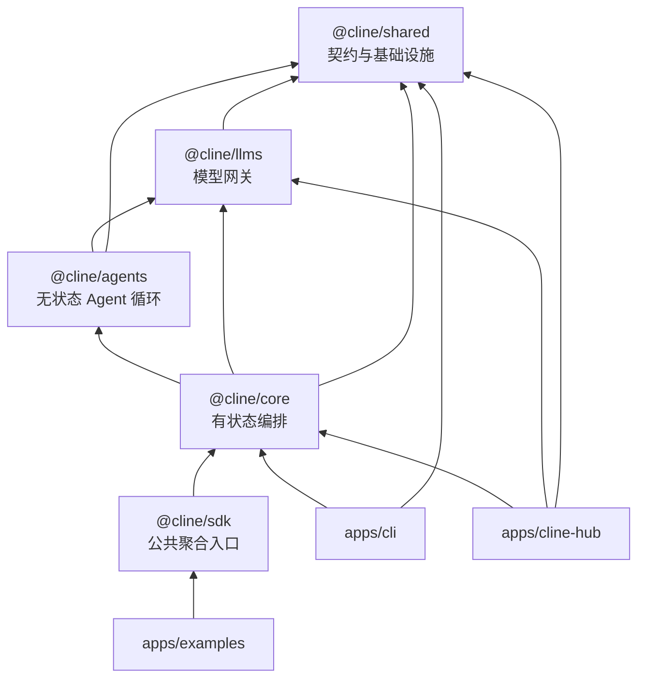
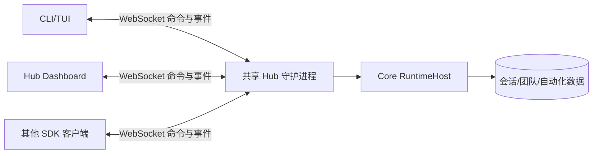
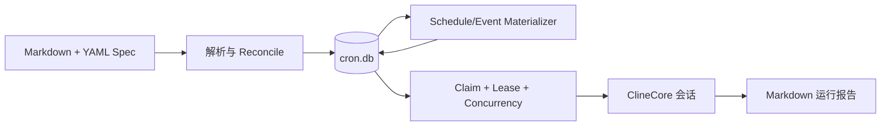

# Cline 项目架构模式分析

> 分析基线：仓库提交 `fae0c4674`（2026-07-10），分支 `v4.0.8-260713`。本文以实际源码、包清单和入口调用链为准；`sdk/ARCHITECTURE.md`、`sdk/AGENTS.md` 仅用于交叉验证。

## 1. 结论先行

Cline 不是一个单体命令行程序，而是一个以“智能体运行时”为内核、支持多个宿主的 TypeScript 平台。它综合采用了以下架构模式：

1. **Monorepo + 分层架构**：`shared → llms → agents → core → apps` 单向依赖。
2. **六边形架构（端口—适配器）**：模型、工具、存储、运行时宿主、遥测和宿主能力均通过接口与具体实现解耦。
3. **事件驱动的状态机**：模型流、工具执行、会话、团队和 Hub 都通过结构化事件传递状态。
4. **微内核/插件架构**：内核运行循环保持稳定，工具、Hook、插件、MCP、规则、技能和工作流作为扩展贡献注入。
5. **Hub-and-Spoke（中心—辐射）架构**：共享 Hub 守护进程持有权威会话，CLI、浏览器面板等客户端连接、附着和恢复会话。
6. **持久化任务队列**：定时、一次性和事件触发自动化统一落入 SQLite 队列，再由 Runner 认领执行。
7. **宿主进程 + 独立 UI**：CLI 使用 OpenTUI；VS Code 使用 Extension Host + Webview；Hub 使用 Bun HTTP/WebSocket + React SPA。

同时，仓库存在一条重要的演进边界：**SDK/CLI/Hub 已使用新的共享分层；`apps/vscode` 仍保留一套规模很大的历史实现**。因此当前物理结构是“新 Core 平台 + 旧 VS Code 宿主并存”，而不是所有产品都已完全复用 `@cline/core`。

## 2. 仓库级结构

```text
cline/
├── sdk/packages/
│   ├── shared/       # 最底层契约、Schema、路径、存储和协议类型
│   ├── llms/         # 模型目录、供应商注册、请求路由和流适配
│   ├── agents/       # 无持久状态的 Agent 迭代循环
│   ├── core/         # 会话、持久化、工具、插件、MCP、Hub、自动化
│   └── sdk/          # 对外聚合入口，重新导出 @cline/core
├── apps/
│   ├── cli/          # 命令行、OpenTUI、ACP、连接器
│   ├── cline-hub/    # Hub 浏览器控制台及其服务端
│   ├── vscode/       # VS Code 正式扩展（历史大内核 + Webview）
│   └── examples/     # SDK、桌面、VS Code、菜单栏等示例宿主
├── evals/            # 冒烟、基准、E2E 和结果分析
├── docs/             # 英文产品文档
└── docs-cn/          # 中文产品文档
```

根 `package.json` 使用 Bun workspaces 管理 SDK、CLI、Hub 和示例；`apps/vscode` 被明确排除，使用自己的 npm/构建流程。这一事实也反映了新旧代码线尚未完全合并。

## 3. 核心分层架构

### 3.1 依赖方向



分层所有权如下：

| 层 | 主要职责 | 关键源码 |
| --- | --- | --- |
| `@cline/shared` | 跨包类型、Zod Schema、Agent/LLM/Hub RPC 契约、路径、SQLite 抽象、远程配置、Hook/插件契约 | `sdk/packages/shared/src/` |
| `@cline/llms` | Provider manifest、模型目录、密钥和配置、请求选项路由、供应商流转换 | `sdk/packages/llms/src/providers/`、`catalog/` |
| `@cline/agents` | 内存消息、迭代循环、模型流消费、工具编排、Hook 和运行时事件 | `sdk/packages/agents/src/agent-runtime.ts` |
| `@cline/core` | 会话生命周期、持久化、上下文压缩、默认工具、审批、安全、插件、MCP、多智能体、Hub、自动化 | `sdk/packages/core/src/` |
| 宿主应用 | 参数解析、UI、宿主能力实现、用户交互 | `apps/cli/`、`apps/cline-hub/`、`apps/vscode/` |

这不是只按目录划分的“表面分层”。包清单也强制了依赖方向：`agents` 只依赖 `llms` 和 `shared`，`core` 才依赖 `agents`，`sdk` 仅聚合 `core`。

### 3.2 为什么 `Agent` 必须无状态

`AgentRuntime` 在 `sdk/packages/agents/src/agent-runtime.ts` 中只维护一次运行所需的内存状态：消息、迭代数、未完成工具调用、用量和中止控制器。它的循环是：

```text
用户输入
  → beforeRun
  → 生成模型请求
  → prepareTurn / beforeModel
  → 消费模型流
  → 组装文本、推理和工具调用
  → 执行工具并追加结果
  → 下一轮模型请求
  → 完成工具或无工具输出
  → afterRun
```

它不知道 SQLite、历史记录、Hub、CLI 或 VS Code。这使 `Agent` 可被嵌入测试、脚本、桌面程序和服务端，而不会绑定宿主生命周期。

### 3.3 为什么 `ClineCore` 是应用服务/门面

`sdk/packages/core/src/ClineCore.ts` 是应用层门面。它统一暴露 `create/start/send/abort/stop/get/listHistory/restore/dispose`，同时组合：

- `RuntimeHost`：本地、共享 Hub 或远程 Hub；
- `CronService`：自动化；
- `settings`、`pendingPrompts`、用量和模型切换等服务；
- 会话启动前的 `prepare` Bootstrap；
- 宿主能力和遥测。

上层应用无需知道底层会话当前在本进程还是守护进程中运行。这个门面把“业务 API”与“部署拓扑”分离。

## 4. 六边形架构：端口与适配器

项目中最稳定的设计不是某个类，而是若干端口。

| 端口 | 意义 | 适配器示例 |
| --- | --- | --- |
| `AgentModel` / Gateway | Agent 只要求可流式生成事件的模型 | Anthropic、OpenAI、Gemini、Bedrock、本地模型等 Provider |
| `AgentTool` | Agent 只要求名称、Schema 和 `execute` | 文件读取、搜索、命令、补丁、编辑、MCP、团队工具 |
| `RuntimeHost` | Core 只面向统一会话生命周期 | `LocalRuntimeHost`、`HubRuntimeHost`、`RemoteRuntimeHost` |
| `SessionStore` / `TeamStore` / `ArtifactStore` | 业务逻辑不绑定存储介质 | SQLite、文件系统实现 |
| `RuntimeCapabilities` | Core 请求宿主提供能力 | 工具审批、工具执行器、UI 对话等宿主回调 |
| `BasicLogger` / telemetry | 跨包日志与可观测性 | Pino、OpenTelemetry、PostHog、VS Code OutputChannel |
| Hub transport | 命令/回复/事件不绑定具体客户端 | 原生 `ws`、浏览器 WebSocket、节点客户端 |

例如 `createRuntimeHost()` 在 `sdk/packages/core/src/runtime/host/host.ts` 中根据 `auto/local/hub/remote` 创建不同适配器；`ClineCore` 后续只委托 `RuntimeHost`，不在每个业务方法中重复判断传输方式。

这种设计适合 Cline 的原因是：同一智能体能力必须同时运行在 CLI、IDE、后台计划任务、浏览器和第三方 SDK 宿主中。

## 5. 事件驱动架构

### 5.1 三层事件模型

源码中存在三层事件，而不是一个全局事件类型：

1. `AgentRuntimeEvent`：`@cline/agents` 的细粒度原始事件，如 `assistant-text-delta`、`tool-started`、`usage-updated`。
2. `AgentEvent`：兼容既有消费者的 Agent 事件，如 `content_start`、`content_end`、`usage`、`done`。
3. `CoreSessionEvent`：宿主级事件，增加 `sessionId`，并包含 `agent_event`、`team_progress`、`pending_prompts`、`session_snapshot`、`ended` 等。

`sdk/packages/core/src/runtime/orchestration/runtime-event-adapter.ts` 负责第一层到第二层的转换；`sdk/packages/core/src/services/agent-events.ts` 和本地事件桥接再将其提升为会话事件。

### 5.2 事件驱动的收益

- UI 可实时显示文本、推理、工具开始/结束和费用；
- 持久化可在 Assistant 响应后增量保存；
- CLI、Hub Webview 和其他宿主复用同一语义；
- 团队成员和根 Agent 的事件可统一聚合，但用量仍区分 root 与 aggregate；
- Hub 传输可保持流的开始、更新和结束边界。

### 5.3 兼容层的代价

事件适配器含有显式的“legacy”兼容逻辑，说明事件模型正在迁移。修改事件时必须同时检查三层类型、适配器、Hub 投影和 UI 消费者，不能只改 `AgentRuntimeEvent`。

## 6. 微内核与扩展架构

### 6.1 扩展类型

| 类型 | 适用场景 | 主要实现 |
| --- | --- | --- |
| 内置工具 | 核心编码动作 | `core/src/extensions/tools/` |
| Hook | 在运行、模型或工具前后拦截 | `shared/src/hooks/`、`core/src/hooks/` |
| Plugin | 声明式贡献工具、命令、规则、Provider、自动化事件 | `core/src/extensions/plugin/` |
| MCP | 外部进程/服务提供工具、资源、Prompt | `core/src/extensions/mcp/` |
| 规则/技能/工作流 | 文件化用户指令与按需知识 | `core/src/extensions/config/` |
| Configured Agent | 由文件定义的专门 Agent | `sdk/packages/core/src/extensions/tools/team/` 中的 `configured-agent-*` 文件 |

插件大体遵循 `resolve → validate → setup → activate` 生命周期。Manifest 声明能力，加载器解析模块，必要时通过 `plugin-sandbox.ts` 隔离执行，贡献项最后进入 `DefaultRuntimeBuilder`。

### 6.2 文件系统是配置总线

规则、技能、工作流、Agent、Hook、插件和自动化 Spec 大量采用文件发现与 Watcher。`unified-config-file-watcher.ts` 负责目录扫描、解析和变更刷新；自动化 Watcher 的事件也只作为“重新 reconcile”的信号，真正状态以扫描和数据库为准。

因此这里的文件并非简单配置，而是一种可审计、可版本控制、可被远程配置物化的扩展总线。

## 7. Hub-and-Spoke 架构

### 7.1 角色



Hub 服务端位于 `sdk/packages/core/src/hub/server/`，发现、进程所有权和启动锁位于 `hub/discovery/`、`hub/daemon/`，客户端适配位于 `hub/client/` 和 `hub/runtime-host/`。

### 7.2 四种后端模式

| 模式 | 行为 |
| --- | --- |
| `local` | Agent 在调用进程内运行，适合单进程或测试 |
| `auto` | 优先复用兼容 Hub；无 Hub 时可快速回退本地并后台预热 |
| `hub` | 要求共享本地 Hub，适合后台运行、跨客户端附着 |
| `remote` | 连接显式远程端点，不做本地发现替换 |

### 7.3 安全与并发

共享 Hub 使用 owner-scoped discovery 文件、启动锁和构建兼容检查。每个守护进程生成随机认证令牌；WebSocket 用子协议携带，关闭接口用 Bearer Token，并进行常量时间比较。显式端点保持“粘性”，不会在重连时悄悄漂移到另一个本地 Hub。

这说明 Hub 不是普通 WebSocket 示例，而是具有进程所有权、发现、鉴权、恢复和协议版本控制的本地服务架构。

## 8. 自动化的持久化任务架构

自动化位于 `sdk/packages/core/src/cron/`，三种触发器共用同一执行管道：



关键模式包括：

- 文件是声明源，数据库是运行状态源；
- `one_off`、`schedule`、`event` 最终都变成 `cron_runs`；
- Runner 用 claim token、lease heartbeat 和并发限制避免重复执行；
- 任务结果写入报告并关联会话；
- Hub 和 CLI 只通过服务/命令管理计划，不直接拼 SQL。

这是典型的 Durable Job/Work Queue，而非简单 `setInterval`。

## 9. 多智能体架构

项目提供两种协作模型：

| 模型 | 生命周期 | 协作关系 | 状态 |
| --- | --- | --- | --- |
| Sub-agent | 单会话内临时 | 父子层级 | 结果回传父 Agent |
| Team | 可跨运行恢复 | Lead 与 Teammate 协作 | 任务板、邮箱、Mission Log、运行记录 |

`DefaultRuntimeBuilder` 按配置装配 Spawn Tool、Configured Agent 和 Team Tools；`AgentTeamsRuntime` 管理任务、消息和成员；`TeamStore` 将状态持久化。完成策略还会检查未完成团队任务和活动 Run，防止 Lead 过早调用完成工具。

## 10. 三种宿主 UI 架构

### 10.1 CLI

`apps/cli/src/main.ts` 和 `commands/program.ts` 负责命令解析，`runtime/run-agent.ts` 负责 Core 会话，`tui/` 用 React reconciler + OpenTUI 渲染。TUI 的首帧不等待 Hub 启动，体现“启动关键路径与后台基础设施解耦”的设计。

### 10.2 Hub Dashboard

`apps/cline-hub/src/server.ts` 用 `Bun.serve` 提供静态 SPA、浏览器 WebSocket 和鉴权；服务端再作为 `ClineCore`/`HubUIClient` 客户端附着到共享 Hub。浏览器不是直接访问权威 Agent，而是经过 Dashboard Server 做协议转换和审批协调。

### 10.3 VS Code

正式扩展的入口是 `apps/vscode/src/extension.ts`。它采用：

```text
VS Code API / HostProvider
        ↕
Controller + Task（历史业务内核）
        ↕
Proto/gRPC 风格服务与消息
        ↕
React Webview
```

`Controller` 管理任务、账户、状态、MCP 和远程配置；`Task` 管理模型循环、工具和上下文；`HostProvider` 隔离 VS Code 能力；`webview-ui` 负责展示。这套实现与新 SDK Core 有大量概念重合，是改造时最需注意的双实现区域。

## 11. 当前架构的优点与风险

### 11.1 优点

- 内核与 UI、传输、模型供应商解耦；
- 同一 Core 可运行于进程内、共享守护进程和远程服务；
- 工具、MCP、插件和文件配置都有清晰扩展点；
- 事件和存储适配使实时交互与持久化可以并存；
- 自动化和多智能体不是外接脚本，而是进入统一会话模型；
- 测试大多与源码同目录，关键边界有单元/E2E 覆盖。

### 11.2 风险与技术债

- VS Code 历史内核与 SDK Core 双轨，Provider、工具、MCP、上下文等可能需要双改；
- `AgentRuntimeEvent → AgentEvent → CoreSessionEvent` 兼容链增加事件修改成本；
- `auto` 模式可能让本地与 Hub 差异在开发时被回退机制掩盖；
- 文件 Watcher、SQLite、Hub discovery 和后台进程组合后，并发/恢复场景较复杂；
- CLI 构建依赖已编译的 SDK `dist`，漏构建会测试到旧代码；
- 插件和工具具备文件、命令、网络能力，策略、审批和沙箱边界属于高风险代码。

## 12. 架构改造时应遵守的放置规则

| 需求 | 首选归属 |
| --- | --- |
| 新模型或 Provider 路由 | `@cline/llms` |
| Agent 迭代、流、工具编排语义 | `@cline/agents` |
| 会话、存储、默认工具、上下文、Hub、自动化 | `@cline/core` |
| 共享契约、Schema、路径和低层工具 | `@cline/shared` |
| CLI 参数、TUI、终端体验、连接器 | `apps/cli` |
| Hub 浏览器页面及浏览器协议 | `apps/cline-hub` |
| VS Code 特有编辑器/终端/Webview 能力 | `apps/vscode` |

判断标准不是“哪个目录方便”，而是：该能力是否需要状态、是否依赖宿主、是否应该跨宿主复用、是否需要跨传输序列化。

## 13. 关键源码索引

| 主题 | 源码 |
| --- | --- |
| Agent 主循环 | `sdk/packages/agents/src/agent-runtime.ts` |
| Core 门面 | `sdk/packages/core/src/ClineCore.ts` |
| RuntimeHost 选择 | `sdk/packages/core/src/runtime/host/host.ts` |
| 本地会话运行 | `sdk/packages/core/src/runtime/host/local-runtime-host.ts` |
| Runtime 装配 | `sdk/packages/core/src/runtime/orchestration/runtime-builder.ts` |
| 事件兼容桥 | `sdk/packages/core/src/runtime/orchestration/runtime-event-adapter.ts` |
| Provider Gateway | `sdk/packages/llms/src/providers/gateway.ts` |
| 插件加载与沙箱 | `sdk/packages/core/src/extensions/plugin/` |
| MCP | `sdk/packages/core/src/extensions/mcp/` |
| Hub | `sdk/packages/core/src/hub/` |
| 自动化 | `sdk/packages/core/src/cron/` |
| CLI | `apps/cli/src/main.ts`、`runtime/`、`tui/` |
| Hub Dashboard | `apps/cline-hub/src/server.ts`、`src/webview/` |
| VS Code 正式扩展 | `apps/vscode/src/extension.ts`、`src/core/`、`webview-ui/` |

## 14. 一句话心智模型

把 Cline 理解为：**一个由模型流和工具调用驱动的无状态 Agent 循环，被有状态 Core 包装成可持久化会话，再通过端口—适配器运行在 CLI、Hub、IDE 和自动化宿主中；插件、MCP、多智能体与文件配置共同组成其扩展平面。**
