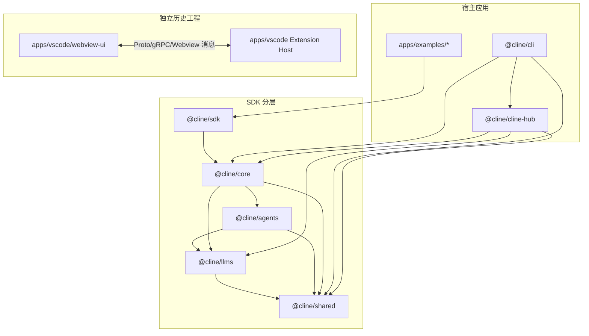
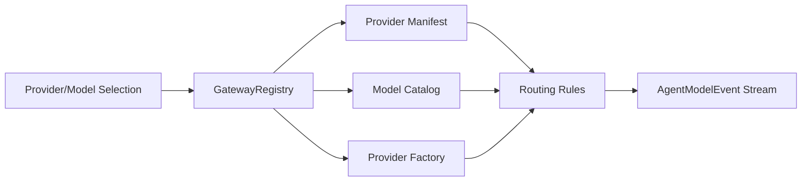
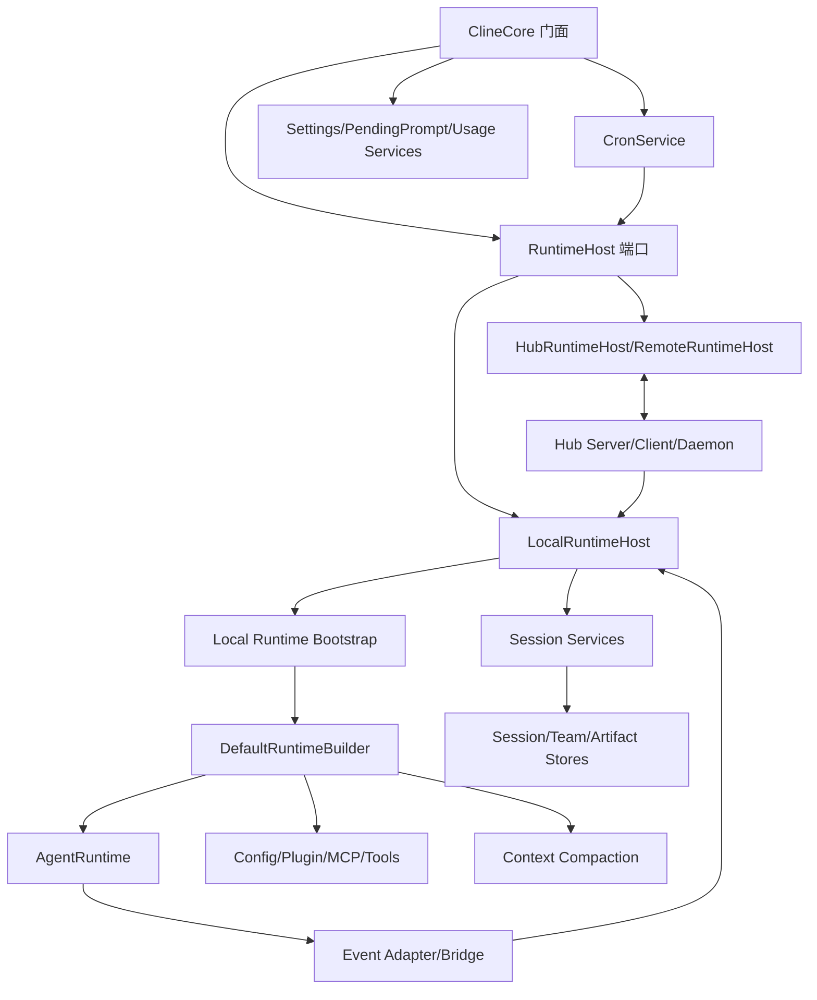
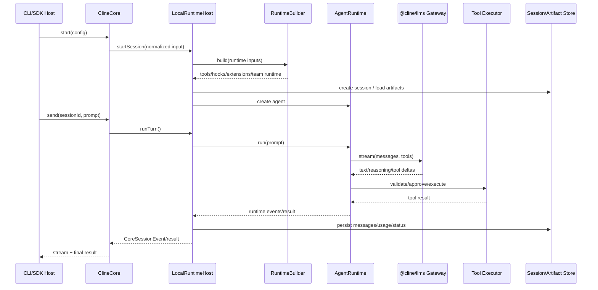
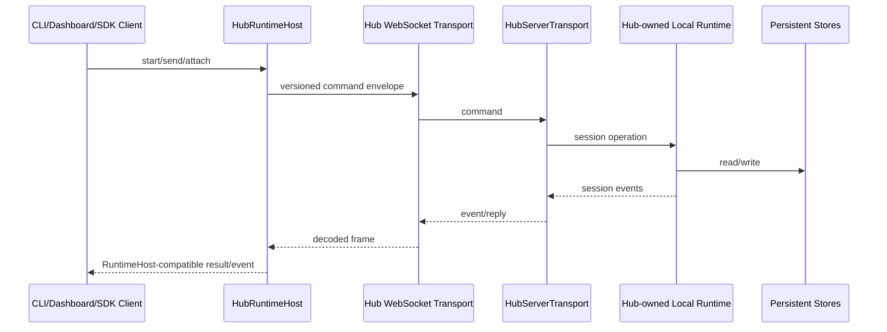
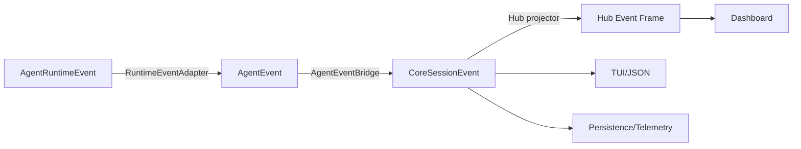
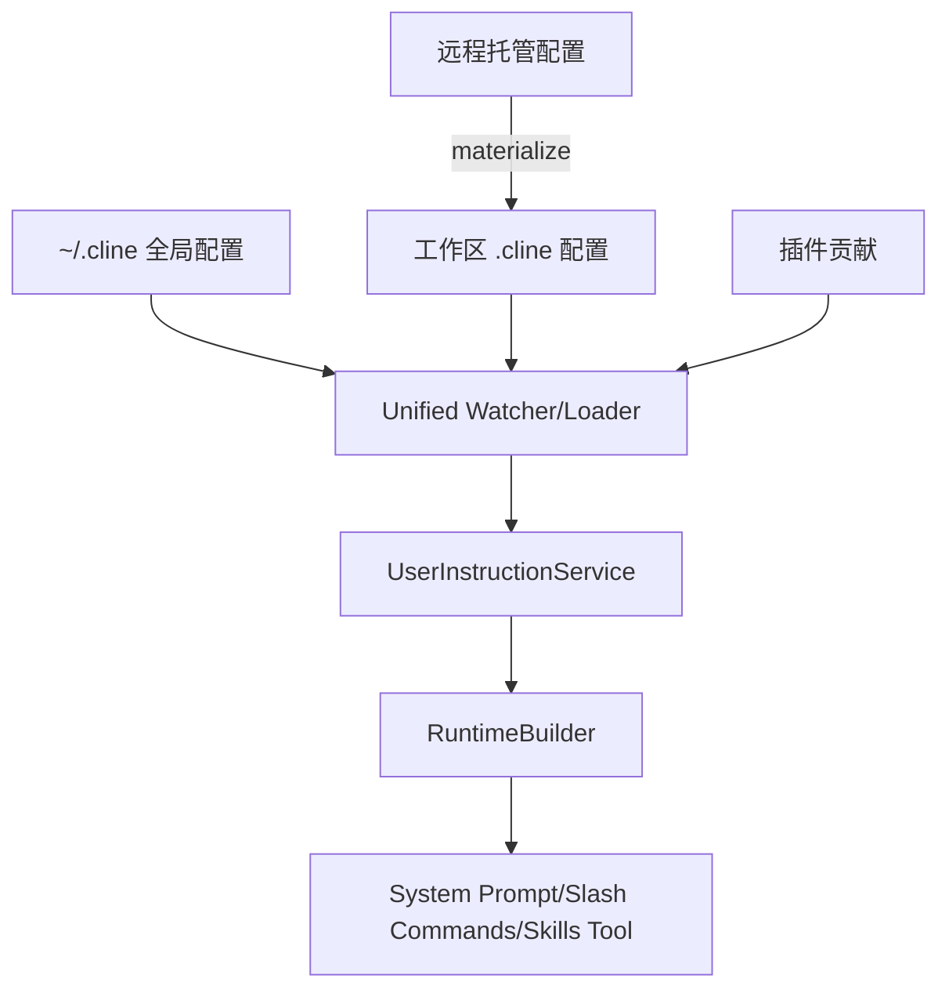
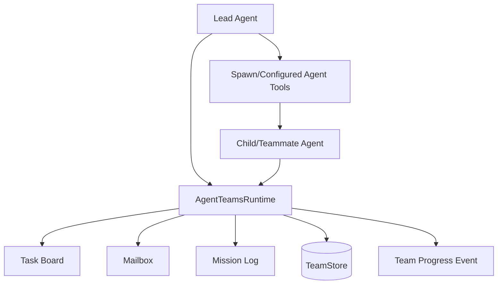
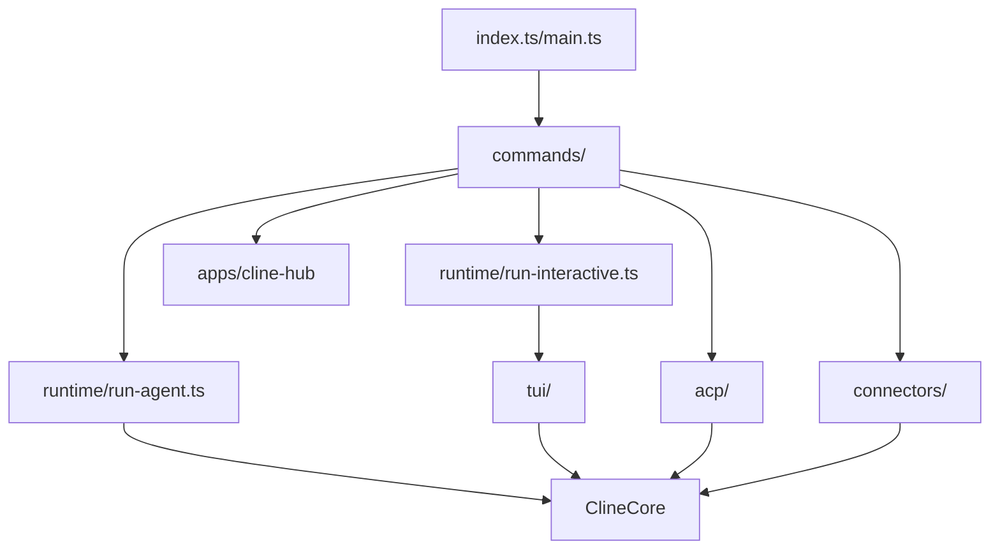
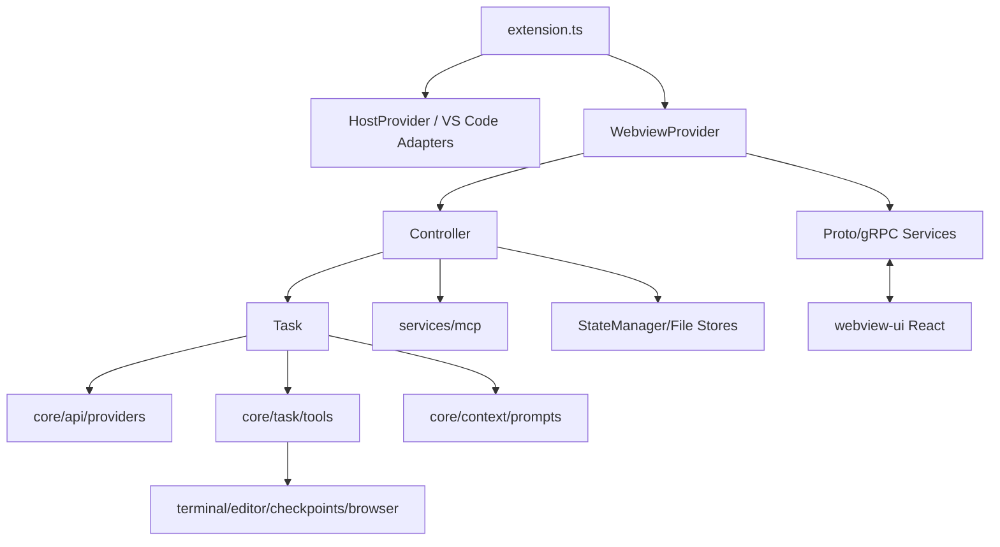

# Cline 模块关联与依赖关系

> 本文区分三类关系：编译期包依赖、运行时调用关系、数据/事件关系。只看 `package.json` 无法解释 Hub、宿主能力和事件投影，只看调用链又会遗漏发布边界。

## 1. 顶层依赖图



`apps/vscode` 在根 workspace 配置中被排除，且没有声明依赖新 `@cline/core`。因此图中没有把正式 VS Code 扩展伪装成新 Core 的宿主。`apps/examples/vscode` 才是基于新 Core 的轻量示例扩展。

## 2. 发布包依赖矩阵

“✓”表示行模块在编译/运行时直接依赖列模块。

| 调用方 \ 被依赖方 | shared | llms | agents | core | cline-hub |
| --- | ---: | ---: | ---: | ---: | ---: |
| `@cline/shared` | — |  |  |  |  |
| `@cline/llms` | ✓ | — |  |  |  |
| `@cline/agents` | ✓ | ✓ | — |  |  |
| `@cline/core` | ✓ | ✓ | ✓ | — |  |
| `@cline/sdk` | 间接 | 间接 | 间接 | ✓ |  |
| `apps/cli` | ✓ | 经 Core 导出 | 经 Core 导出 | ✓ | ✓ |
| `apps/cline-hub` | ✓ | ✓ | 间接 | ✓ | — |

### 2.1 为什么依赖只能向下

- `shared` 若依赖上层，会使所有包形成循环；
- `llms` 必须能独立提供 Provider/模型能力；
- `agents` 需要模型和契约，但不能知道持久化；
- `core` 才能组合会话、存储、工具和宿主；
- 应用可依赖 Core，但 Core 不能依赖 CLI/VS Code UI。

SDK 的发布顺序 `shared → llms → agents → core` 正是依赖方向的外部表现。

## 3. `@cline/shared` 与其他模块

### 3.1 它向上提供什么

| 契约域 | 主要消费者 | 源码 |
| --- | --- | --- |
| Agent 消息、事件、工具类型 | agents、core、UI | `shared/src/agent.ts`、`agents/` |
| LLM Gateway/Model 类型 | llms、agents、core | `shared/src/llms/` |
| Hook/Plugin 契约 | agents、core、插件作者 | `shared/src/hooks/`、`extensions/` |
| Hub 命令、Reply、Transport Frame | core Hub、CLI、Dashboard | `shared/src/hub.ts`、`rpc/` |
| Session/Runtime Config | core、apps | `shared/src/session/` |
| Team/Cron/Connector 类型 | core、CLI、Dashboard | `shared/src/team/`、`cron/`、`connectors/` |
| SQLite 抽象 | Core Stores | `shared/src/db/` |
| Storage Path | Core、CLI | `shared/src/storage/` |
| Remote Config | Core、企业宿主 | `shared/src/remote-config/` |

### 3.2 边界规则

`shared` 只定义低层事实和可复用算法，不应创建 Agent、打开 Hub 或启动宿主。把应用服务放入 `shared` 会破坏整个依赖图。

## 4. `@cline/llms` 内部关系



模块依赖含义：

- `catalog/` 提供模型事实，不执行请求；
- `builtins.ts` 声明 Provider、默认模型、配置字段和路由 metadata；
- `registry.ts` 合并 Manifest、用户配置和自定义模型；
- `routing/` 把通用请求意图转换为特定 Provider 选项；
- `gateway.ts` 是对 Agent 暴露的统一入口；
- `vendors/`、AI SDK Provider 执行实际网络请求。

Core 只应通过 Gateway/Handler 使用模型，不应把 Provider 分支散落到会话逻辑中。

## 5. `@cline/agents` 与上下层

### 5.1 输入依赖

`AgentRuntime` 依赖上层传入：

- `AgentModel`；
- System Prompt 与初始消息；
- Tools；
- Hooks/Plugins；
- `prepareTurn`；
- Tool Policy/Approval；
- Logger/Telemetry；
- Pending User Message 消费器。

### 5.2 输出关系

它输出：

- `AgentRunResult`；
- `AgentRuntimeEvent` 流；
- 最终消息和 usage；
- 工具执行结果。

### 5.3 不应依赖的模块

Agent 不应直接依赖 Session Store、SQLite、Hub、Cron、CLI 或 VS Code。当前只有 4 个 Agent 包源码文件，核心实现集中，说明该层有意保持窄小。

## 6. `@cline/core` 内部模块图



### 6.1 `ClineCore`

`ClineCore` 是唯一推荐的应用门面。它创建 Host、归一化 Start Input、处理 Bootstrap、发布启动遥测，并把 Session 服务委托给 Host。

### 6.2 RuntimeHost

`RuntimeHost` 是最关键的运行边界：

- `LocalRuntimeHost`：同进程会话和 Agent；
- `HubRuntimeHost`：通过 Hub 命令操作权威 Runtime；
- `RemoteRuntimeHost`：显式远端的 Hub Host 子类。

`ClineCore` 不关心具体传输，从而使同一上层代码能切换后端。

### 6.3 Bootstrap 与 Builder

`prepareLocalRuntimeBootstrap()` 负责把宽泛宿主配置规范化为 Runtime Builder 输入；`DefaultRuntimeBuilder` 再装配：

- 内置工具和执行器；
- Tool Policy；
- MCP；
- Rules/Skills/Workflows；
- Plugin 贡献；
- Configured Agents；
- Spawn/Team Tools；
- Hook 与完成策略。

关系是“Bootstrap 解析环境，Builder 组合运行环境”，二者不应被宿主绕过。

## 7. 本地会话运行时序



关键依赖方向：工具执行由 Agent 发起，但工具实现、审批和持久化由 Core/宿主提供；模型由 Agent 调用，但 Provider 细节由 LLM Gateway 隔离。

## 8. Hub 运行关系



### 8.1 权威关系

Hub 模式下，会话生命由守护进程持有。客户端 detach 不等于 stop；另一个客户端可继续附着。这是 Hub 与普通 RPC Worker 的核心区别。

### 8.2 客户端能力反向调用

某些能力只能在客户端宿主执行，例如 IDE 文件编辑器或用户审批。Hub 会向拥有能力的客户端发起 capability request，再把结果交给权威 Runtime。这个反向依赖通过协议完成，而不是让 Core 静态依赖 VS Code。

### 8.3 Discovery 依赖

`daemon/` 依赖 `discovery/` 解决：谁拥有 Hub、使用哪个端口、当前构建是否兼容、认证令牌是什么、并发启动由谁获锁。`HubRuntimeHost` 只消费解析后的端点。

## 9. 事件关系



事件转换中的状态依赖包括：

- Tool Start 时间用于 Tool Finish duration；
- 上一次累计 usage 用于计算本轮增量；
- Session ID、Agent ID、Team Role 用于投影和遥测；
- 根 Agent usage 与 Teammate usage 分桶后再计算 aggregate。

因此事件转换器不是纯字段重命名，修改顺序或遗漏事件会影响费用、加载状态和工具生命周期。

## 10. 工具模块关系

```text
Tool Schema
   ↓
Tool Definition（名称、描述、生命周期、超时）
   ↓
Executor Port
   ↓
本地默认 Executor / 宿主 Capability Executor
   ↓
Policy Filter
   ↓
Approval
   ↓
beforeTool Hook → execute → afterTool Hook
   ↓
Tool Result + Event + Telemetry
```

对应目录：

- Schema：`core/src/extensions/tools/schemas.ts`；
- Definition：`definitions.ts`；
- Executor：`executors/`；
- 路由：`model-tool-routing.ts`；
- Preset：`presets.ts`；
- Policy：`runtime/tools/tool-approval.ts`、`extensions/mcp/policies.ts`；
- 装配：`extensions/tools/runtime.ts`、`runtime-builder.ts`。

新增工具若只添加 Definition 而未配置 Executor、Preset/Policy 和传输安全性，在部分 Backend 下会不可用。

## 11. 配置与扩展关系



### 11.1 优先级关系

具体 Loader 合并全局、工作区、插件和托管来源；远程配置通常先物化为工作区文件，再复用统一 Watcher。这样减少了“内存配置一条路、文件配置另一条路”的分叉。

### 11.2 设置修改关系

设置修改由 `core/src/settings/` 的服务统一处理；Hub 通过 `settings.*` 命令代理；CLI/Browser UI 消费 Snapshot 和 `settings.changed`，不应直接绕过服务写文件。

## 12. 插件、MCP 与 Agent 的依赖关系

| 扩展 | 依赖 Agent 吗 | 依赖 Core 吗 | 进入 Runtime 的方式 |
| --- | ---: | ---: | --- |
| 自定义 Tool | 只依赖共享契约即可 | 可选 | Agent config / Plugin contribution |
| Hook | 依赖 Hook 契约 | Core 负责发现和组合 | Hook Bag |
| Plugin | 不直接控制会话 | Core 负责加载/沙箱 | Manifest + Setup contributions |
| MCP Server | 外部独立进程/服务 | Core 负责连接 | 投影为 AgentTool |
| Skill/Rule | 纯文件 | Core 负责发现 | Prompt/Skills Tool |
| Provider Plugin | 实现 Gateway Provider | Core/LLMS Registry 注入 | Gateway registration |

插件/MCP 最终都转换成 Agent 能理解的通用 Tool/Hook/Provider，而不是在循环中增加 `if plugin`、`if mcp` 分支。

## 13. 多智能体模块关系



- `DelegatedAgentConfigProvider` 继承根 Agent 的 Provider、工具和 Hook，并允许角色覆盖；
- `TeamChildSessionManager` 把子运行映射为 Session 图；
- `TeamStore` 持久化任务、成员和 Run；
- Core Event Bridge 把 Teammate 事件投影到根 Session；
- Completion Guard 依赖 Team Runtime 的未完成任务/活动 Run。

## 14. 自动化模块关系

| 模块 | 依赖 | 输出 |
| --- | --- | --- |
| Spec Parser | YAML、共享 Cron 类型 | Valid/Invalid Spec |
| Reconciler | 文件扫描、Parser、Store | Upsert/Remove/Revision |
| Watcher | 文件系统事件 | Reconcile 信号 |
| Scheduler/Materializer | Store、Cron 计算 | Queued Run |
| EventIngress | Event、Filter、Dedupe/Cooldown | Queued/Suppressed Run |
| Runner | Store、ResourceLimiter、Runtime Handler | Session、Run 状态 |
| Report Writer | Run、Session Result | Markdown Report |
| `CronService` | 上述全部 | ClineCore/Hub API |

Runner 不直接 new `Agent`，而通过 Runtime Handler 启动会话，因此计划任务与交互任务共享会话、工具、插件、遥测和存储语义。

## 15. CLI 模块关系



### 15.1 UI 与 Runtime 的关系

TUI 不直接创建模型请求，它通过 Session Context 和回调调用 Core。事件桥把 Core Session Event 转成聊天条目、工具输出、队列和状态栏。

### 15.2 Connectors 与 Session 的关系

Connector Adapter 只处理平台消息；`session-runtime.ts` 创建/恢复 Cline 会话；`thread-bindings.ts` 持久化外部 thread 到 session 的映射。这样平台 API 不进入 Core。

## 16. Hub Dashboard 模块关系

Dashboard 有两层 Hub：

```text
Browser SPA
   ↕ /browser WebSocket
apps/cline-hub Dashboard Server
   ↕ ClineCore + HubUIClient
共享 @cline/core Hub Daemon
   ↕
权威 Runtime/Stores
```

Dashboard Server 的职责是浏览器鉴权、静态资源、浏览器协议、审批协调和 UI 数据整形；共享 Core Hub 才负责权威会话。不要把 `apps/cline-hub` 的 Dashboard HTTP 端口与 Core Hub WebSocket 端点视为同一个服务。

## 17. VS Code 正式扩展内部关系



### 17.1 `Controller` 是应用协调器

它持有当前 Task、MCP Hub、账户/Auth、StateManager 和 Workspace Manager，并处理 UI RPC。它类似新架构的 `ClineCore + 宿主服务` 合体。

### 17.2 `Task` 是旧 Agent/Core 合体

它同时管理模型循环、Prompt、上下文、工具、持久化和 Checkpoint，职责比新 `AgentRuntime` 更宽。这也是迁移时不能把两个 `core` 目录等同的原因。

### 17.3 Webview 边界

Webview 不能直接使用 Node/VS Code API。它通过生成的 Proto/gRPC 风格客户端和 `postMessage` 访问 Extension Host；Host Bridge 再调用 VS Code 文件、Diff、窗口和终端能力。

## 18. 存储关系

```text
SessionStore  → sessions.db（会话检索与状态）
ArtifactStore → 会话目录（消息、Manifest、Checkpoint、报告）
TeamStore     → teams.db（团队快照与 Run）
CronStore     → cron.db（自动化 Spec/Run/Event）
Config Files  → ~/.cline、workspace/.cline（声明式配置）
Discovery     → owner-scoped 文件（Hub 端点和令牌）
```

这些存储域故意分开：会话删除不应破坏 Cron 定义，团队恢复不应依赖 UI 状态，Hub discovery 也不是业务数据库。

## 19. 依赖影响矩阵

| 修改点 | 必查下游 |
| --- | --- |
| `shared` Agent/Hub 类型 | llms、agents、core、CLI、Dashboard 协议消费者 |
| Provider Manifest/Model | Core 设置、CLI Picker、Hub Models；必要时 VS Code 历史 Provider |
| AgentRuntimeEvent | RuntimeEventAdapter、Core Event Bridge、Hub、TUI/UI、Telemetry |
| Tool Schema/名称 | Prompt、Preset/Policy、Executor、审批、Hub Capability、UI 渲染 |
| Session Record/DB Schema | Store migration、History、Hub session payload、CLI export |
| RuntimeHost 方法 | Local/Hub/Remote 三实现、ClineCore facade、Hub command handler |
| Plugin capability | shared Manifest、Loader、Sandbox、Builder、CLI/Hub UI |
| Cron Spec | shared 类型、Parser、DB、CLI import/export、Dashboard form |
| Team Event | TeamStore、Session Coordinator、Core Event、TUI/Hub UI、usage |
| VS Code Proto | `.proto`、生成代码、Host handler、Webview client、测试 |

## 20. 最重要的依赖规则

1. 低层契约不能导入高层运行时。
2. Provider 细节留在 `llms`，不要散落到 Core。
3. Agent 不拥有持久化和宿主生命周期。
4. Core 的 Host Input 必须可跨传输序列化；宿主函数能力通过 Capability 反向调用。
5. 应用 UI 只调用服务/门面，不直接写 Core 数据文件。
6. Hub 客户端 detach 与权威 Session stop 是不同操作。
7. 正式 VS Code 与新 SDK Core 是当前两套入口，改造前先确认执行路径。

掌握以上关系后，可以从任意 UI 操作沿“宿主 → ClineCore/Controller → Runtime/Task → Agent/Provider/Tool → Store/Event → UI”正反向追踪完整链路。
